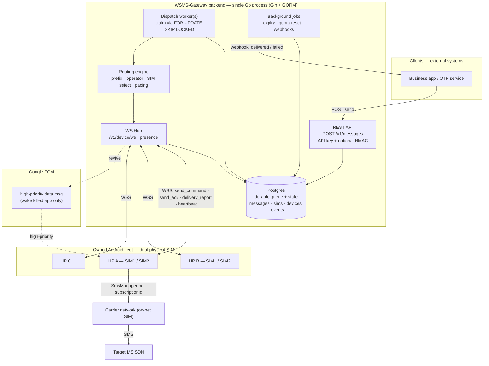
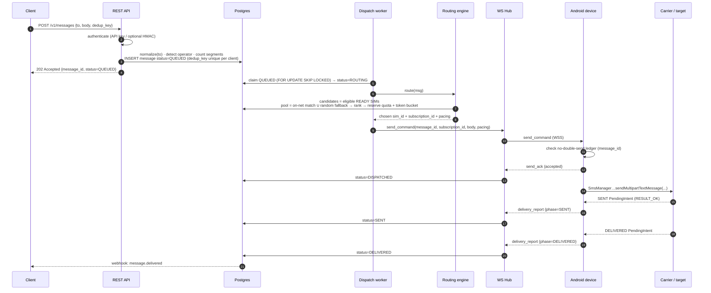
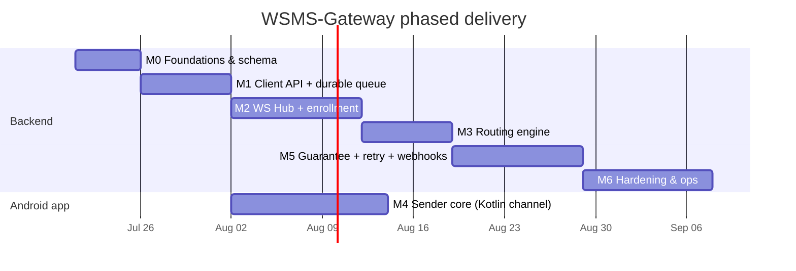

# 00 — WSMS-Gateway Master Overview (SSoT Entry Point)

> **Status:** Orientation & index. This is the **first document a new engineer reads.**
> It gives the vision, the shape of the system, and a map into the deeper docs. It is
> *not* the authoritative wire contract — for every field name, enum value, endpoint
> path, frame `type`, and state transition, **[`02 — Contract, Protocol & Schema`](02-contract-protocol-schema.md)
> is the Single Source of Truth.** Where this overview and doc 02 disagree, **doc 02 wins.**

---

## 1. Vision

**WSMS-Gateway** is a self-hosted, production-grade SMS gateway that turns a small fleet of
**owned dual-SIM Android phones** into a reliable A2P send channel controlled by a single Go
backend. A client submits *"send this message to this Indonesian number"* over an authenticated
REST API; the backend **detects the target's operator from its prefix**, routes the send over a
**live WebSocket to one specific SIM on one specific phone that is on the same operator** (on-net =
cheaper/free), and the phone reports **real SENT/DELIVERED status back to the server**. It is a
deliberate, point-by-point **repair of `nsms_gateway`** — replacing its OneSignal broadcast, its
dead `sms` plugin, and its fire-and-forget model with targeted routing, delivery ACKs, retries,
idempotency, presence tracking, and auth. It is designed for a **small owned fleet (3–10 phones,
~6–20 SIMs)**, not carrier scale, and it treats the legal/ToS "grey route" risk of sending A2P
traffic from consumer SIMs **honestly and up front** (see the [Risk Register](#8-risk-register)).

---

## 2. nsms_gateway → WSMS-Gateway (what we fixed)

| Concern | `nsms_gateway` (reference) | **WSMS-Gateway** (this system) |
|---|---|---|
| **Delivery fan-out** | Broadcast to **all** devices via OneSignal "Active Users" → **duplicate SMS** | **Targeted:** exactly one `send_command` to one `sim_id` on one device |
| **Operator routing** | None — random device, manually chosen SIM | **Operator-aware:** prefix → operator → on-net SIM match, **random fallback** if none online |
| **Transport** | 3rd-party push (OneSignal), quota-limited, one-way | **Persistent WSS hub** (primary) + **FCM high-priority data msg as wake/backup only** |
| **Delivery feedback** | Fire-and-forget, **no ACK** ever returns to server | **ACK + retry:** `send_ack`, then real **SENT/DELIVERED** `delivery_report` from `PendingIntent` receivers; retry on failure |
| **Idempotency** | None — a re-push = another SMS | Client `dedup_key` (unique per client) + **device-side no-double-send ledger**; at-least-once + idempotent |
| **Auth** | Open PHP endpoint, no identity | **Enrolled & signed:** API keys (+ optional HMAC request signing), device enrollment secrets & rotation |
| **Sending API** | Discontinued Flutter `sms` plugin, single SIM | Native **`SmsManager.getSmsManagerForSubscriptionId`** via Kotlin channel, dual-SIM, multipart |
| **App survival** | App can be killed silently; sends lost | **Foreground service** holds the WS; FCM wakes a killed process; battery-optimization exemption |
| **Observability** | None | Message state machine, `message_events`, Prometheus metrics, structured logs, webhooks |

---

## 3. Top-level architecture

**Stack:** Go (Gin + GORM) + Postgres backend, single process for a small fleet · Flutter **Android-only**
sender app · Google FCM used **only** to wake a killed app. **iOS can never be a sender** — it has no
public API to send SMS programmatically or bind a subscription; the fleet is Android exclusively (see
[`05`](05-flutter-android-app.md) §1).

**Two decoupled planes** (see [`04`](04-go-server.md) §1): a **synchronous dispatch plane**
(workers claim `QUEUED` rows, route, emit `send_command`, block only for the short `send_ack`) and
an **asynchronous event plane** (WS ingress accepts `delivery_report`/`status` frames whenever they
arrive, seconds to minutes later, and advances the state machine). **Postgres is the durable queue** —
no external broker; rows are claimed with `FOR UPDATE SKIP LOCKED`, which is crash-safe and leaves a
horizontal-scaling path open without changing the model.

---

## 4. End-to-end happy path

> Statuses shown (`QUEUED → ROUTING → DISPATCHED → SENT → DELIVERED`, plus `FAILED`/`EXPIRED` and
> reasons like `NO_MATCHING_OPERATOR_SIM`) are named per doc 02 — see **[`02` §D](02-contract-protocol-schema.md)**
> for the authoritative state machine and the retry / reroute edges omitted here for clarity.

---

## 5. Core concepts (quick glossary)

| Term | Meaning | Authority |
|---|---|---|
| **message_id** | Server-assigned `UUIDv7` — time-ordered, globally unique, sortable | 02 §0.1 |
| **sim_id / device_id** | Server-assigned `UUID`; **never** the Android `subscription_id` (unstable across reboot/SIM swap) | 02 §0.1 |
| **subscription_id** | Android `SubscriptionInfo` id — used only *inside* the device to pick the SIM; passed in `send_command`, never used as a stable key | 05 §5 |
| **dedup_key** | Client-chosen idempotency key, ≤128 chars, unique **per client** | 02 §0.1 |
| **frame.id** | Per-WS-frame `ULID` for transport correlation/ack | 02 §0.1 |
| **on-net / fallback** | On-net = target operator == SIM operator (cheap/free); fallback = any READY SIM when no on-net SIM is online | 03 §5 |
| **operator (ID)** | Telkomsel · Indosat · XL Axiata · Axis · Tri (3) · Smartfren, resolved from `08xx` prefix | 03 §2 |

**Operator prefix heuristic** (canonical table lives in `operator_prefixes`; normalize `+62`/`62`/`0`
first). Reliable but **not guaranteed** — Indonesia has no full mobile MNP, which is exactly why the
random fallback exists.

| Operator | Prefixes (08xx) |
|---|---|
| Telkomsel | 0811 0812 0813 0821 0822 0823 0851 0852 0853 |
| Indosat (IM3) | 0814 0815 0816 0855 0856 0857 0858 |
| XL Axiata | 0817 0818 0819 0859 0877 0878 |
| Axis | 0831 0832 0833 0838 |
| Tri (3) | 0895 0896 0897 0898 0899 |
| Smartfren | 0881 0882 0883 0884 0885 0886 0887 0888 0889 |

> Indosat + Tri merged (2022) under Indosat Ooredoo Hutchison, but their networks/prefixes remain
> operationally distinct — treat them as separate operators for on-net matching.

---

## 6. Document map

| Doc | Title | One-line purpose |
|---|---|---|
| **[00](00-overview.md)** | Master Overview *(this doc)* | Vision, architecture, roadmap, risks — the entry point |
| **[01](01-architecture-transport.md)** | Architecture & Transport / Realtime Layer | Topology, WS-vs-push decision, WS Hub, presence/heartbeat, device survival, delivery-guarantee model, failure matrix |
| **[02](02-contract-protocol-schema.md)** | Contract, Protocol & Schema | **The SSoT.** All DB tables, enums, REST API, WS frames, state machine, idempotency guarantee |
| **[03](03-routing-engine.md)** | Routing Engine | MSISDN normalization → operator detection → candidate/pool/rank → pacing/jitter → quarantine; the `route()` algorithm |
| **[04](04-go-server.md)** | Go Backend (Gin + GORM) | Project layout, config, models, store layer, Gin handlers, WS hub, dispatch/retry loop, background jobs, webhooks, shutdown, metrics |
| **[05](05-flutter-android-app.md)** | Flutter (Android-Only) Sender App | Why iOS is impossible, app architecture, permissions, foreground service + FCM wake, Kotlin platform channel (enumerate/send/receivers), enrollment, WS client, dedup ledger |
| **[06](06-security-legal-ops.md)** | Security, Legal & Operations | Threat model, TLS/WSS, API-key + HMAC auth, enrollment secrets, rate limiting, audit log, **legal/ToS reality**, Docker/deploy, metrics, alerting, backups, testing, rollout, cost model |
| **[07](07-admin-management.md)** | Admin Management (Web Dashboard) | Operator console: KPI overview, message log + detail drawer, fleet/SIM view, routing & ban-risk insight, clients/keys, enrollment, settings, **integrated OpenAPI docs portal**, RBAC, PII masking |
| **[08](08-amendments.md)** | Amendments *(normative)* | Concrete fixes for the 15 audit findings — **supersedes** the referenced sections of 01–06 (double-send fix, quota reserve, `AWAITING_ACK`/`SENT_UNCONFIRMED` states, TTL, FCM/FGS reality, …) |
| **[09](09-audit-findings.md)** | Audit Findings | Traceability record of the adversarial review → resolved in 08 |

**Reading order for a new engineer:** 00 → 02 (skim the enums & state machine) → **08 (the amendments that override 02/04/05)** → 01 → 03 → 04 → 05 → 06 → 07.

> ⚠️ **Docs 01–06 are the original design; [08](08-amendments.md) is normative errata that overrides them** where they conflict (notably the message state machine and the idempotency/no-double-send path). Read 08 alongside 02/04/05.

---

## 7. Phased delivery roadmap

Effort is in **engineer-weeks (ew)** for one focused engineer; the Android track (M4) can run in
parallel with the backend track once M1 lands, so calendar time is shorter than the summed effort.

| Milestone | Deliverable | Exit criterion | Effort |
|---|---|---|---|
| **M0 — Foundations** | Repo scaffold, config, Postgres schema + GORM models + migrations, contract enum types | `migrate up` builds all tables from doc 02; models compile | ~1.0 ew |
| **M1 — Client API + durable queue** | `POST /v1/messages`, API-key auth, `dedup_key` idempotency, `messages` rows land in `QUEUED` | Duplicate `dedup_key` returns the same `message_id`; row persists | ~1.5 ew |
| **M2 — WS Hub + enrollment** | Device WSS terminate, enrollment tokens/secrets, presence + heartbeat, foreground service in app | A real phone enrolls, connects, shows online, survives screen-off | ~2.0 ew |
| **M3 — Routing engine** | Normalization, prefix→operator, candidate/pool/rank, per-SIM token bucket + jitter, quarantine | Unit-tested `route()` picks on-net SIM, falls back correctly | ~1.5 ew |
| **M4 — Android sender core** *(parallel from M1)* | Kotlin channel: `SubscriptionManager` enumerate, `SmsManager` multipart send, SENT/DELIVERED `PendingIntent` receivers → `delivery_report` | One SMS sent on a chosen SIM with SENT+DELIVERED reported | ~2.5 ew |
| **M5 — Guarantee + retry + webhooks** | Dispatch loop, `send_ack`, retry/reroute, no-double-send ledger, client webhooks, FCM wake | Chaos test: no double-send under retry; delivery webhook fires | ~2.0 ew |
| **M6 — Hardening & ops** | Prometheus metrics, structured logs, alerting, backups/retention, load + integration tests, staged rollout | Load test green; runbooks + alerts live; owner sign-off on legal risk | ~2.0 ew |

**Total ≈ 12.5 ew** (≈ 3 months solo; ≈ 6–7 calendar weeks with one Go + one Flutter engineer in parallel).

---

## 8. Risk register

Ranked by combined severity. **The SIM-ban / legal risk is the single most important entry — it can
end the project, and no amount of engineering fully removes it.**

| # | Risk | Likelihood | Impact | Mitigation |
|---|---|---|---|---|
| **R1** | **SIM ban / carrier ToS violation — bulk A2P from consumer SIMs is a "grey route"; carriers detect high-volume P2P-shaped traffic and block/ban the SIM** | **High** | **High** | Strict **per-SIM rate limits**, human-like **pacing + jitter**, **rotate SIMs**, keep volume low, SIM **quarantine / circuit breaker** on failures; treat SIMs as consumable. This is deliverability & ToS hygiene, **not** detection evasion. |
| **R2** | **Legal / regulatory — Indonesian A2P rules; sending from ordinary SIMs is non-compliant for commercial bulk** | **Med** | **High** | Disclose plainly to the owner (doc 06 §2); recommend a **legitimate A2P / official channel** for real volume; keep an audit log; owner accepts risk in writing before go-live. |
| R3 | OEM battery killer (Xiaomi/Oppo/etc.) kills app → dropped WS → sends stall | High | Med | **Foreground service** holds WS; **FCM high-priority** wake revives; battery-optimization exemption prompt; heartbeat + reconnect; presence marks SIM offline so routing skips it |
| R4 | No online SIM on the target's operator | Med | Med | **Random-SIM fallback**; if truly none online, queue with backpressure and surface `NO_MATCHING_OPERATOR_SIM` |
| R5 | Prefix→operator wrong (no full MNP in Indonesia) | Med | Low | Prefix is a heuristic, not a guarantee — **fallback path already handles the miss**; on-net is best-effort cost optimization, not correctness |
| R6 | **Double-send (duplicate SMS)** | Low | High | Client `dedup_key` unique per client + **device-side no-double-send ledger** keyed on `message_id`; at-least-once + idempotent so retries can't duplicate |
| R7 | Message-body leakage (OTP / PII) | Low | High | TLS/WSS everywhere, API-key hashing, restricted at-rest access, retention limits (doc 06 §1, §3.7) |
| R8 | API-key leakage / abuse | Med | High | Hashed keys, rotation, optional **HMAC request signing**, per-client rate limits |
| R9 | Single backend instance failure | Low | Med | Durable Postgres queue survives restart; nothing lost mid-flight (claimed rows re-appear); backups; scale-out path documented (doc 04 §17) |
| R10 | SIM metadata wrong / number null | Med | Low | Server-assigned `sim_id` + operator set from `operator_prefixes`/manual config, not from unreliable `SubscriptionInfo.number` |
| R11 | FCM is still a 3rd-party dependency (for wake) | Low | Med | FCM is **wake-only**, never the delivery channel; WS is primary; degrade gracefully if a push is missed (heartbeat reconnect) |

---

## 9. Key decisions & rationale

1. **Android-only sender fleet.** iOS exposes no public API to send SMS programmatically or bind a
   subscription, and its background model forbids a headless control socket. There will never be an
   iOS sender build (doc 05 §1).
2. **Persistent WSS as the primary transport, not push broadcast.** A live socket lets the server
   address **one SIM on one phone** and receive ACKs back — directly fixing OneSignal's broadcast-to-all
   duplicate-SMS flaw (doc 01 §3).
3. **FCM is wake/backup only, never the delivery channel.** A high-priority data message revives a
   killed process; actual commands and ACKs flow over the WS. This avoids re-introducing a
   quota-limited 3rd-party dependency for real sends.
4. **Foreground service holds the WS.** The only reliable way to survive Doze and app-kill on Android
   long enough to keep a control socket alive (doc 05 §4).
5. **Postgres is the durable queue** (`FOR UPDATE SKIP LOCKED`), no external broker. Crash-safe,
   transactional, minimal ops for a small fleet, and keeps a horizontal-scaling path open (doc 04 §1).
6. **Doc 02 (the contract) is the shared type system.** One vocabulary — enums, field names, frame
   shapes, state transitions — across Go, Flutter, and the REST client. Other docs wire it up but
   never redefine it.
7. **Operator routing by Indonesian prefix + random fallback.** On-net matching captures the
   cost/free-SMS benefit; fallback exists **because Indonesia has no full MNP**, so prefix→operator is
   a strong heuristic, not a guarantee (doc 03 §2, §5).
8. **Server-assigned `sim_id`, not Android `subscription_id`, as the stable key.** `subscription_id`
   changes across reboots and SIM swaps; the server mints durable IDs (doc 02 §0.1).
9. **At-least-once delivery + idempotent dedup.** Retries are safe because of the per-client `dedup_key`
   plus a device-side ledger keyed on `message_id` — no duplicate SMS despite re-sends (doc 01 §9).
10. **`UUIDv7` for `message_id`.** Time-ordered, sortable by creation, globally unique — good queue and
    log ergonomics without a separate sequence.
11. **Native `SmsManager.getSmsManagerForSubscriptionId` via a Kotlin platform channel.** The Flutter
    `sms` plugin is dead; this is the supported dual-SIM send path (multipart via `divideMessage`/
    `sendMultipartTextMessage`) with SENT/DELIVERED `PendingIntent` receivers for real status
    (doc 05 §5).
12. **Per-SIM rate limits + pacing/jitter + quarantine.** Framed as deliverability and ToS-compliance
    hygiene to reduce ban risk — explicitly **not** carrier-detection evasion (doc 03 §7–§8, doc 06 §2).
13. **Enrolled + signed everywhere.** API keys (+ optional HMAC) for clients, enrollment secrets with
    rotation for devices — closing `nsms_gateway`'s open-endpoint flaw (doc 06 §1).
14. **Single backend instance for the target fleet.** Pragmatic and shippable for 3–10 phones; the
    scale-out path is documented but deliberately deferred (doc 04 §17).

---

*New here? Read this doc, then jump to **[02 — Contract, Protocol & Schema](02-contract-protocol-schema.md)**;
everything else hangs off that contract.*
