# 01 — Architecture & Transport / Realtime Layer

> **Status:** Normative for topology and transport; subordinate to `02 — Contract, Protocol
> & Schema` for every wire format, field name, enum value, and state transition. Where this
> doc names a frame (`send_command`), a status (`DISPATCHED`), a table (`sims`), or a reason
> (`NO_MATCHING_OPERATOR_SIM`), it is using the vocabulary defined in doc 02 verbatim — this
> doc explains *how the pieces move*, doc 02 defines *what the bytes are*.

This document specifies the end-to-end architecture of **WSMS-Gateway** and, in depth, its
**transport / realtime layer** — the part that carries a send instruction from an API caller,
through the Go backend, out over a live socket to one specific SIM on one specific owned
Android phone, and back again as a delivery ACK.

The design is deliberately framed as a point-by-point **repair of `nsms_gateway`**. Every
major choice below is paired with the exact flaw of the reference system it eliminates.

---

## Table of Contents

- [0. The reference system we are fixing](#0-reference)
- [1. System context — the whole pipeline](#1-context)
- [2. Component diagram (end-to-end)](#2-component-diagram)
- [3. Transport decision: persistent WebSocket vs blind push](#3-transport-decision)
- [4. Deployment topology & process model](#4-topology)
- [5. Request lifecycle, end-to-end (sequence)](#5-lifecycle)
- [6. The WS Hub — the realtime core](#6-ws-hub)
- [7. Device survival: foreground service + FCM wake](#7-survival)
- [8. Presence, heartbeat, reconnect & real-time device+SIM tracking](#8-presence)
- [9. Delivery-guarantee model (at-least-once + idempotent dedup)](#9-guarantee)
- [10. Backpressure & the "no device online" case](#10-backpressure)
- [11. Failure domains & degradation matrix](#11-failure)
- [12. Master contrast table — every nsms_gateway flaw → WSMS fix](#12-master)

---

<a name="0-reference"></a>

## 0. The reference system we are fixing

`nsms_gateway` (the PHP + OneSignal + Flutter `sms`-plugin design) works like this:

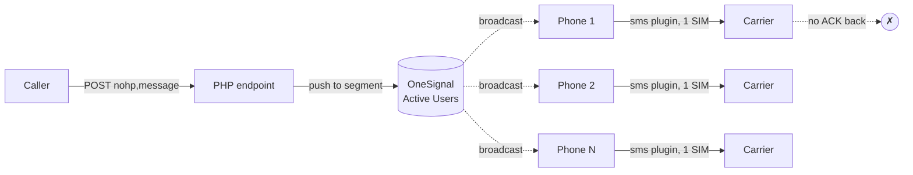

Its structural defects, which this architecture must eliminate:

| # | `nsms_gateway` flaw | Consequence |
|---|---|---|
| F1 | **Broadcast** to the "Active Users" segment | Every online phone sends the *same* SMS → duplicate messages to the recipient |
| F2 | **No device/SIM addressing** | Cannot target one phone, one slot |
| F3 | **No operator routing** | Cannot pick an on-net SIM → every SMS is cross-net / paid |
| F4 | **No delivery ACK path** | Server never learns SENT/DELIVERED/FAILED |
| F5 | **No queue / retry / idempotency** | Lost pushes vanish; retries double-send |
| F6 | **No auth** | Anyone who finds the endpoint can send |
| F7 | **Dead `sms` plugin, single hand-picked SIM** | Fragile, no dual-SIM |
| F8 | **OneSignal 3rd-party dependency** | Quota-limited, opaque, adds latency, single point of external failure |
| F9 | **Push is fire-and-forget** | No knowledge of whether a phone is even online |

The rest of this document maps each fix onto a concrete component. The master table in
[§12](#12-master) closes the loop.

---

<a name="1-context"></a>

## 1. System context — the whole pipeline

WSMS-Gateway is a **single Go service** (Gin + GORM) fronting **Postgres** (durable state)
and **Redis** (hot counters, rate-limit buckets, cross-instance presence hints), talking to a
**small owned fleet of Android phones** (3–10 devices, ~6–20 SIMs) over **WSS**, with **FCM**
used only as an out-of-band *wake* channel.

At the highest level there are five moving parts and one hard boundary:

1. **Client** — an external system calling `POST /v1/messages`.
2. **Go backend** — REST API, router/queue, WS Hub, webhook dispatcher.
3. **Datastores** — Postgres (source of truth) + Redis (ephemeral hot state).
4. **Device fleet** — Android phones, each a dual-SIM **sender** running the Flutter app.
5. **Carriers** — the actual GSM network that carries the SMS to the recipient handset.

> **Hard boundary — Android only.** The sender fleet is **exclusively Android**. **iOS
> cannot send SMS programmatically**; there is no public iOS API for it, so an iOS build could
> only *monitor*, never send. The server rejects enrollment of any non-`android` sender role
> (contract A.4). Every "device" in every diagram below is an Android phone.

---

<a name="2-component-diagram"></a>

## 2. Component diagram (end-to-end)

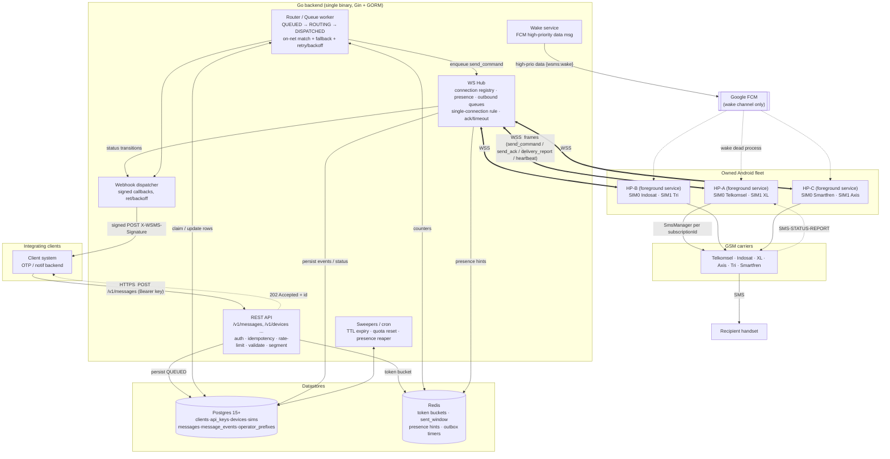

### 2.1 Component responsibilities

| Component | Responsibility | Fixes |
|---|---|---|
| **REST API** (Gin) | Authn/z (Bearer `wsms_…`), `Idempotency-Key` dedup, per-client token-bucket rate limit, MSISDN normalization → `+62…`, prefix→`target_operator` resolution, `encoding`+`segments` computation, persist `messages` row as `QUEUED`, return `202`. | F5, F6 |
| **Router / Queue worker** | Scans `QUEUED`/`ROUTING`, runs the routing decision (on-net match → fallback random SIM), assigns `sim_id`+`device_id`, hands a `send_command` to the Hub, applies retry/backoff, honors `max_attempts` and `expires_at`. | F1, F2, F3 |
| **WS Hub** | Owns every live device socket, the presence registry, per-device outbound queues, the single-connection rule, transport/app ack tracking, and reconciles `sim_report`/`heartbeat`/`status`/`delivery_report`. | F2, F4, F9 |
| **Wake service** | Sends FCM **high-priority data** `{"wsms":"wake"}` to revive a killed/frozen process that has no live WS but has queued work. | F8, F9 |
| **Webhook dispatcher** | Signed, retried status callbacks on every relevant transition. | F4 |
| **Sweepers / cron** | TTL expiry (`EXPIRED`), `sent_today` reset at `00:00 Asia/Jakarta`, presence reaper (mark stale devices `OFFLINE`), retention purge. | F5 |
| **Postgres** | Durable source of truth for all tables in contract A. | F5 |
| **Redis** | Hot, ephemeral: token buckets, per-SIM `sent_window`, presence hints, ack/outbox timers. Rebuildable from Postgres + reconnect. | — |

---

<a name="3-transport-decision"></a>

## 3. Transport decision: persistent WebSocket vs blind push

This is the single most important architectural choice, and it is a direct inversion of
`nsms_gateway`.

### 3.1 The two models

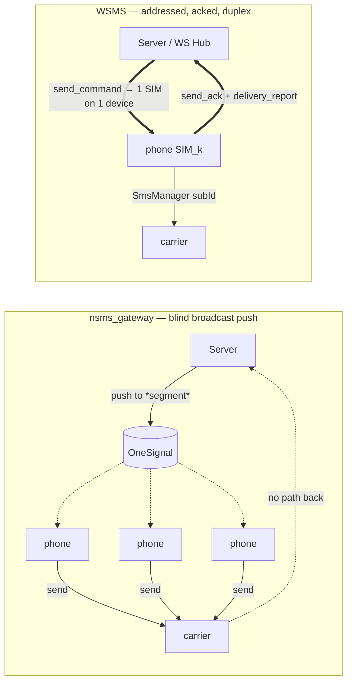

`nsms_gateway` uses push as a **content-delivery broadcast**: the payload *is* the SMS, fanned
out to a whole segment, with no reply channel. WSMS uses a **persistent, bidirectional,
per-device session**: the server addresses **exactly one SIM on exactly one device**, and that
device streams status back over the same socket.

### 3.2 Why a persistent WebSocket wins — property by property

| Property the gateway needs | Blind push (OneSignal) | Persistent WSS (WSMS) | nsms flaw fixed |
|---|---|---|---|
| **Unicast addressing** | Segment-level only; cannot say "HP-A slot 0" | Frame is delivered on *one* device's socket, naming `sim_id`+`sim_subscription_id` | F1, F2 |
| **Operator routing** | Impossible — no notion of which SIM is on which operator | Hub knows every SIM's live `operator`/`status`; router picks on-net | F3 |
| **Delivery ACK** | No return path | `send_ack` + `delivery_report(SENT/DELIVERED/FAILED)` on the same socket | F4 |
| **Idempotent retry** | Re-push = re-broadcast = duplicate SMS | Same `message_id`, new frame `id`; device ledger dedups | F5 |
| **Backpressure** | None; push is fire-and-forget | Bounded per-device outbound queue + pacing; server *sees* congestion | — |
| **Presence truth** | "Active Users" is stale/opaque | Live socket = ground truth; heartbeat + reaper | F9 |
| **Ordering / correlation** | None | Frame `id` (ULID) correlates command↔ack↔report | F4 |
| **3rd-party coupling** | Hard dependency, quota-limited, opaque | Self-hosted socket; **FCM used only to wake**, never to carry payload | F8 |
| **Auth** | Endpoint open | Device secret on WS handshake; API keys on REST | F6 |

### 3.3 Why not *only* FCM/push, or *only* long-poll?

- **Push-only (the old way)** cannot carry an ACK, cannot address a slot, and couples us to a
  quota-limited third party for the *hot path*. Rejected.
- **HTTP long-poll / SSE** gives a server→device stream but no clean device→server ACK stream
  on the same connection, and holding thousands of long-polls is strictly worse than one WS.
  For a fleet this small, WSS is simpler and fully duplex.
- **WebSocket** gives duplex, low-latency, correlated frames over a single authenticated
  connection — exactly the shape of "dispatch one job, stream back its lifecycle."

The one thing a persistent socket **cannot** do is survive Android killing the app process.
That gap — and *only* that gap — is where push returns, demoted to a **wake trigger**
([§7](#7-survival)). This is the crucial reframing: **push moves from being the payload
channel to being the doorbell.**

---

<a name="4-topology"></a>

## 4. Deployment topology & process model

For a 3–10 phone fleet, the pragmatic and correct answer is a **single Go binary** running all
modules as goroutine pools, with Postgres and Redis alongside. No microservices, no Kafka.

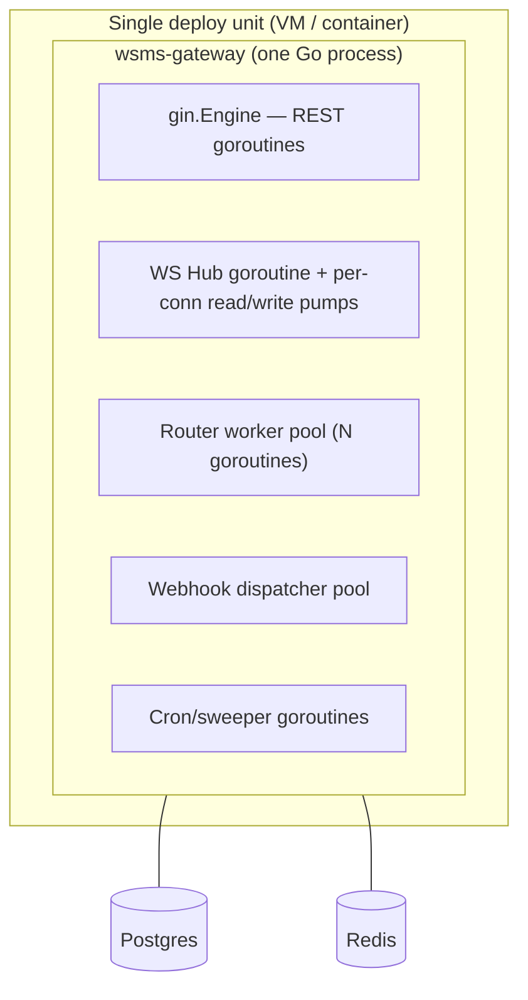

### 4.1 Concurrency model inside the binary

- **REST**: standard Gin handler goroutines. Stateless; safe to run many.
- **WS Hub**: one owning goroutine holds the registry maps; each device connection gets a
  **read pump** and a **write pump** goroutine. All registry mutations funnel through the hub
  (channel-serialized) or a `sync.RWMutex` — never touched raw from pumps.
- **Router**: a small worker pool. Each worker `SELECT … FOR UPDATE SKIP LOCKED` claims a
  batch of actionable `messages` (index `ix_msg_queue`), routes, and dispatches. `SKIP LOCKED`
  makes the queue safe even if we later run 2 instances.
- **Sweepers**: single-fire cron goroutines guarded by a Postgres advisory lock so only one
  instance runs each job.

### 4.2 Scaling past one instance (future, not required now)

The only stateful, sticky thing is the **live WS connection**. If we ever run 2+ instances:

- A device's socket lands on whichever instance it connected to. That instance owns the
  session; `devices.session_id` records it, and a Redis key `presence:{device_id} → instance`
  lets the router discover *which instance* holds the socket and forward the `send_command`
  over an internal bus (NATS/Redis pub-sub). The **single-connection rule** (contract C.3)
  still holds globally because `session_id` is a DB-checked invariant.
- For 3–10 phones this is unnecessary. Documented so the schema (which already carries
  `session_id`) is understood as scale-ready, not accidental.

---

<a name="5-lifecycle"></a>

## 5. Request lifecycle, end-to-end (sequence)

The happy path, on-net, single segment:

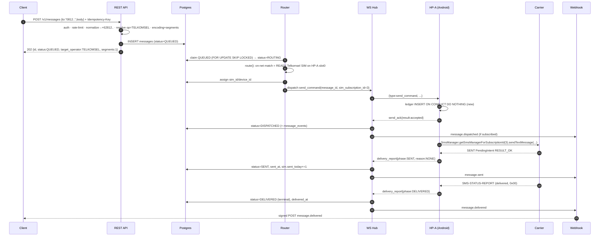

Every arrow into Postgres that changes `messages.status` also appends a `message_events` row
(contract A.7) — the audit trail that powers `GET /v1/messages/:id?include=events` and webhook
replay. This end-to-end **ACK path back to the server is exactly flaw F4 eliminated.**

---

<a name="6-ws-hub"></a>

## 6. The WS Hub — the realtime core

The Hub is the component that has no analog in `nsms_gateway` and is where F1/F2/F4/F9 are
actually fixed. It is the in-memory authority on *who is connected and reachable right now*.

### 6.1 In-memory structures (illustrative Go)

```go
// Hub owns all live device sockets and the routing-critical presence index.
type Hub struct {
    mu    sync.RWMutex
    conns map[uuid.UUID]*DeviceConn                 // device_id -> live connection
    byOp  map[Operator]map[uuid.UUID]*SimPresence   // operator -> sim_id -> presence
    // outstanding server-initiated frames awaiting ack (send_command, config, cancel, ping)
    pending map[string]*PendingFrame                // frame.id -> timer/retry state
}

type DeviceConn struct {
    DeviceID  uuid.UUID
    SessionID string                 // matches devices.session_id; guards single-conn rule
    send      chan Frame             // BOUNDED outbound queue -> write pump
    sims      map[int]*SimPresence   // slot_index -> presence
    lastSeen  atomic.Int64           // epoch ms, bumped by every inbound frame
    closeOnce sync.Once
}

type SimPresence struct {
    SimID          uuid.UUID
    DeviceID       uuid.UUID
    SubscriptionID int         // current Android subId — bind-only, never a cross-system key
    Operator       Operator    // TELKOMSEL | INDOSAT | XL | AXIS | TRI | SMARTFREN | UNKNOWN
    Status         SimStatus   // READY | ABSENT | DISABLED | QUOTA_EXCEEDED | COOLDOWN | UNKNOWN
    SentWindow     int         // rolling short-window counter (pacing / ban hygiene)
    LastSentAt     time.Time
}
```

`byOp` is the routing hot path: "give me a READY, enabled SIM on `TELKOMSEL`" is an O(1) map
lookup into a small set, mirroring the DB index `ix_sim_routing`. The DB is the durable truth;
`byOp` is the microsecond-latency live view the router consults.

### 6.2 Connection = ground-truth presence

- A device is **ONLINE** iff it has an entry in `conns` with a live socket. There is no
  "Active Users segment" guesswork (F9): connection existence *is* presence.
- On WS accept, the Hub verifies the `device_secret` hash, enforces the **single-connection
  rule** (close any prior socket for that `device_id` with `4001 "superseded"`, update
  `devices.session_id`), sends `welcome`, then ingests `hello` + the authoritative
  `sim_report`.
- On socket close (any cause), the Hub removes the device from `conns` and its SIMs from
  `byOp`, and marks `devices.status=OFFLINE`, `sims.status` untouched-but-unreachable (a SIM on
  an offline device is simply absent from `byOp`, so the router will never pick it).

### 6.3 Why the Hub is authoritative for routing

The router **never** dispatches to a SIM that is not currently in `byOp`. This is what makes
"send to a phone that is actually online, on the right operator, with quota left" a hard
guarantee rather than a hope — the precise opposite of broadcasting to a segment and praying
(F1/F9).

---

<a name="7-survival"></a>

## 7. Device survival: foreground service + FCM wake

A persistent WebSocket is only as good as the process holding it. Android aggressively kills
background apps (Doze, App Standby, OEM battery managers, user swipe-away). WSMS uses a
**two-layer defense**, each layer with a distinct, non-overlapping job.

### 7.1 The two layers

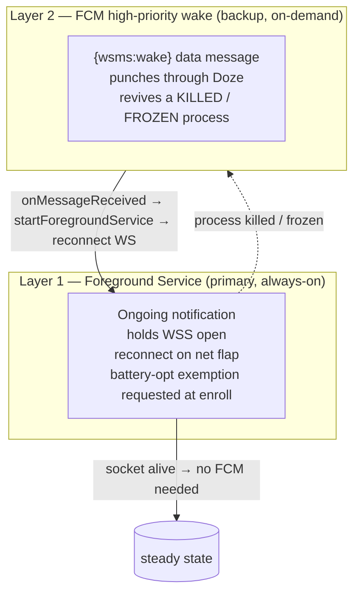

**Layer 1 — Foreground service (the default, 99% of the time).**
The app runs a foreground service with an ongoing notification. Foreground services are not
subject to normal background execution limits, so the WSS socket, heartbeats, and inbound
`send_command`s flow continuously while the process lives. At enrollment the app prompts for
the **battery-optimization exemption** (`ignoring_batt_opt` is reported in `hello`/`heartbeat`)
so OEM Doze does not freeze the socket during deep sleep. Network flaps are handled *inside*
this layer by immediate WS reconnect + `sim_report` replay.

**Layer 2 — FCM high-priority data message (the doorbell, on-demand only).**
When the process is **killed** (OS memory pressure, user swipe, OEM task-killer) or **frozen**
hard enough that the socket dies, Layer 1 is gone and the server sees the socket drop. The
**Wake service** then sends a **high-priority `data` FCM message** `{"wsms":"wake"}`. High-
priority data messages are delivered even in Doze (Android grants the app a brief allowlist
window), waking `FirebaseMessagingService.onMessageReceived`, which calls
`startForegroundService(...)` → the app reconnects the WSS → Layer 1 is restored →
queued `send_command`s dispatch.

> **Key reframing vs nsms_gateway (F8):** OneSignal *carried the SMS payload*. Here FCM carries
> **no payload and no SMS** — only a contentless wake ping. The actual send instruction always
> travels over our own authenticated WSS. FCM is a doorbell, not a mail carrier. If FCM is slow
> or drops the wake, the message simply waits in `QUEUED` and is retried on the next presence
> event or router scan — correctness never depends on FCM.

### 7.2 Exactly when each mechanism is used

| Situation | Layer 1 (FS/WSS) | Layer 2 (FCM wake) | Outcome |
|---|---|---|---|
| Steady state, app alive | Holds socket, heartbeats | **not used** | Commands dispatch instantly |
| Wi-Fi/LTE flap, app alive | Auto-reconnect + `sim_report` replay | not used | Brief gap, self-heals |
| Doze deep sleep, batt-opt exempt | FS keeps socket (maintenance windows) | not used unless socket dropped | Slower heartbeats, still reachable |
| Doze + socket dropped | dead until woken | **wake** on pending work | Reconnect → dispatch |
| Process killed / swiped away | dead | **wake** → `startForegroundService` | Revive → reconnect → dispatch |
| Phone rebooted | `BOOT_COMPLETED` receiver starts FS | wake also works post-boot | Auto-rejoin fleet |
| Phone powered off / no network | dead | wake undeliverable | Message stays `QUEUED` until TTL (§10) |

### 7.3 When does the server decide to fire a wake?

The Wake service fires FCM in two situations, never speculatively:

1. **On dispatch demand** — the router has a `QUEUED`/`ROUTING` message whose *only* viable
   SIM lives on a device that is currently **OFFLINE** (not in `conns`). Before failing or
   waiting, it triggers a wake and holds the message for the reconnect window.
2. **Presence reaper** — a periodic job notices a device that *should* be online (enrolled,
   enabled, has pending work) but has no live socket, and sends a wake to reestablish presence.

De-duplicated per device with a short cooldown (Redis key `wake:{device_id}` TTL ~30s) so a
burst of queued messages triggers at most one wake.

### 7.4 Device process state machine

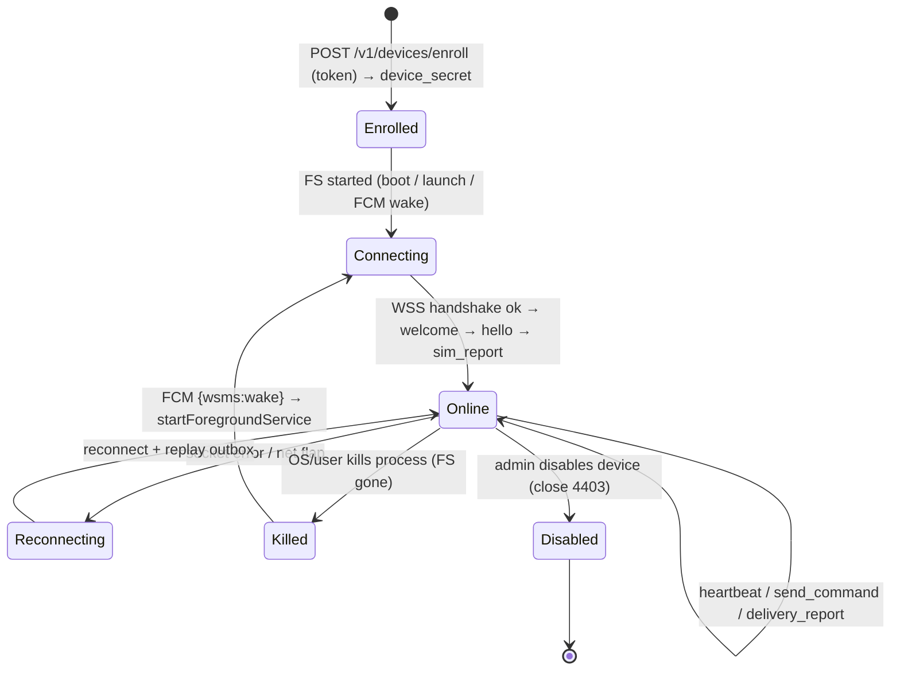

---

<a name="8-presence"></a>

## 8. Presence, heartbeat, reconnect & real-time device+SIM tracking

This section answers directly: **"how does the server know, in real time, which device and
which SIM is online?"**

### 8.1 Three tiers of presence truth

| Tier | Where | Latency | Meaning |
|---|---|---|---|
| **Live socket** | Hub `conns` map (in-mem) | µs | Device ONLINE *right now* — the ground truth |
| **SIM index** | Hub `byOp` map (in-mem) | µs | Which SIMs are READY, per operator — the routing view |
| **Durable state** | Postgres `devices.status`, `devices.last_seen_at`, `sims.status` | ms | Survives restart; reconciled from frames |
| **Cross-instance hint** | Redis `presence:{device_id}` | ms | (Scale-out only) which instance holds the socket |

The **live socket + SIM index** are what routing consults. Postgres is the durable mirror,
updated on every meaningful frame; Redis is only needed for multi-instance and for hot
counters (`sent_window`).

### 8.2 What updates presence, and from which frame

| Frame (device→server) | Effect on presence |
|---|---|
| WS connect + `hello` | Add to `conns`; `devices.status=ONLINE`, `session_id` set, `last_seen_at=now` |
| `sim_report` (authoritative) | Rebuild this device's `sims`: upsert by `device_id+slot_index`, refresh `subscription_id`, `operator` (derived server-side from `mcc/mnc`, confirmed by `msisdn` prefix if known), `carrier_name`, `status`; rebuild its slice in `byOp` |
| `heartbeat` | Bump `lastSeen`/`last_seen_at`; update coarse SIM health, battery |
| `status` (`sim_removed`, `radio_off`, …) | Flip affected `sims.status` (e.g. `ABSENT`), remove from `byOp`; `radio_off`/`battery_low` recorded |
| socket close | Remove from `conns`; strip all its SIMs from `byOp`; `devices.status=OFFLINE` |

The Hub always **acks** `sim_report`/`heartbeat`/`status`/`delivery_report` with a transport
`ack{ref:<frame.id>}` (contract C.6). A SIM present in one `sim_report` but missing from a
later one → its `sims.status` flips to `ABSENT` (contract C.4) and it leaves `byOp`.

### 8.3 Heartbeat & liveness derivation

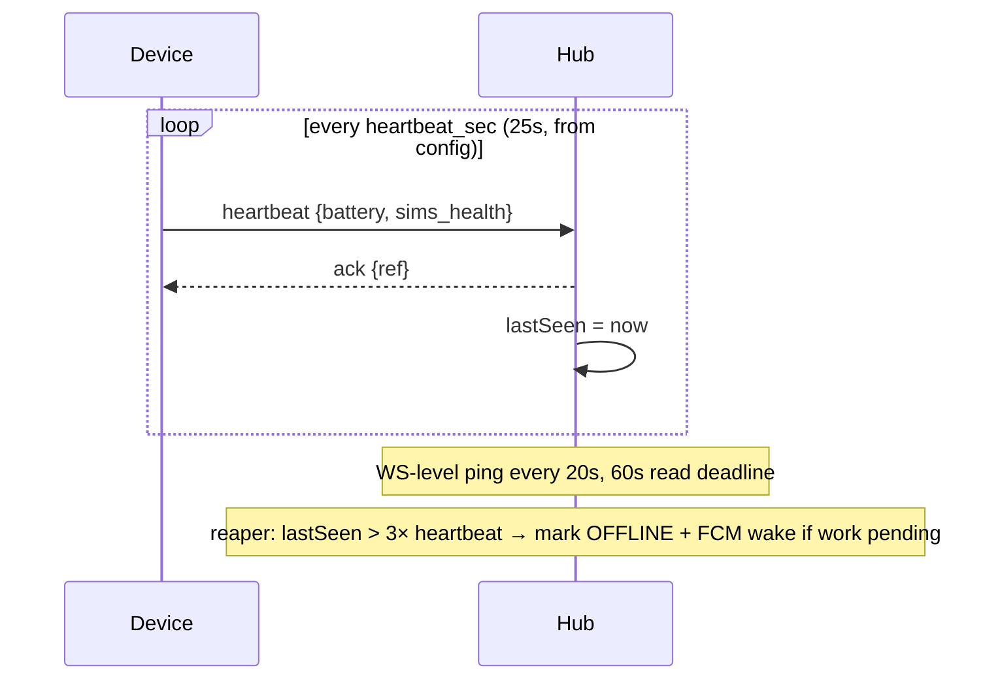

- **App-level heartbeat** every `heartbeat_sec` (25s default, pushed via `config`) carries
  battery + coarse SIM health.
- **WS-level ping** every 20s with a 60s read deadline catches dead sockets the OS hasn't
  reported yet.
- **Liveness rule:** if `now - lastSeen > 3 × heartbeat_sec` (~75s), the presence reaper marks
  the device `OFFLINE`, removes its SIMs from `byOp`, and — if it has pending work — fires an
  FCM wake ([§7.3](#7-survival)).

### 8.4 Reconnect & resume (no double-send)

On reconnect the device re-runs the handshake and **replays its on-device outbox** — any
`delivery_report`s the server never `ack`'d, plus a fresh `sim_report`. For each `DISPATCHED`
message assigned to this device with no terminal report, the server **does not** re-issue a new
`send_command`; it waits for the device's idempotency ledger to resolve state (contract C.6).
This is the seam where "reconnect" must never become "resend" — see [§9](#9-guarantee).

---

<a name="9-guarantee"></a>

## 9. Delivery-guarantee model (at-least-once + idempotent dedup)

### 9.1 The model in one line

**Transport is at-least-once; the *effect* (an actual SMS leaving a SIM) is exactly-once** —
achieved by idempotency keys at every hop, not by hoping messages aren't lost.

`nsms_gateway` has the opposite properties: pushes are *at-most-once* (lost pushes vanish
silently, F5) yet *duplicating* (a re-push broadcasts again, F1). WSMS inverts both.

### 9.2 The three guards (from contract §E), mapped onto the transport

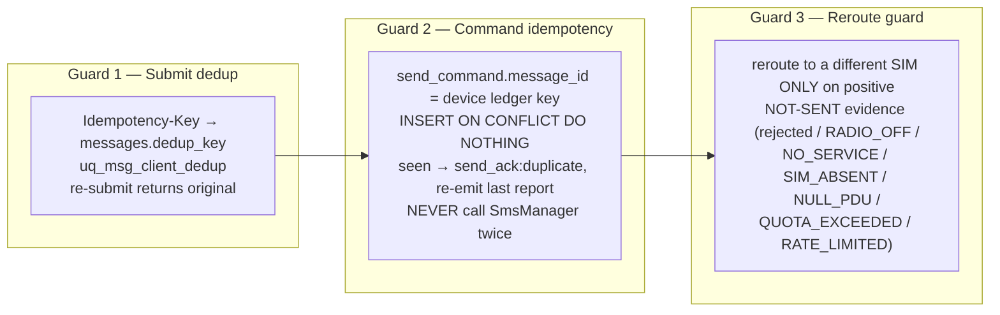

- **Guard 1 (client→server):** protects against the client double-submitting. Same
  `Idempotency-Key` → same `message` row → one send.
- **Guard 2 (server→device):** protects against **transport at-least-once**. The server may
  redeliver a `send_command` (same `message_id`, new frame `id`) after a lost `send_ack`; the
  device's local `outbox(message_id PK …)` makes the second delivery a no-op (`send_ack:
  duplicate` + re-emit last report). **`SmsManager` is invoked at most once per `message_id`.**
- **Guard 3 (server routing):** the reroute back-edge `DISPATCHED → ROUTING` fires **only**
  with positive evidence the SMS did **not** leave the phone. Ambiguity (command delivered but
  no `send_ack`; device vanished mid-flight) → the server **waits** on the same `message_id`/SIM
  and lets the device ledger or TTL resolve it. It **must not** pick a different SIM, because
  the first SIM may already have sent.

### 9.3 The ambiguity rule (why retry never becomes double-send)

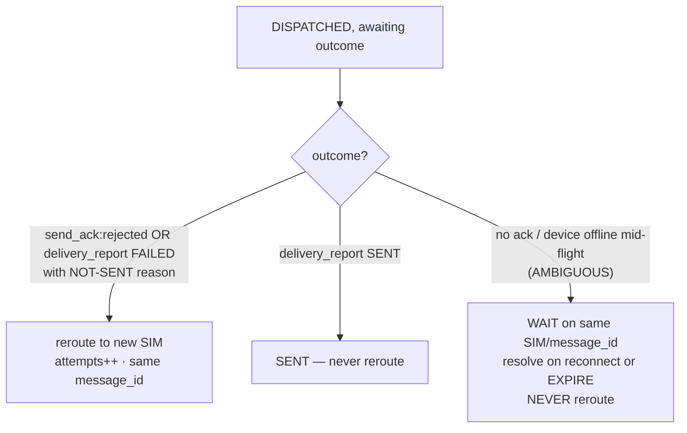

This single rule is the crux of correctness. It is why WSMS can offer "reliable delivery with
retry" while structurally guaranteeing what `nsms_gateway` could not: **exactly one SMS per
message, or zero + a terminal `FAILED`/`EXPIRED` — never two** (F1 + F5 jointly fixed).

### 9.4 Timeouts that make at-least-once concrete

| Waiter | Waits for | Timeout | Action |
|---|---|---|---|
| server after `send_command` | `send_ack` | `ack_timeout_sec` 15s | resend same command (new frame id), ≤3 transport redeliveries; device dedups |
| server after `send_ack:accepted` | `delivery_report(SENT)` | `send_wait_sec` 60s | keep `DISPATCHED`; re-query on reconnect; **do not reroute** (may be gone) — let TTL decide |
| device after `heartbeat` | `ack` | 10s | keep conn; escalate to reconnect after 3 misses |

---

<a name="10-backpressure"></a>

## 10. Backpressure & the "no device online" case

Because the queue (`messages` in Postgres) sits between submission and dispatch, WSMS decouples
*accepting* work from *having capacity to send it* — precisely the buffering `nsms_gateway`
lacks (F5). Multiple backpressure points protect the system and the SIMs.

### 10.1 The four backpressure points

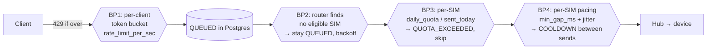

1. **BP1 — Ingress (client).** Per-client token bucket (`clients.rate_limit_per_sec`), backed
   by Redis. Over-limit → `429` with `Retry-After`. Stops a client from flooding the fleet.
2. **BP2 — Routing.** If no SIM is eligible *now* (none online / none on the matching operator
   under `ON_NET_STRICT`), the message stays `QUEUED` with exponential backoff
   `min(30s·2^(attempt-1), 10m) ±20%`, re-scanned on the next worker tick **and** eagerly on a
   presence event (a device coming online triggers a targeted re-scan of `QUEUED` work).
3. **BP3 — Per-SIM daily quota.** When `sent_today + segments > daily_quota`, the SIM flips to
   `QUOTA_EXCEEDED` and leaves the routing pool until the `00:00 Asia/Jakarta` reset. This is
   the anti-ban hygiene mandated by contract §Appendix, expressed as capacity backpressure.
4. **BP4 — Per-SIM pacing.** `send_command.pacing = {min_gap_ms, jitter_ms}` forces human-like
   spacing; a SIM sits in `COOLDOWN` between sends. Deliberate backpressure that trades
   throughput for **deliverability + ToS-compliance** (never framed as detection-evasion).

Additionally, each `DeviceConn.send` channel is **bounded**; if a device is momentarily slow,
the write pump applies flow control and the router leaves the message `DISPATCHED`/`ROUTING`
rather than blowing memory — the socket itself is a backpressure signal, something a blind
broadcast can never provide.

### 10.2 What happens when NO device is online

This is the scenario `nsms_gateway` handles worst (the push simply evaporates, F5/F9). WSMS
handles it as a first-class state:

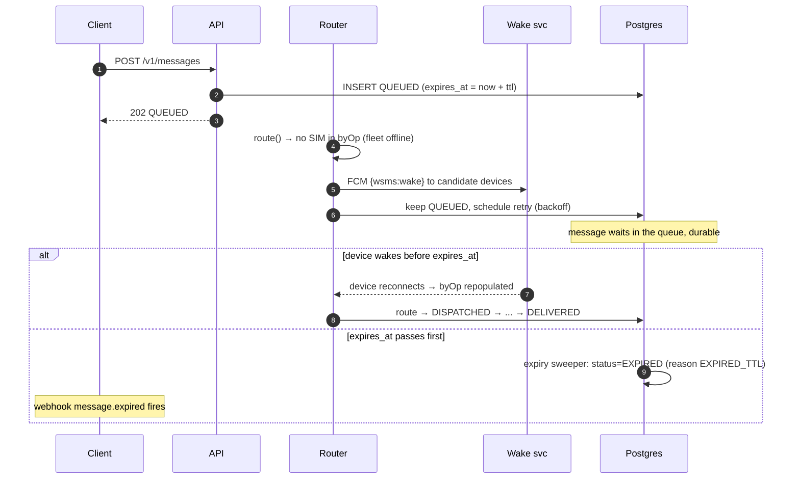

Concretely:

- The message is **accepted and persisted** (`202`, `QUEUED`). Acceptance never depends on a
  phone being online — the client gets a durable receipt, not a silent drop.
- The router cannot route it, so it **stays `QUEUED`** and the Wake service fires an FCM wake
  ([§7.3](#7-survival)) to try to bring a device back.
- If a device comes online before `expires_at`, its `welcome`/`sim_report` repopulates `byOp`,
  a presence-triggered re-scan picks the waiting message up, and it flows normally.
- If `expires_at` passes first, the **TTL expiry sweeper** (index `ix_msg_expiry`) transitions
  it to `EXPIRED` with `last_reason = EXPIRED_TTL`, writes a `message_events` row, and fires the
  `message.expired` webhook. The client is *told*, not left guessing.
- `ON_NET_STRICT` with a matching-operator SIM never appearing terminates
  `FAILED / NO_MATCHING_OPERATOR_SIM` at TTL; `ON_NET_PREFERRED` (the owner's default) falls
  back to a random available SIM the moment any SIM is online, per the routing decision in
  contract §D.

Default TTL is `created_at + 6h` (contract A.6), overridable via `ttl_seconds` (60..86400).

---

<a name="11-failure"></a>

## 11. Failure domains & degradation matrix

| Failure | Detection | Behavior | Client-visible |
|---|---|---|---|
| One device offline | socket close / reaper | Its SIMs leave `byOp`; router uses other SIMs or `ON_NET_PREFERRED` fallback; FCM wake attempted | Transparent unless it was the only matching SIM |
| Whole fleet offline | `byOp` empty; `readyz` 503 | Messages buffer in `QUEUED`; wake attempts; `EXPIRED` at TTL | `202` on submit; `message.expired` if TTL hits |
| SIM hits daily quota | `sent_today ≥ daily_quota` | SIM → `QUOTA_EXCEEDED`, skipped till reset; other SIMs used | Transparent (or `FAILED` if strict + only that SIM) |
| SIM banned/blocked by carrier | `delivery_report FAILED` patterns | Reroute on NOT-SENT reason; admin alerts; SIM can be `DISABLED` | Retries then `FAILED` if `ROUTE_EXHAUSTED` |
| FCM wake fails/slow | no reconnect within window | Message stays `QUEUED`; correctness unaffected | Delay, then delivery or `EXPIRED` |
| Postgres down | health probes | API `readyz` 503; no new accepts; Hub buffers reports in Redis/outbox | `503` on submit |
| Redis down | probes | Fall back to DB-only counters (slower); presence still from live sockets | Minor latency |
| Duplicate WS (same device) | second connect | Older socket closed `4001 superseded`; one session survives | None — prevents split delivery (F1) |
| Lost `send_ack` | `ack_timeout_sec` | Redeliver same `message_id`; device dedups | None — no double-send (F5) |

`GET /v1/readyz` returns `200` only if DB reachable **and** ≥1 device ONLINE **and** ≥1 SIM
READY — i.e. it reports the fleet truth the Hub holds, not a guess.

---

<a name="12-master"></a>

## 12. Master contrast table — every nsms_gateway flaw → WSMS fix

| # | nsms_gateway flaw | WSMS architectural fix | Where |
|---|---|---|---|
| F1 | Broadcast → duplicate SMS to recipient | Unicast `send_command` to one `sim_id`; single-connection rule; idempotent `message_id`; reroute only on not-sent evidence | §6, §9 |
| F2 | No device/SIM targeting | Hub `byOp`/`conns` addressing; router assigns `assigned_sim_id`+`assigned_device_id`; command carries `sim_subscription_id` | §6, §8 |
| F3 | No operator routing (always cross-net) | Server prefix→`target_operator`; on-net match against live `byOp`; `ON_NET_PREFERRED` fallback to random SIM | §5, §8, contract §D |
| F4 | No delivery ACK back to server | `send_ack` + `delivery_report(SENT/DELIVERED/FAILED)` over the same WSS; `message_events` audit; signed webhooks | §5, §6, §9 |
| F5 | No queue / retry / idempotency | `messages` queue in Postgres; TTL/backoff retry; 3 idempotency guards; at-least-once transport + exactly-once effect | §9, §10 |
| F6 | No auth | REST Bearer `wsms_…` keys (Argon2id); device WS auth via enrolled `device_secret`; enrollment tokens | §2, §4, contract §A.3/C.2 |
| F7 | Dead `sms` plugin, single manual SIM | `SmsManager.getSmsManagerForSubscriptionId` per active subscription; dual-SIM enumerated via `sim_report`; multipart | §5, §6 |
| F8 | OneSignal carries payload, quota-limited, opaque | Self-hosted WSS carries every instruction/ACK; **FCM demoted to contentless wake doorbell**; correctness never depends on it | §3, §7 |
| F9 | Fire-and-forget; no presence knowledge | Live socket = ground-truth presence; heartbeat + reaper; `readyz` reflects real fleet capacity | §6, §8, §11 |

---

## Appendix — legal & deliverability reminder (carried from the contract)

The transport layer is engineered so that its **only** volume controls — per-SIM
`daily_quota`, `sent_today`/`sent_window` accounting, `pacing.min_gap_ms`+`jitter_ms`, SIM
rotation through the routing pool, and the `COOLDOWN`/`QUOTA_EXCEEDED` states — exist for
**ToS-compliance and deliverability**, not detection-evasion. Bulk/A2P SMS from ordinary
consumer SIMs is a **grey route** that violates carrier ToS and Indonesian A2P rules; carriers
detect high-volume P2P-shaped traffic and **block/ban SIMs**. This risk is real and is
surfaced to the owner plainly. For sustained or higher volume, the owner SHOULD move to a
licensed A2P / official sender channel. This architecture keeps volume low and paced by
design, but it cannot make a grey route legitimate.
