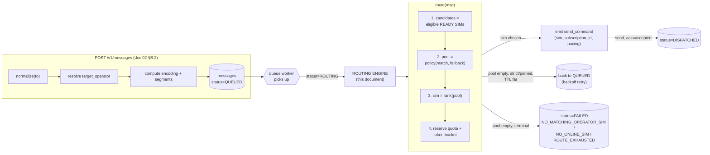
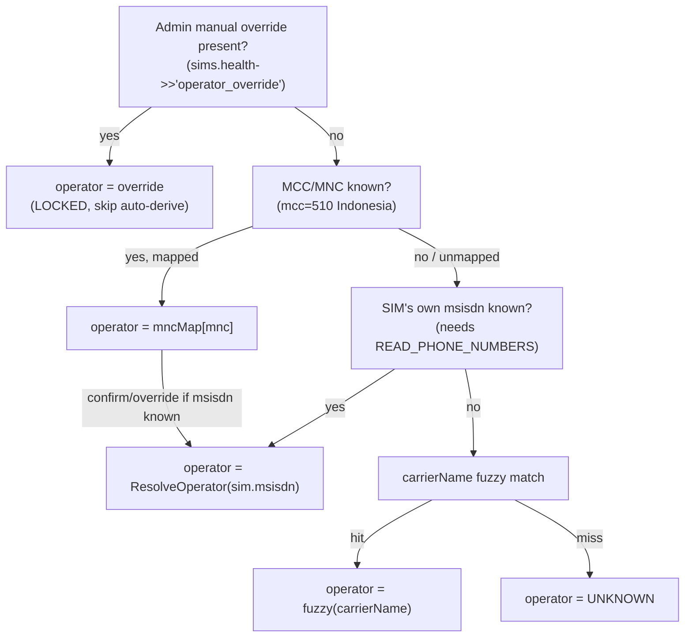
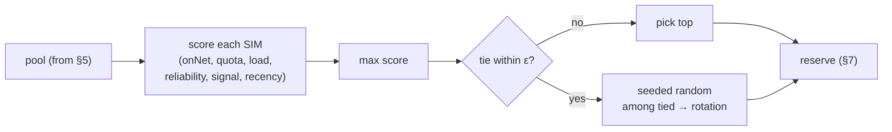
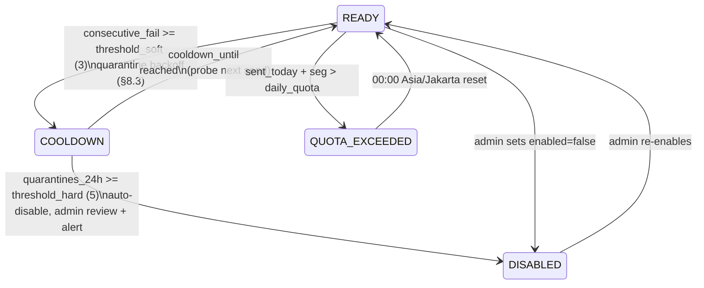
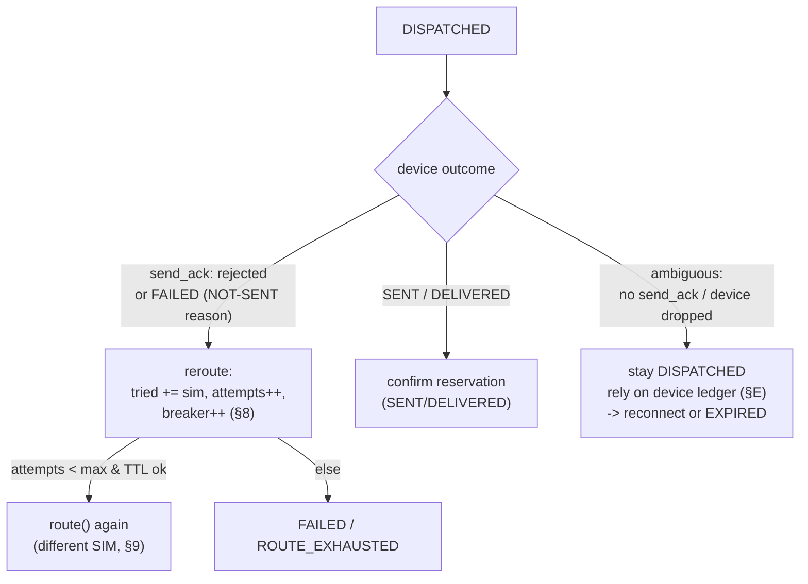

# 03 — Routing Engine (Operator-Aware SIM Selection)

> **Status:** Normative-adjacent. This document specifies the algorithm that turns a
> `QUEUED` message into a concrete `send_command` aimed at exactly one `sim_id` on one
> device. It **builds on** [`02 — Contract, Protocol & Schema`](#) and never redefines a
> schema, enum, or wire shape from it. Where a name is capitalized in `code`, it is a
> field/enum/frame from the contract. If this doc and the contract disagree, **the contract
> wins.**

The routing engine is the single component that answers the owner's core question:

> *"Nomor tujuan ini satu operator dengan SIM yang mana — dan kalau tidak ada, kirim lewat
> SIM mana pun yang siap?"*

It runs on the `QUEUED → ROUTING` transition of the [message state machine](#) and, on
success, produces the `ROUTING → DISPATCHED` transition by emitting a `send_command` WS frame.

---

## Table of Contents

- [0. Where routing sits in the lifecycle](#0-where-routing-sits)
- [1. Stage 1 — MSISDN normalization](#1-normalization)
- [2. Stage 2 — Operator detection from prefix](#2-operator-detection)
- [3. What "operator" means for a SIM (the other side of the match)](#3-sim-operator)
- [4. Stage 3 — Candidate gathering (eligibility filter)](#4-candidates)
- [5. Stage 4 — Policy pool selection (on-net + fallback)](#5-pool)
- [6. Stage 5 — Ranking the pool (beyond operator)](#6-ranking)
- [7. Per-SIM rate limiting, pacing & jitter](#7-pacing)
- [8. SIM quarantine / circuit breaker](#8-quarantine)
- [9. Full `route()` reference implementation](#9-route)
- [10. Worked examples](#10-examples)
- [11. Reroute & the no-double-send interplay](#11-reroute)
- [12. Observability](#12-observability)
- [13. Configuration knobs (summary)](#13-config)

---

<a name="0-where-routing-sits"></a>

## 0. Where routing sits in the lifecycle



Two things are computed **at submit time** (before `QUEUED`) and are therefore *inputs* to
routing, already persisted on the `messages` row:

- `TargetMSISDN` — canonical E.164 (`+62…`), via [normalization](#1-normalization).
- `TargetOperator` (`operator_t`) — via [prefix resolution](#2-operator-detection).
- `Encoding` + `Segments` — routing needs `Segments` for the quota check.

The engine itself is **pure selection + reservation**. It is invoked by the queue worker and
must be:

- **Deterministic given a snapshot** — same fleet state → same decision (modulo the random
  tie-break, which is seeded per call for reproducibility in tests).
- **Fast** — the hot path is a single indexed query (`ix_sim_routing`) + an in-memory rank.
- **Reservation-safe** — the chosen SIM's quota/rate counters are incremented **before** the
  `send_command` leaves, under a per-SIM lock, so two concurrent routes never over-book one SIM.

---

<a name="1-normalization"></a>

## 1. Stage 1 — MSISDN normalization

Every number — the client's `to` **and** every SIM-reported `msisdn` — is forced into the
canonical form **E.164 with leading `+`** (`+628123456789`) *before* any prefix match or DB
write. This mirrors contract §0.3 exactly; it is reproduced here as runnable Go because it is
the literal first line of the routing pipeline.

```go
package routing

import (
    "errors"
    "regexp"
    "strings"
)

var (
    ErrInvalidMSISDN = errors.New("INVALID_MSISDN")

    // strip cosmetic characters: spaces, dashes, parentheses, dots
    reStrip = regexp.MustCompile(`[\s\-().]`)
    // Indonesian mobile: +62 followed by 8..13 digits
    reE164ID = regexp.MustCompile(`^\+62\d{8,13}$`)
)

// NormalizeMSISDN implements contract §0.3 normalize().
func NormalizeMSISDN(raw string) (string, error) {
    s := reStrip.ReplaceAllString(raw, "")
    switch {
    case strings.HasPrefix(s, "+62"): // already canonical country code
        // keep as-is
    case strings.HasPrefix(s, "62"): // "628.." -> "+628.."
        s = "+" + s
    case strings.HasPrefix(s, "0"): // "0812.." -> "+62812.."
        s = "+62" + s[1:]
    case strings.HasPrefix(s, "8"): // bare national "812.." -> "+62812.."
        s = "+62" + s
    default:
        return "", ErrInvalidMSISDN
    }
    if !reE164ID.MatchString(s) {
        return "", ErrInvalidMSISDN // non-Indonesian / non-mobile / too short/long
    }
    return s, nil
}
```

**Rejection is a hard `400 INVALID_MSISDN`** at submit (never a silent pass to routing). A
foreign number (`+1202…`), a landline that fails the `^\+62\d{8,13}$` shape, or garbage never
reaches the queue. Because both target numbers and SIM numbers pass through the same function,
a Telkomsel SIM that reports `0812…` and a target of `+62812…` compare on identical strings.

> **Ordering caveat (important):** the `+62` case is tested **before** the bare `62` case, and
> `0` before `8`, because the branches are prefix-overlapping. Keep this order.

Deriving the **national `08xx` routing key** from canonical (contract §0.3):

```go
// localPrefix4("+6281234567890") -> "0812"
func localPrefix4(canonical string) string {
    // canonical is guaranteed "+62" + >=8 digits here
    local := "0" + canonical[3:] // drop "+62", prepend "0"
    return local[:4]
}
```

---

<a name="2-operator-detection"></a>

## 2. Stage 2 — Operator detection from prefix

The **target** operator is resolved from the routing prefix against the `operator_prefixes`
table (contract §A.8), which is the DB-backed source of truth loaded into an in-memory map at
boot and refreshed on change. The hardcoded map below is the **seed / fallback** and the
compiled mirror of that table — identical to the contract's normative seed.

```go
// Operator is the operator_t enum (contract §0.4 / §A.2).
type Operator string

const (
    Telkomsel Operator = "TELKOMSEL"
    Indosat   Operator = "INDOSAT"
    XL        Operator = "XL"
    Axis      Operator = "AXIS"
    Tri       Operator = "TRI"
    Smartfren Operator = "SMARTFREN"
    Unknown   Operator = "UNKNOWN"
)

// prefixSeed mirrors the operator_prefixes seed (contract §A.8).
// Loaded into an atomic.Value map at boot; hot-reloaded on LISTEN/NOTIFY.
var prefixSeed = map[string]Operator{
    // Telkomsel
    "0811": Telkomsel, "0812": Telkomsel, "0813": Telkomsel,
    "0821": Telkomsel, "0822": Telkomsel, "0823": Telkomsel,
    "0851": Telkomsel, "0852": Telkomsel, "0853": Telkomsel,
    // Indosat (IM3)
    "0814": Indosat, "0815": Indosat, "0816": Indosat,
    "0855": Indosat, "0856": Indosat, "0857": Indosat, "0858": Indosat,
    // XL Axiata
    "0817": XL, "0818": XL, "0819": XL, "0859": XL, "0877": XL, "0878": XL,
    // Axis (owned by XL Axiata, kept DISTINCT for on-net cost correctness)
    "0831": Axis, "0832": Axis, "0833": Axis, "0838": Axis,
    // Tri / 3 (Hutchison; merged into Indosat Ooredoo Hutchison 2022 but DISTINCT network)
    "0895": Tri, "0896": Tri, "0897": Tri, "0898": Tri, "0899": Tri,
    // Smartfren
    "0881": Smartfren, "0882": Smartfren, "0883": Smartfren, "0884": Smartfren,
    "0885": Smartfren, "0886": Smartfren, "0887": Smartfren, "0888": Smartfren, "0889": Smartfren,
}

// ResolveOperator maps a canonical MSISDN to its operator (contract §A.8 resolve()).
func (t *PrefixTable) ResolveOperator(canonical string) Operator {
    if op, ok := t.load()[localPrefix4(canonical)]; ok {
        return op
    }
    return Unknown // new/ported/short-code range not in the table
}
```

### 2.1 The two caveats you must not forget

1. **No full mobile MNP in Indonesia.** Indonesia has no comprehensive mobile number
   portability, so `prefix → operator` is a **strong heuristic, not a guarantee**. A number
   *could* be on a different network than its prefix implies (edge cases: legacy fixed-wireless
   ranges, corporate ports, sub-brands). **This heuristic being imperfect is the entire reason
   the [fallback](#5-pool) exists** and why we record `on_net` (whether the actual send matched)
   rather than trusting the prediction.

2. **Merged owners, distinct networks.** `INDOSAT` and `TRI` share a corporate parent (Indosat
   Ooredoo Hutchison, 2022) and `XL` and `AXIS` share XL Axiata — **but their prefixes,
   networks, and on-net tariffs remain operationally separate.** The engine therefore treats
   all six as **distinct operators**. An Axis SIM is on-net for an Axis target **only**, never
   for an XL target. This is the conservative, cost-correct choice: it will never claim an
   on-net send that isn't one. (If the owner later confirms XL↔Axis on-net billing, that is a
   *policy* change expressed as an operator-equivalence set — see §5.3 — not a change to
   detection.)

3. **`UNKNOWN` target.** If the prefix is not in the table, `TargetOperator = UNKNOWN`. No SIM
   can ever be an on-net match for `UNKNOWN` (a SIM whose own operator is `UNKNOWN` still is not
   a *match* — see [§5.2](#5-pool)). Consequences:
   - `ON_NET_STRICT` / `PINNED-to-wrong-op` on an `UNKNOWN` target → the on-net pool is
     permanently empty → the message eventually terminates `FAILED / NO_MATCHING_OPERATOR_SIM`.
   - `ON_NET_PREFERRED` / `ANY` → routes straight to fallback (random ready SIM). This is the
     right behavior: we still *try* to deliver, we just can't promise on-net.

---

<a name="3-sim-operator"></a>

## 3. What "operator" means for a SIM (the other side of the match)

Matching needs an operator on **both** sides. The target's operator comes from the prefix; the
SIM's operator (`sims.Operator`) is reconciled by the server from each `sim_report` frame
(contract §C.4). `carrierName` alone is **not** trustworthy:

- It is a free-form string set by carrier config (`SubscriptionInfo.getCarrierName()`); OEM
  skins and user relabeling can change it.
- Under roaming it shows the *visited* network, not the SIM's home operator.
- Sub-brands report their own name (`by.U`, `Live.On`, `MPWR`) that a naive string match misses.

So the server resolves `sims.Operator` by a **precedence ladder** (highest wins):



### 3.1 MCC/MNC is the primary signal

The SIM reports `mcc`/`mnc` in `sim_report` (contract §C.4). For Indonesia `mcc="510"`. MNC is
the **home network** identity — far more reliable than the display name:

```go
// mncToOperator: Indonesia (MCC 510). Authoritative for on-net decisions.
var mncToOperator = map[string]Operator{
    "10": Telkomsel, // + MVNOs on Telkomsel core (by.U) report 510-10
    "01": Indosat, "21": Indosat, // IM3 Ooredoo (01 legacy, 21 IM3)
    "11": XL,
    "08": Axis,      // Axis on XL Axiata core, DISTINCT operator
    "89": Tri,       // 3 / Hutchison
    "09": Smartfren, "28": Smartfren,
}

func operatorFromMNC(mcc, mnc string) (Operator, bool) {
    if mcc != "510" {
        return Unknown, false // foreign SIM (e.g. roaming test SIM) — not on-net-classifiable
    }
    op, ok := mncToOperator[mnc]
    return op, ok
}
```

### 3.2 Reconciliation rule (server-side, per `sim_report`)

```text
reconcileSimOperator(report):
  if health.operator_override present:      # admin escape hatch, §3.3
      return override                       # LOCKED — never auto-changed
  op, ok = operatorFromMNC(report.mcc, report.mnc)
  if report.msisdn != null:
      pxOp = ResolveOperator(normalize(report.msisdn))
      if pxOp != UNKNOWN:
          return pxOp                        # a known own-number is the strongest evidence
  if ok:                                     # trust MNC
      return op
  if fuzzyCarrier(report.carrier_name) != UNKNOWN:
      return fuzzyCarrier(report.carrier_name)   # last resort
  return UNKNOWN
```

`fuzzyCarrier` is a lowercase-contains matcher (`"telkomsel"`, `"indosat"`/`"im3"`, `"xl"`,
`"axis"`, `"tri"`/`"3"`/`"hutchison"`, `"smartfren"`) used **only** when MNC is absent.

### 3.3 Manual override (admin escape hatch)

Because prefix/MNC/carrier can all be wrong for an odd SIM, an operator can **pin** a SIM's
operator from the admin UI. To avoid redefining the `sims` schema, the override is stored in
the **existing** `sims.Health` JSONB as `{"operator_override":"XL"}`. When present:

- `sims.Operator` is set to the override and the reconciler **never** auto-changes it.
- The SIM is treated as on-net for that operator's targets and off-net for all others.

This is the honest answer to *"apa kalau `carrierName` bohong?"*: MNC first, own-number second,
name last, and a human override that beats them all.

---

<a name="4-candidates"></a>

## 4. Stage 3 — Candidate gathering (eligibility filter)

Before any policy or ranking, the engine computes the **candidate set**: SIMs that are
*eligible to send this message right now*, independent of operator. This is one indexed query
backed by `ix_sim_routing` (contract §A.5) plus the message's `Segments`:

```sql
-- $1 = msg.segments
SELECT s.*
FROM sims s
JOIN devices d ON d.id = s.device_id
WHERE s.deleted_at IS NULL
  AND s.enabled = true                       -- admin master switch (contract §A.5)
  AND s.status = 'READY'                      -- excludes ABSENT/DISABLED/QUOTA_EXCEEDED/COOLDOWN/UNKNOWN
  AND d.status = 'ONLINE'                      -- device WS session live (contract §A.4)
  AND (s.sent_today + $1) <= s.daily_quota     -- daily segment cap has headroom
ORDER BY s.sent_window ASC;                     -- cheap LRU-ish pre-sort (final rank in §6)
```

A SIM is **excluded** by construction if any of these hold — and each maps to a contract
`failure_reason_t` used when the whole set collapses:

| Condition | `sim_status_t` / cause | If it makes the set empty |
|---|---|---|
| `enabled = false` | admin `DISABLED` master switch | → `NO_ONLINE_SIM` |
| `status != READY` | `ABSENT` / `DISABLED` / `QUOTA_EXCEEDED` / `COOLDOWN` / `UNKNOWN` | → `NO_ONLINE_SIM` / `QUOTA_EXCEEDED` |
| `device.status != ONLINE` | WS down / not enrolled | → `DEVICE_OFFLINE` / `NO_ONLINE_SIM` |
| `sent_today + segments > daily_quota` | anti-ban daily cap | → `QUOTA_EXCEEDED` |

> **`COOLDOWN` and `QUOTA_EXCEEDED` are surfaced as `status != READY`**, so the eligibility
> query naturally skips a paced or capped SIM without any special-casing. The pacing engine
> (§7) and quarantine (§8) are the two things that *set* those statuses.

The candidate set is loaded once per `route()` call, held in memory, and passed to §5 and §6.

---

<a name="5-pool"></a>

## 5. Stage 4 — Policy pool selection (on-net + fallback)

Given the candidate set and the message's `RoutingPolicy` (`routing_policy_t`), the engine
narrows candidates to a **pool** to rank. This is where "same operator as the target"
(on-net) and the owner's **random fallback** live. It is the exact contract §D `route()`
switch, made concrete.

```go
type Policy string

const (
    OnNetPreferred Policy = "ON_NET_PREFERRED" // default: prefer on-net, else random (owner's ask)
    OnNetStrict    Policy = "ON_NET_STRICT"    // on-net only, else wait/FAIL
    Any            Policy = "ANY"              // any ready SIM, on-net only as a soft tiebreak
    Pinned         Policy = "PINNED"           // exactly the client-chosen sim
)

func selectPool(msg Message, cands []SIM) []SIM {
    // on-net = SIM whose operator equals the target's operator (contract §0.4)
    match := filter(cands, func(s SIM) bool {
        return sameOperator(s.Operator, msg.TargetOperator)
    })

    switch Policy(msg.RoutingPolicy) {
    case Pinned:
        return filter(cands, func(s SIM) bool { return s.ID == *msg.RequestedSIMID })
    case OnNetStrict:
        return match // may be empty -> caller decides wait vs FAIL
    case OnNetPreferred:
        if len(match) > 0 {
            return match // prefer on-net (cheaper/free)
        }
        return cands // FALLBACK: the whole eligible set -> random ready SIM
    case Any:
        return cands // on-net becomes a soft ranking bonus in §6, not a hard filter
    default:
        return cands
    }
}
```

### 5.1 The fallback, precisely

The owner's requirement — *"kalau ndak ada SIM se-operator, kirim lewat SIM mana saja yang
siap"* — is **exactly** the `ON_NET_PREFERRED` branch: `match` if non-empty, else the full
eligible candidate set. "Random" is realized in [§6 ranking](#6-ranking): among the fallback
pool, a least-loaded-then-random pick is made, so the fallback SIM rotates instead of always
being the same phone.

`on_net` on the `messages` record and in every API/webhook payload is set to
`sameOperator(assignedSIM.Operator, msg.TargetOperator)` **after** selection — it records what
*actually* happened, not the prediction.

### 5.2 `sameOperator` and `UNKNOWN`

```go
func sameOperator(sim, target Operator) bool {
    if sim == Unknown || target == Unknown {
        return false // UNKNOWN never counts as an on-net match (§2.1, §3)
    }
    return sim == target
}
```

An `UNKNOWN` target or an `UNKNOWN`-operator SIM is never a match, so on-net pools exclude
them; they remain usable only via the fallback / `ANY` pool.

### 5.3 Operator-equivalence sets (future policy hook)

`sameOperator` is intentionally a function, not `==`, so a future owner decision ("treat XL and
Axis as on-net") becomes a config-only equivalence table:

```go
// default: identity (each operator on-net to itself only — conservative & correct today)
var onNetEquiv = map[Operator]map[Operator]bool{ /* empty => strict identity */ }
```

No detection or schema change required. Ships **off** by default (§2.1 caveat 2).

### 5.4 Empty-pool decision

When the pool is empty, the engine does **not** immediately fail every case — it honors TTL:

```text
if pool is empty:
  switch policy:
    ON_NET_STRICT, PINNED:
       if now < msg.expires_at - GRACE:  -> back to QUEUED (retry later; a matching SIM may come online)
       else:                             -> FAILED (NO_MATCHING_OPERATOR_SIM for strict / ROUTE_EXHAUSTED for pinned)
    ON_NET_PREFERRED, ANY:
       # pool empty here means the *whole eligible set* was empty (no READY SIM at all)
       if now < msg.expires_at - GRACE:  -> back to QUEUED
       else:                             -> FAILED (NO_ONLINE_SIM)
```

`GRACE` (default 60s) prevents a pointless re-queue when TTL is about to lapse anyway. Every
transition writes a `message_events` row (`ROUTED` / `FAILED` with the mapped `reason`).

---

<a name="6-ranking"></a>

## 6. Stage 5 — Ranking the pool (beyond just operator)

Picking *any* on-net SIM is not enough: hammering one SIM burns its daily quota, trips its rate
window, and — critically for §8 — looks like exactly the bulk-P2P pattern carriers ban. So
among the pool the engine ranks by a **weighted score** and picks the top (with a random
tie-break). The score reduces to the contract's baseline "`min(sent_window)`, tie-break random"
when only the load weight is non-zero, so the MVP and the full engine share one code path.

### 6.1 Signals (each normalized to `[0,1]`, higher = better)

| Signal | Formula | Rationale |
|---|---|---|
| `onNet` | `1` if `sameOperator(sim, target)` else `0` | soft on-net preference inside a mixed `ANY` pool (constant inside an on-net-only pool) |
| `quotaHeadroom` | `(DailyQuota − SentToday) / DailyQuota` | spread load off SIMs near their daily cap |
| `loadInv` | `1 − min(SentWindow / windowCap, 1)` | favor the SIM with the emptiest short-term rate window (this **is** the least-loaded signal) |
| `reliability` | `1 − ewmaFailRate(sim)` | avoid a SIM that has been failing (health score, §8) |
| `signal` | `clamp01((signalDbm + 120) / 70)` | −120 dBm→0, −50 dBm→1; a stronger radio sends faster/cleaner |
| `recency` | `clamp01((now − LastSentAt) / spread)` | LRU: reward the SIM idle the longest → rotation |

`windowCap = perSimRatePerMin × windowMinutes` (the SIM's short-window budget, §7). `spread`
defaults to 10 minutes. `signalDbm` comes from `sims.Health.signal_dbm`; missing → treat as
neutral `0.5`.

### 6.2 The score

```go
type Weights struct {
    OnNet, Quota, Load, Reliability, Signal, Recency float64
}

// Default weights. Load dominates (least-recently/least-loaded), on-net is a strong soft bonus,
// reliability + quota guard against burning or over-using a SIM.
var DefaultWeights = Weights{
    OnNet:       0.30,
    Quota:       0.15,
    Load:        0.25,
    Reliability: 0.15,
    Signal:      0.05,
    Recency:     0.10,
}

func scoreSIM(s SIM, msg Message, w Weights, now time.Time) float64 {
    onNet := b2f(sameOperator(s.Operator, Operator(msg.TargetOperator)))
    quota := headroom(s)                          // (quota - sentToday)/quota
    load  := 1 - clamp01(float64(s.SentWindow)/windowCap(s))
    rel   := 1 - ewmaFailRate(s.ID)               // §8, from Redis
    sig   := clamp01((signalDbm(s) + 120) / 70)
    rec   := clamp01(sinceLastSent(s, now) / spread)

    return w.OnNet*onNet + w.Quota*quota + w.Load*load +
        w.Reliability*rel + w.Signal*sig + w.Recency*rec
}

// pick returns the best-scoring SIM; ties (within epsilon) break by seeded random -> rotation.
func pick(pool []SIM, msg Message, now time.Time, rng *rand.Rand) SIM {
    best := pool[0]
    bestScore := scoreSIM(best, msg, DefaultWeights, now)
    tied := []SIM{best}
    for _, s := range pool[1:] {
        sc := scoreSIM(s, msg, DefaultWeights, now)
        switch {
        case sc > bestScore+1e-9:
            best, bestScore, tied = s, sc, []SIM{s}
        case math.Abs(sc-bestScore) <= 1e-9:
            tied = append(tied, s)
        }
    }
    return tied[rng.Intn(len(tied))] // "random available SIM" happens here
}
```

### 6.3 Why this satisfies "load-balancing" and "random fallback" at once

- **Weighted round-robin / LRU** emerges from `loadInv` + `recency`: the more a SIM was used
  recently, the lower its score, so traffic spreads across the fleet instead of pinning HP-A.
- **The owner's random fallback** is the tie-break: in a fallback pool where several off-net
  SIMs are roughly equal, one is chosen at random and rotates on the next message.
- **MVP escape hatch:** set `Weights{Load:1}` → the engine collapses to exactly the contract's
  `min(sent_window)` + random tie-break. Nothing else changes.



---

<a name="7-pacing"></a>

## 7. Per-SIM rate limiting, pacing & jitter

This section is **ToS-compliance and deliverability hygiene**, not detection-evasion (contract
Appendix). Consumer SIMs sending A2P-shaped traffic get banned when they fire fast, evenly, and
in bulk. The engine spaces sends per SIM and paces them with human-like jitter. Two enforcement
layers, both keyed by `sim_id`:

### 7.1 Layer 1 — server reservation (token bucket + daily cap)

At the moment a SIM is chosen (§6), **before** the `send_command` is emitted, the engine takes
a per-SIM lock and reserves capacity atomically:

```text
reserve(sim, msg) under lock sim_id (Redis):
  # 1) daily segment cap (contract §A.5)
  if sim.sent_today + msg.segments > sim.daily_quota:
      set sim.status = QUOTA_EXCEEDED ; return REJECT(QUOTA_EXCEEDED)

  # 2) short-window token bucket (rolling window rate limit)
  bucket = tokenBucket("rl:sim:"+sim.id, capacity=burst, refillPerSec=perSimRate)
  if not bucket.tryTake(1):
      set sim.status = COOLDOWN (short) ; return REJECT(RATE_LIMITED)

  # 3) minimum inter-send gap on THIS sim (spacing, not burst)
  if now - sim.last_sent_at < min_gap_ms:
      return DEFER  # caller re-queues; another SIM may be picked instead

  # commit the reservation (optimistic; rolled back if send_ack=rejected)
  sim.sent_today  += msg.segments
  sim.sent_window += 1          # rolling 60s counter, mirrored Redis + snapshot to sims.SentWindow
  sim.last_sent_at = now
```

- **`sent_today`** is the persisted daily segment counter, reset by the `00:00 Asia/Jakarta`
  cron (contract §A.5). When it would overflow `daily_quota`, the SIM flips to
  `QUOTA_EXCEEDED` and is skipped until reset.
- **`sent_window`** is the rolling short-window counter (contract §A.5: "last 60s, maintained
  in Redis + snapshotted"). It is both the token-bucket ledger and the `loadInv` ranking input.
- **Rollback:** if the device answers `send_ack: rejected` (SMS never left), the reservation is
  reversed (`sent_today -= segments`) so a rejected attempt does not consume quota. A `SENT`
  confirms the reservation permanently (the `phase:"SENT"` handler in contract §C.4 already
  does `sim.sent_today += segments`; the engine's optimistic reserve + rollback keeps these
  consistent — reserve on dispatch, reconcile on the report, never double-count).

### 7.2 Layer 2 — device pacing (jitter, human-like spacing)

The server hands the device the pacing envelope inside `send_command.data.pacing` (contract
§C.5). The device holds the SMS for a human-like interval measured from *its own* last send on
that physical SIM:

```json
"pacing": { "min_gap_ms": 4000, "jitter_ms": 2500 }
```

```text
device, before calling SmsManager for sim s:
  wait_until = s.local_last_sent + min_gap_ms + rand(0, jitter_ms)
  sleep until wait_until
  send (SmsManager.getSmsManagerForSubscriptionId(sim_subscription_id))
```

So real spacing on a SIM is `min_gap_ms + U(0, jitter_ms)` — e.g. 4.0–6.5 s — irregular, not a
metronome. `min_gap_ms`/`jitter_ms` are per-SIM, pushed via the `config` frame and defaulted
from `sims`-level config. The server's Layer-1 `min_gap_ms` gate and the device's Layer-2 sleep
are the **same budget** enforced on both ends so a lost/queued command can't bypass spacing.

### 7.3 Defaults (small owned fleet, 3–10 phones)

| Knob | Default | Meaning |
|---|---|---|
| `daily_quota` | 200 segments/SIM/day | contract §A.5 default; keep volume low |
| `perSimRate` | 1 msg / 15 s (≈4/min) | token-bucket refill |
| `burst` | 2 | token-bucket capacity |
| `min_gap_ms` | 4000 | hard floor between two sends on one SIM |
| `jitter_ms` | 2500 | random add-on for human-like pacing |
| `windowMinutes` | 1 | rolling window for `sent_window` |

These are deliberately conservative. **The ban risk is real and surfaced to the owner
(contract Appendix); for sustained/higher volume the owner should move to a licensed A2P
channel.** The engine caps volume — it does not try to look like something it isn't.

---

<a name="8-quarantine"></a>

## 8. SIM quarantine / circuit breaker

A SIM that keeps failing is either radio-sick or **getting blocked by its carrier**. Continuing
to route to it wastes attempts and deepens the ban. The engine runs a per-SIM circuit breaker
on top of the health/reliability signal from §6.

### 8.1 What counts against a SIM

Only **not-sent, sender-side** failures — the same NOT-SENT class the [reroute guard](#11-reroute)
recognizes — increment the breaker. Delivery-report errors on the *recipient* side do not
quarantine the sender:

| `failure_reason_t` | Counts toward quarantine? | Why |
|---|---|---|
| `NO_SERVICE`, `RADIO_OFF`, `GENERIC_FAILURE` | ✅ yes | SIM/radio can't send |
| `SIM_ABSENT` | ✅ yes (→ also mark `ABSENT`) | SIM physically gone |
| `SHORT_CODE_NOT_ALLOWED`, `FDN_CHECK_FAILURE`, `LIMIT_EXCEEDED` | ✅ yes (strong ban signal) | carrier restricting this SIM |
| `DELIVERY_TEMP_ERROR`, `DELIVERY_PERMANENT_ERROR` | ❌ no | recipient/network side, not sender health |
| `NONE` (a `SENT`/`DELIVERED`) | resets the counter | SIM is healthy |

### 8.2 State machine (uses existing `sim_status_t`, no new enum values)



- **Soft trip → `COOLDOWN`.** After `threshold_soft` (default 3) consecutive not-sent failures,
  the SIM is put in `COOLDOWN` until `cooldown_until = now + backoff`, where
  `backoff = min(base * 2^(q−1), cap)` (default `base=60s`, `cap=30m`, `q` = quarantine count).
  Because `COOLDOWN` is `status != READY`, the eligibility query (§4) skips it automatically.
- **Reset.** A single successful `SENT` on the SIM zeroes `consecutive_failures` and the EWMA
  decays back toward healthy, so a transient dead-zone doesn't permanently sideline a good SIM.
- **Hard trip → `DISABLED` + alert.** If a SIM enters `COOLDOWN` `threshold_hard` times within a
  rolling 24 h (default 5), the engine sets `enabled=false` (→ effectively `DISABLED`) and emits
  an operator alert. This is the "**this SIM is probably banned**" signal — pull it, swap it,
  investigate — rather than silently retrying a dead card forever.

### 8.3 Where the counters live

Fast-moving counters (`consecutive_failures`, `ewma_fail_rate`, `quarantines_24h`,
`cooldown_until`) live in **Redis** keyed by `sim_id`, snapshotted to `sims.Health` /
`sims.Status` on change so a server restart recovers state. `ewmaFailRate(sim_id)` is the
`reliability` input to §6, so a wobbling SIM is *deprioritized* long before it is *quarantined*
— degradation is graceful.

### 8.4 Interaction with reroute

When a `send_command` comes back `send_ack: rejected` or `delivery_report FAILED` with a
NOT-SENT reason, the engine: (1) rolls back the §7 reservation, (2) increments the breaker for
that SIM, (3) adds the SIM to the message's `tried` set (§11) so the reroute never re-picks it,
(4) re-routes the message with `attempts++` per the contract §D back-edge — choosing a
*different* SIM from the pool. If the breaker trips, that SIM is `COOLDOWN` and thus already
absent from the next candidate query.

---

<a name="9-route"></a>

## 9. Full `route()` reference implementation

The complete engine, assembling §1–§8. This is the body executed on `QUEUED → ROUTING`.

```go
// Route selects a SIM for msg and emits a send_command, or transitions the message
// (back to QUEUED / to FAILED). Returns the outcome for the state-machine writer.
func (e *Engine) Route(ctx context.Context, msg *Message) (Outcome, error) {
    now := e.clock.Now()

    // 0) TTL guard (contract §D: ROUTING -> EXPIRED)
    if now.After(msg.ExpiresAt) {
        return e.fail(ctx, msg, StatusExpired, ReasonExpiredTTL)
    }

    // 1) candidate set — eligible READY SIMs (contract §A.5 ix_sim_routing), §4
    cands, err := e.repo.EligibleSIMs(ctx, msg.Segments)
    if err != nil {
        return Outcome{}, err
    }
    if len(cands) == 0 {
        // no READY SIM anywhere → wait or fail by TTL
        if now.Before(msg.ExpiresAt.Add(-e.cfg.Grace)) {
            return e.requeue(ctx, msg, ReasonNoOnlineSim) // back to QUEUED, backoff
        }
        return e.fail(ctx, msg, StatusFailed, ReasonNoOnlineSim)
    }

    // reroute guard: never re-pick a SIM already tried for THIS message (§11)
    cands = excludeTried(cands, e.triedSet(ctx, msg.ID))

    // 2) policy pool: on-net match, or fallback to random (contract §D), §5
    pool := selectPool(*msg, cands)
    if len(pool) == 0 {
        switch Policy(msg.RoutingPolicy) {
        case OnNetStrict:
            if now.Before(msg.ExpiresAt.Add(-e.cfg.Grace)) {
                return e.requeue(ctx, msg, ReasonNoMatchingOperatorSim)
            }
            return e.fail(ctx, msg, StatusFailed, ReasonNoMatchingOperatorSim)
        case Pinned:
            if now.Before(msg.ExpiresAt.Add(-e.cfg.Grace)) {
                return e.requeue(ctx, msg, ReasonRouteExhausted)
            }
            return e.fail(ctx, msg, StatusFailed, ReasonRouteExhausted)
        default: // ON_NET_PREFERRED / ANY: empty pool == empty candidate set (handled above),
            return e.fail(ctx, msg, StatusFailed, ReasonRouteExhausted) // all tried
        }
    }

    // 3) rank + pick (least-loaded-then-random / weighted), §6
    seed := fnvSeed(msg.ID, msg.Attempts) // reproducible tie-break per attempt
    sim := pick(pool, *msg, now, rand.New(rand.NewSource(seed)))

    // 4) reserve quota + rate token under per-SIM lock, §7
    switch e.reserve(ctx, &sim, msg, now) {
    case ReserveRejectQuota:
        e.markQuotaExceeded(ctx, sim.ID)
        return e.requeue(ctx, msg, ReasonQuotaExceeded)
    case ReserveRejectRate:
        e.markCooldownShort(ctx, sim.ID)
        return e.requeue(ctx, msg, ReasonRateLimited)
    case ReserveDefer:
        return e.requeue(ctx, msg, ReasonRateLimited) // min_gap not elapsed; try again / another SIM
    }

    // 5) persist assignment + emit send_command (contract §C.5), status -> stays ROUTING
    //    until send_ack=accepted flips it to DISPATCHED.
    msg.AssignedSIMID = &sim.ID
    msg.AssignedDevID = &sim.DeviceID
    msg.Attempts++
    e.repo.Save(ctx, msg)
    e.events.Write(ctx, msg.ID, EventRouted, withSIM(sim), attempt(msg.Attempts))

    cmd := SendCommand{
        MessageID:            msg.ID,
        Attempt:              msg.Attempts,
        SimSubscriptionID:    sim.SubscriptionID, // BIND local SmsManager (contract §0.1)
        SimID:                sim.ID,
        To:                   msg.TargetMSISDN,
        Body:                 msg.Body,
        Encoding:             msg.Encoding,
        Segments:             msg.Segments,
        RequestDeliveryReport: true,
        ExpiresAt:            msg.ExpiresAt,
        Pacing:               e.pacingFor(sim), // min_gap_ms + jitter_ms, §7.2
    }
    if err := e.hub.Send(sim.DeviceID, cmd); err != nil {
        // device WS not writable right now -> rollback reservation, requeue
        e.rollbackReserve(ctx, sim.ID, msg.Segments)
        return e.requeue(ctx, msg, ReasonDeviceOffline)
    }
    return OutcomeDispatchPending, nil // await send_ack (contract §C.6 ack_timeout)
}
```

Notes tying back to the contract:

- The message stays `ROUTING` until the device's `send_ack: accepted` flips it to `DISPATCHED`
  (contract §D). `send_ack: rejected` triggers the reroute back-edge; `duplicate` is treated as
  accepted (contract §C.4, §E) — the engine never re-sends.
- `sim_subscription_id` is carried **only** so the device can bind the right local
  `SmsManager`; the durable key is `sim_id` (contract §0.1). The engine never treats
  `subscription_id` as a cross-system identifier.
- Reservation is optimistic and reversed on any not-sent outcome, so `sent_today`/`sent_window`
  stay honest.

---

<a name="10-examples"></a>

## 10. Worked examples

Common fleet for the examples (a small owned fleet, contract's target scale):

| Device | Slot 0 | Slot 1 |
|---|---|---|
| **HP-A** (ONLINE) | Telkomsel — `READY`, sent_today 40/200, window 1 | XL — `READY`, sent_today 12/200, window 0 |
| **HP-B** (ONLINE) | Indosat — `READY`, sent_today 5/200, window 0 | Tri — `READY`, sent_today 190/200, window 3 |

### Example 1 — on-net hit (owner's primary path)

**Target `0812-3456-7890`**, body 1 segment, policy `ON_NET_PREFERRED`.

1. **Normalize:** `0812…` → `+6281234567890`. `localPrefix4` → `0812`.
2. **Resolve:** `prefixSeed["0812"]` → `TELKOMSEL` → `msg.TargetOperator = TELKOMSEL`.
3. **Candidates (§4):** all four SIMs are `READY`, `ONLINE`, quota-OK → `{A0-Tel, A1-XL, B0-Ind, B1-Tri}`.
4. **Pool (§5):** `match = {A0-Telkomsel}` (only Telkomsel SIM). `ON_NET_PREFERRED`, match
   non-empty → `pool = {A0-Telkomsel}`.
5. **Rank (§6):** single element → **HP-A slot 0 (Telkomsel)**.
6. **Reserve + dispatch:** `send_command{ sim_subscription_id: <A0>, to:"+6281234567890" }`.
   `on_net = true`, `assigned_operator = TELKOMSEL`.

> If HP-A **and** a second phone both had Telkomsel SIMs, step 5 would pick the least-loaded
> (lower `sent_window`, longer idle) and rotate on ties — spreading OTPs across both Telkomsel
> SIMs instead of hammering one.

### Example 2 — no on-net SIM → random fallback (owner's fallback path)

**Target `0899-1111-2222`** (Tri), 1 segment, policy `ON_NET_PREFERRED`. Now suppose the fleet
degraded: **HP-B slot 1 (Tri)** hit `sent_today 200/200` → `QUOTA_EXCEEDED`, and **HP-B slot 0
(Indosat)** tripped the breaker → `COOLDOWN`.

1. **Normalize/Resolve:** `+6289911112222`, prefix `0899` → `TRI`.
2. **Candidates (§4):** the Tri SIM (`QUOTA_EXCEEDED`) and the Indosat SIM (`COOLDOWN`) are
   `status != READY` → excluded. Remaining `= {A0-Telkomsel, A1-XL}`.
3. **Pool (§5):** `match = {}` (no `READY` Tri). `ON_NET_PREFERRED`, match empty →
   **fallback** → `pool = {A0-Telkomsel, A1-XL}`.
4. **Rank (§6):** neither is on-net, so `onNet` is 0 for both; scoring falls to load/quota/
   recency/signal. A1-XL has `sent_window 0` vs A0's `1`, and higher quota headroom → **HP-A
   slot 1 (XL)** wins (ties would break randomly → rotation).
5. **Dispatch:** SMS goes out on the XL SIM. `on_net = false`, `assigned_operator = XL`,
   `target_operator = TRI`. The message still delivers; the API/webhook `on_net:false` tells the
   client it was an off-net (paid) send.

> If policy had been **`ON_NET_STRICT`**, step 3's empty `match` would **not** fall back:
> message returns to `QUEUED` and retries until a `READY` Tri SIM appears or TTL lapses → then
> `FAILED / NO_MATCHING_OPERATOR_SIM`. That is the explicit trade the client opts into.

### Example 3 — pinned SIM unavailable

**Policy `PINNED`, `pinned_sim_id = <B1-Tri>`**, but B1 is `QUOTA_EXCEEDED`.

1. Candidates exclude B1 (not `READY`). Pool = `filter(cands, id==B1)` = `{}`.
2. `PINNED` + empty pool: TTL far → back to `QUEUED` (retry, quota resets at midnight); TTL near
   → `FAILED / ROUTE_EXHAUSTED`. A pinned message is **never** silently rerouted to a different
   SIM — that would defeat the pin.

### Example 4 — reroute without double-send

Target Telkomsel, picked **HP-A slot 0**. Device replies `send_ack: rejected, reason: RADIO_OFF`
(NOT-SENT). Engine: rolls back A0's reservation, increments A0's breaker, adds A0 to
`route:tried:{message_id}`, `attempts=2`, re-routes. Next candidate query still returns other
Telkomsel/eligible SIMs **minus A0**; a different SIM is chosen. Because the SMS never left A0,
this is safe (contract §D / §E). Had the failure been *ambiguous* (command delivered, no
`send_ack`), the engine would **not** reroute — it waits on the device idempotency ledger (§11).

---

<a name="11-reroute"></a>

## 11. Reroute & the no-double-send interplay

The routing engine is one half of the contract's exactly-once guarantee (§E). Its rule is
narrow and absolute:

> **A different SIM is chosen only when the server has positive evidence the SMS did *not*
> leave the phone.** Ambiguity → wait, never duplicate.

Concretely, the engine re-enters `route()` (a new attempt, a *different* SIM) **only** on the
contract's NOT-SENT signals:

- `send_ack.result = "rejected"`, or
- `delivery_report.phase = "FAILED"` with reason ∈
  `{ RADIO_OFF, NO_SERVICE, SIM_ABSENT, NULL_PDU, QUOTA_EXCEEDED, RATE_LIMITED }`.

For every reroute:

1. The failed SIM is added to a per-message **tried set** in Redis: `route:tried:{message_id}`
   (TTL = message TTL). Step 1 of `route()` (§9) excludes it, so the engine never oscillates
   back onto the SIM that just failed.
2. `attempts++`; backoff before the next attempt is the contract's
   `min(30s · 2^(attempt−1), 10m) ± 20%`; capped by `MaxAttempts` (default 3) and `ExpiresAt`.
   Exhaustion → `FAILED / ROUTE_EXHAUSTED`.
3. The failed SIM's §8 breaker advances (possibly → `COOLDOWN`), removing it from the candidate
   pool for subsequent messages too.

**Ambiguous outcomes are not rerouted.** If a `send_command` was delivered but no `send_ack`
arrived, or the device dropped mid-flight, the engine keeps the **same** `message_id` on the
**same** SIM in `DISPATCHED` and relies on the device's idempotency ledger (contract §E-2): on
reconnect the device replies `duplicate` and re-emits its last report, or the message hits
`EXPIRED`. The reroute path and the ambiguity path are mutually exclusive — that separation is
what makes "retry" never become "double-send."



---

<a name="12-observability"></a>

## 12. Observability

The routing engine emits both `message_events` rows (per contract §A.7 — the durable audit
trail) and Prometheus metrics for fleet health dashboards.

**`message_events` written by the engine:** `ROUTED` (SIM chosen), `REROUTED` (reroute
attempt), `DISPATCH` (command sent), and the terminal `FAILED` reasons above — each carrying
`SIMID`/`DeviceID`/`Attempt`/`Reason` so a delivery can be reconstructed end-to-end.

**Metrics:**

| Metric | Type | Labels | Answers |
|---|---|---|---|
| `routing_decisions_total` | counter | `policy`, `on_net`, `result` | how often we hit on-net vs fell back vs failed |
| `routing_fallback_total` | counter | `target_operator` | which operators lack coverage (buy more SIMs) |
| `routing_latency_seconds` | histogram | — | route() cost (should be sub-ms) |
| `sim_selected_total` | counter | `sim_id`, `operator`, `on_net` | per-SIM load distribution (is one SIM hammered?) |
| `sim_quota_used` | gauge | `sim_id`, `operator` | `sent_today / daily_quota` headroom |
| `sim_quarantine_total` | counter | `sim_id`, `reason` | ban-risk early warning (§8) |
| `sim_ready` | gauge | `operator` | per-operator READY SIM count → drives `GET /v1/readyz` |
| `route_no_route_total` | counter | `reason` | `NO_ONLINE_SIM` / `NO_MATCHING_OPERATOR_SIM` spikes |

`sim_ready{operator}` and `sim_quota_used` directly feed the contract's `GET /v1/sims`
`on_net_ready` booleans and `GET /v1/readyz`, so a client can check per-operator capacity before
submitting a strict-on-net batch.

---

<a name="13-config"></a>

## 13. Configuration knobs (summary)

All defaults chosen for a **small owned fleet (3–10 phones, ~6–20 SIMs)**, favoring
ToS-compliance and low ban-risk over throughput.

| Knob | Default | Section | Notes |
|---|---|---|---|
| Ranking `Weights` | `OnNet .30, Quota .15, Load .25, Reliability .15, Signal .05, Recency .10` | §6.2 | set `{Load:1}` for the contract's MVP `min(sent_window)` behavior |
| `daily_quota` (per SIM) | 200 segments | §7.3 | contract §A.5 default; anti-ban cap |
| `perSimRate` | ~4/min (1 per 15 s) | §7.3 | token-bucket refill |
| `burst` | 2 | §7.3 | token-bucket capacity |
| `min_gap_ms` | 4000 | §7 | hard inter-send spacing per SIM (server + device) |
| `jitter_ms` | 2500 | §7.2 | human-like pacing add-on |
| `windowMinutes` | 1 | §6.1/§7 | rolling window for `sent_window` |
| `threshold_soft` | 3 consecutive NOT-SENT | §8.2 | trip → `COOLDOWN` |
| `threshold_hard` | 5 quarantines / 24 h | §8.2 | trip → `DISABLED` + operator alert (likely banned SIM) |
| cooldown `base` / `cap` | 60 s / 30 m | §8.2 | exponential quarantine backoff |
| `Grace` (TTL) | 60 s | §5.4/§9 | don't re-queue when TTL is about to lapse |
| reroute backoff | `min(30s·2^(n−1), 10m) ±20%` | §11 | contract §D |
| `MaxAttempts` | 3 | §11 | contract `messages.max_attempts` |
| `onNetEquiv` | identity (empty) | §5.3 | XL↔Axis on-net folding is OFF by default |

---

## Appendix — legal & deliverability reminder

Everything in §7 (per-SIM `daily_quota`, `sent_today`/`sent_window`, token-bucket rate limits,
`min_gap_ms` + `jitter_ms` pacing) and §8 (`COOLDOWN`/`QUOTA_EXCEEDED`, quarantine, auto-disable
on ban signal) is **ToS-compliance and deliverability hygiene — not detection-evasion.** Bulk /
A2P SMS from ordinary consumer SIMs is a grey route that violates carrier ToS and Indonesian A2P
rules; carriers detect high-volume P2P-shaped traffic and **block/ban SIMs.** The engine's job
is to keep per-SIM volume low, paced, and rotated, and to **surface** a probable ban (§8.2 hard
trip) to the operator rather than hide it. For sustained or higher volume, the owner **should**
move to a licensed A2P / official sender channel. The ban risk is real and is stated plainly, as
the contract requires.
