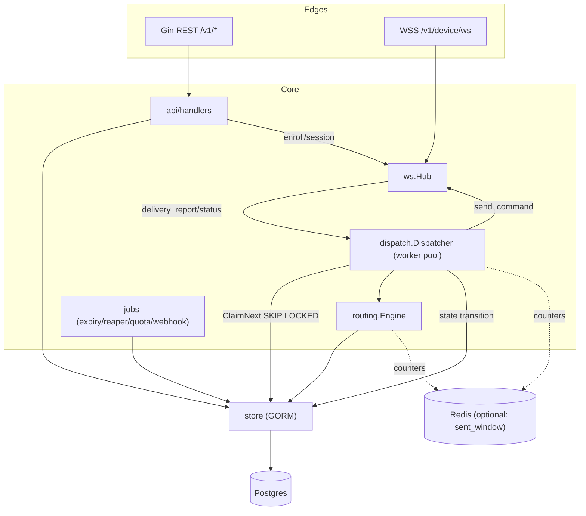
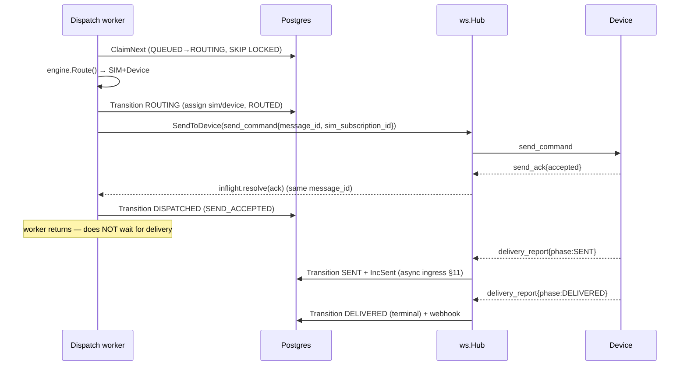

# 04 — Go Backend (Gin + GORM) Server Design

> **Status:** Design. Builds **strictly** on `02 — Contract, Protocol & Schema`
> (the SSoT). Every schema field, enum value, endpoint path, frame `type`, and
> state transition referenced here is defined there — this doc does **not**
> redefine them, it wires them into runnable Go. Where this doc and the contract
> disagree, **the contract wins**.
>
> Scope: the single Go process that (1) serves the client REST API (§B of the
> contract), (2) terminates the device WebSocket (§C), (3) runs the routing
> engine (§D) and the dispatch/retry loop, and (4) runs the background jobs
> (expiry, quota reset, webhooks). Target deployment is **one backend instance**
> for a small owned fleet (3–10 phones); the horizontal-scaling path is noted but
> not required.

---

## Table of contents

- [1. Design principles](#1-design-principles)
- [2. Project layout](#2-project-layout)
- [3. Configuration](#3-configuration)
- [4. Process bootstrap & wiring (`cmd/server`)](#4-process-bootstrap)
- [5. Models & the migration story (GORM + native enums)](#5-models)
- [6. Store layer (repositories)](#6-store-layer)
- [7. Gin: routing, middleware, handlers](#7-gin)
- [8. The WebSocket hub](#8-ws-hub)
- [9. Routing engine](#9-routing-engine)
- [10. Queue & the dispatch worker loop](#10-dispatcher)
- [11. Inbound device frames & async state transitions](#11-ingress)
- [12. Background jobs](#12-jobs)
- [13. Webhooks](#13-webhooks)
- [14. Concurrency-safety reference](#14-concurrency)
- [15. Graceful shutdown](#15-shutdown)
- [16. Observability](#16-observability)
- [17. Scaling past one instance (deferred)](#17-scaling)

---

<a name="1-design-principles"></a>

## 1. Design principles

1. **The contract is the type system.** Wire formats, DB columns, and enums come
   verbatim from doc 02. Go packages hold *behavior*, not new vocabulary.
2. **Postgres is the durable queue.** No external broker. Messages are claimed
   with `FOR UPDATE SKIP LOCKED`; this is transactional, crash-safe, and lets us
   add instances later without changing the model. Redis is *optional*, used only
   for hot pacing counters (`sent_window`) and can degrade to in-memory on a
   single instance.
3. **Two decoupled planes.**
   - **Synchronous dispatch plane:** worker goroutines pull `QUEUED` messages,
     route, send `send_command`, and block only for the short `send_ack`
     (≤15 s). They never block waiting for delivery.
   - **Asynchronous event plane:** the WS ingress path receives
     `delivery_report`/`status` frames *whenever* they arrive (seconds to
     minutes later) and applies the state-machine transition + webhook. The two
     planes meet only at the `messages` row.
4. **No double send is a server invariant, not a hope.** The reroute back-edge
   fires **only** on positive not-sent evidence (contract §D/§E). Ambiguity ⇒
   wait, never re-dispatch to a different SIM.
5. **Idiomatic Go:** small interfaces at the consumer, `context.Context` on every
   blocking call, goroutine-per-connection with owned channels, explicit locks on
   explicitly-named shared state, `errgroup`/`sync.WaitGroup` for lifecycle.

---

<a name="2-project-layout"></a>

## 2. Project layout

```text
wsms-gateway/
├── cmd/
│   ├── server/                # main.go — wires config→stores→hub→api→workers, runs, drains
│   └── migrate/               # main.go — golang-migrate up/down runner (CI + ops)
├── migrations/                # 0001_enums.up.sql, 0002_tables.up.sql, ... (+ .down.sql)
├── internal/
│   ├── config/                # Config struct + load (envconfig); no globals
│   ├── models/                # GORM structs = contract §A; typed enum consts + Valid()
│   ├── store/                 # repo interfaces + gorm impls (tx helper, SKIP LOCKED claim)
│   │   ├── store.go           #   interfaces: Messages, Devices, SIMs, Clients, Events
│   │   ├── messages.go
│   │   ├── devices.go
│   │   ├── sims.go
│   │   └── gorm.go            #   *gorm.DB open, pooling, WithTx
│   ├── api/                   # Gin layer
│   │   ├── router.go          #   route table (contract §B paths)
│   │   ├── dto.go             #   request/response bodies (contract §B shapes)
│   │   ├── errors.go          #   error envelope + code map
│   │   ├── middleware/        #   requestid, recover, clientauth, deviceauth, ratelimit, log
│   │   └── handlers/          #   messages.go devices.go sims.go enroll.go health.go stats.go
│   ├── ws/                    # device WebSocket
│   │   ├── hub.go             #   registry map, register/supersede/send-to-one
│   │   ├── conn.go            #   DeviceConn, readPump, writePump
│   │   ├── ingress.go         #   frame demux → handlers
│   │   └── frame.go           #   Envelope + typed data structs (contract §C)
│   ├── routing/               # pure-ish decisioning
│   │   ├── engine.go          #   Route(msg) → (sim, device, onNet, err)
│   │   ├── prefix.go          #   Resolver: 08xx-prefix→operator, hot-reloaded map
│   │   ├── msisdn.go          #   Normalize() → canonical +62… ; ResolveOperator()
│   │   └── segments.go        #   Encoding()+Segments() (GSM7/UCS2)
│   ├── dispatch/              # the send loop
│   │   ├── dispatcher.go      #   worker pool, ClaimNext→Route→send_command→await ack
│   │   ├── inflight.go        #   ack-waiter registry (message_id → chan)
│   │   └── command.go         #   build send_command frame from a message+sim
│   ├── queue/                 # claim + wake
│   │   ├── claim.go           #   UPDATE … SKIP LOCKED RETURNING
│   │   └── notify.go          #   pg LISTEN/NOTIFY + fallback ticker → wake channel
│   ├── webhook/               # signer.go (HMAC per §B.9) + sender.go (retry, backoff)
│   ├── jobs/                  # cron/loops: expiry.go quotareset.go reaper.go window.go
│   ├── auth/                  # apikey.go (parse wsms_…, Argon2id verify) + device.go
│   └── telemetry/             # slog setup, prometheus metrics, /metrics
└── pkg/
    └── wsmsproto/             # (optional) exported frame constants shared with tooling
```

**Package dependency direction** (no cycles): `models` ← `store` ← everything;
`ws`, `routing`, `queue` are leaf-ish; `dispatch` depends on `store`+`ws`+`routing`;
`api` depends on `store`+`ws`(for enroll/session)+`routing`(for submit-time
normalize/segment). `config` and `telemetry` depend on nothing.



---

<a name="3-configuration"></a>

## 3. Configuration

Loaded once at boot from environment (`kelseyhightower/envconfig` or `caarlos0/env`),
never read again from globals — the parsed `Config` is passed down explicitly.

```go
// internal/config/config.go
type Config struct {
    Env  string `env:"WSMS_ENV" envDefault:"live"` // "live"|"test" → API-key prefix wsms_<env>_
    HTTP struct {
        Addr            string        `env:"HTTP_ADDR"           envDefault:":8080"`
        ReadTimeout     time.Duration `env:"HTTP_READ_TIMEOUT"   envDefault:"15s"`
        WriteTimeout    time.Duration `env:"HTTP_WRITE_TIMEOUT"  envDefault:"30s"`
        ShutdownGrace   time.Duration `env:"HTTP_SHUTDOWN_GRACE" envDefault:"25s"`
        TrustedProxies  []string      `env:"HTTP_TRUSTED_PROXIES"` // set when behind nginx/Caddy for TLS
    }
    DB struct {
        URL          string `env:"DATABASE_URL,required"` // postgres://…?sslmode=require
        MaxOpenConns int    `env:"DB_MAX_OPEN" envDefault:"20"`
        MaxIdleConns int    `env:"DB_MAX_IDLE" envDefault:"10"`
    }
    Redis struct {
        URL     string `env:"REDIS_URL"` // empty ⇒ in-memory counter fallback (single instance)
    }
    Dispatch struct {
        Workers        int           `env:"DISPATCH_WORKERS"    envDefault:"4"`
        AckTimeout     time.Duration `env:"DISPATCH_ACK_TIMEOUT" envDefault:"15s"` // wait send_ack
        AckRedeliveries int          `env:"DISPATCH_ACK_REDELIVERIES" envDefault:"3"`
        SendWait       time.Duration `env:"DISPATCH_SEND_WAIT"  envDefault:"60s"` // DISPATCHED→SENT watchdog
        RerouteBackoffBase time.Duration `env:"DISPATCH_BACKOFF_BASE" envDefault:"30s"`
        RerouteBackoffMax  time.Duration `env:"DISPATCH_BACKOFF_MAX"  envDefault:"10m"`
    }
    WS struct {
        HeartbeatSec int           `env:"WS_HEARTBEAT_SEC" envDefault:"25"`
        WritePing    time.Duration `env:"WS_WRITE_PING"    envDefault:"20s"`
        ReadDeadline time.Duration `env:"WS_READ_DEADLINE" envDefault:"60s"`
        SendBuffer   int           `env:"WS_SEND_BUFFER"   envDefault:"64"` // per-conn outbound queue depth
        MaxFrameKiB  int64         `env:"WS_MAX_FRAME_KIB" envDefault:"64"`
    }
    Msg struct {
        DefaultTTL   time.Duration `env:"MSG_DEFAULT_TTL" envDefault:"6h"`
        MaxSegments  int           `env:"MSG_MAX_SEGMENTS" envDefault:"10"` // contract: body ≤10 segments
    }
    Security struct {
        Argon2Time    uint32 `env:"ARGON2_TIME"    envDefault:"3"`
        Argon2MemKiB  uint32 `env:"ARGON2_MEM_KIB" envDefault:"65536"`
        Argon2Threads uint8  `env:"ARGON2_THREADS" envDefault:"2"`
        // 32-byte key (base64) that decrypts clients.webhook_secret at rest (age/KMS-wrapped).
        WebhookSecretKey string `env:"WEBHOOK_SECRET_KEY,required"`
    }
    FCM struct {
        CredentialsFile string `env:"FCM_CREDENTIALS_FILE"` // service-account JSON; wake killed devices
    }
    Timezone string `env:"WSMS_TZ" envDefault:"Asia/Jakarta"` // sent_today reset boundary
    LogLevel string `env:"LOG_LEVEL" envDefault:"info"`
}
```

---

<a name="4-process-bootstrap"></a>

## 4. Process bootstrap & wiring (`cmd/server`)

`main` is a thin composition root: build dependencies bottom-up, start the long-lived
components under one root `context`, block on a signal, then drain. No global state.

```go
func main() {
    cfg := config.MustLoad()
    log := telemetry.NewLogger(cfg.LogLevel)

    ctx, stop := signal.NotifyContext(context.Background(), os.Interrupt, syscall.SIGTERM)
    defer stop()

    db := store.MustOpen(cfg.DB, log)          // *gorm.DB + pool tuning; pings
    stores := store.New(db)                     // repos
    counters := pacing.New(cfg.Redis)           // Redis or in-memory sent_window
    resolver := routing.NewResolver(stores.Prefixes)   // loads operator_prefixes → atomic map
    engine := routing.NewEngine(stores, resolver, counters, log)

    hub := ws.NewHub(log)                        // registry map; no goroutine yet
    disp := dispatch.New(cfg.Dispatch, stores, hub, engine, log)
    hub.SetReportSink(disp)                       // ingress forwards send_ack/reports to dispatcher

    // wake source: pg LISTEN "messages_ready" + 1s fallback ticker
    waker := queue.NewNotifier(cfg.DB.URL, log)

    var wg sync.WaitGroup
    disp.Start(ctx, &wg, waker.C())               // N worker goroutines
    jobs.Start(ctx, &wg, cfg, stores, hub, disp, log) // expiry/reaper/quota/window/webhook

    r := api.NewRouter(cfg, stores, hub, engine, log)
    srv := &http.Server{
        Addr: cfg.HTTP.Addr, Handler: r,
        ReadHeaderTimeout: cfg.HTTP.ReadTimeout, WriteTimeout: 0, // WriteTimeout 0: WS needs long-lived
    }
    go func() {
        if err := srv.ListenAndServe(); err != nil && !errors.Is(err, http.ErrServerClosed) {
            log.Error("http server", "err", err); stop()
        }
    }()
    log.Info("wsms-gateway up", "addr", cfg.HTTP.Addr, "workers", cfg.Dispatch.Workers)

    <-ctx.Done()                                  // SIGINT/SIGTERM
    shutdown(context.Background(), cfg, srv, hub, waker, &wg, db, log) // §15
}
```

> **`WriteTimeout: 0`.** A per-server write timeout would kill long-lived WS
> upgrades. WS write deadlines are set per-write inside `writePump` instead; REST
> handlers get their own timeout via a middleware `http.TimeoutHandler` mounted on
> the `/v1` REST group only, not on the WS route.

---

<a name="5-models"></a>

## 5. Models & the migration story (GORM + native enums)

`internal/models` holds the exact structs from contract §A (`Client`, `APIKey`,
`Device`, `SIM`, `Message`, `MessageEvent`, `OperatorPrefix`, `EnrollmentToken`)
plus the typed enum constants from §A.2. Nothing here is new — it is the contract
transcribed with the same GORM tags. Example (already normative in the contract,
shown to fix the package boundary):

```go
// internal/models/message.go — fields & tags verbatim from contract §A.6
type Message struct { /* … id, client_id, dedup_key, target_msisdn, target_operator,
    body, encoding, segments, status, routing_policy, requested/assigned ids,
    attempts, max_attempts, priority, callback_url, scheduled_at, expires_at,
    last_reason, last_detail, lifecycle timestamps, metadata, Base … */ }

// enum type + Valid(), pattern from contract §A.2
type MessageStatus string
const ( StatusQueued MessageStatus = "QUEUED"; /* …ROUTING,DISPATCHED,SENT,
    DELIVERED,FAILED,EXPIRED,CANCELLED */ )
func (s MessageStatus) Terminal() bool { /* Delivered|Failed|Expired|Cancelled */ }
func (s MessageStatus) Valid() bool { /* membership check */ }
```

### 5.1 Do **not** rely on `AutoMigrate` for the schema

The contract mandates **Postgres native `ENUM` types** (`CREATE TYPE operator_t …`),
partial unique indexes (`WHERE deleted_at IS NULL`), partial/filtered routing
indexes, and check-style constraints. GORM `AutoMigrate` cannot create native
enum types, cannot express `WHERE`-filtered indexes, and would try to model the
enum columns as plain `text`. Therefore:

- **Schema is owned by SQL migrations** under `migrations/` run via `golang-migrate`
  (`cmd/migrate`). Order: `0001_enums` (all `CREATE TYPE`), `0002_tables`,
  `0003_indexes` (the partial indexes from §A), `0004_seed_prefixes` (the §A.8
  seed `INSERT`).
- GORM is used **only** as a data-mapper/query builder at runtime, never as a
  migrator in production. A `dev-only` AutoMigrate guard may exist for local
  scratch DBs but is off by default.
- Adding an operator range = an `INSERT` into `operator_prefixes` (no deploy,
  hot-reloaded per §A.8). Adding an enum value = `ALTER TYPE … ADD VALUE` in a new
  migration.

### 5.2 GORM registration notes

- Register the pgx driver (`gorm.io/driver/postgres`) with `PreferSimpleProtocol`
  off; UUIDv7 generated in Go (`uuid.NewV7()`), so IDs are time-sortable and the
  DB never assigns them.
- `datatypes.JSON` for all `jsonb` columns (`Device.Health`, `SIM.Health`,
  `Message.Metadata`, `MessageEvent.Raw`).
- `pq.StringArray` for `api_keys.scopes text[]`.
- Enum columns: keep them as the model's typed string; add a GORM `serializer` is
  unnecessary since the underlying wire type is text-compatible with the native
  enum. Writes send the string; Postgres validates against the enum type.
- **`SIM.SentToday` / `SentWindow` are never written with read-modify-write in Go.**
  All increments go through an atomic SQL `UPDATE sims SET sent_today = sent_today
  + ? …` (§6.3, §14) to avoid lost updates across workers.

---

<a name="6-store-layer"></a>

## 6. Store layer (repositories)

Small interfaces defined where they are consumed; one GORM implementation.

```go
// internal/store/store.go
type Messages interface {
    Create(ctx context.Context, m *models.Message) error
    GetByID(ctx context.Context, id uuid.UUID) (*models.Message, error)
    // FindByDedup returns the original for idempotent replay (contract §E.1 / §B.1).
    FindByClientDedup(ctx context.Context, clientID uuid.UUID, dedup string) (*models.Message, error)
    // ClaimNext atomically flips one actionable QUEUED row to ROUTING and returns it.
    ClaimNext(ctx context.Context) (*models.Message, error)
    // Transition is the ONLY way status changes; it writes the row + a message_events row in one tx.
    Transition(ctx context.Context, in Transition) error
    List(ctx context.Context, f MessageFilter) ([]models.Message, string, error)
}

type SIMs interface {
    RoutingCandidates(ctx context.Context, op models.Operator, segments int) ([]models.SIM, error)
    IncSent(ctx context.Context, simID uuid.UUID, segments int) error // atomic; flips QUOTA_EXCEEDED
    UpsertFromReport(ctx context.Context, deviceID uuid.UUID, r ws.SIMReport) error
}
type Devices interface { /* GetByKey, GetByID, SetSession, SetStatus, MarkSeen, … */ }
type Clients interface { /* GetByAPIKeyID, TouchKeyUse, … */ }
type Events  interface { Append(ctx context.Context, e *models.MessageEvent) error }
```

### 6.1 One `Transition` primitive for all state changes

Every state-machine edge (contract §D) is applied through a single method so the
`messages` row and its `message_events` audit row are written **in the same
transaction** — the append-only log can never drift from the row.

```go
type Transition struct {
    MessageID  uuid.UUID
    From, To   models.MessageStatus // From is asserted with optimistic guard
    Event      models.EventType     // CREATED/ROUTED/DISPATCH/SENT/DELIVERED/FAILED/…
    Reason     models.FailureReason // NONE unless failing
    SIMID, DeviceID *uuid.UUID
    Attempt    int
    OnNet      *bool
    Raw        datatypes.JSON       // verbatim device payload for message_events.raw
    SetTimes   func(*models.Message)// nil-safe: stamps sent_at/delivered_at/terminal_at/etc.
    Backoff    *time.Time           // when requeuing: sets scheduled_at (see §10.4)
}

func (r *gormMessages) Transition(ctx context.Context, in Transition) error {
    return r.db.WithContext(ctx).Transaction(func(tx *gorm.DB) error {
        // Optimistic concurrency: only advance if still in the expected state.
        res := tx.Model(&models.Message{}).
            Where("id = ? AND status = ?", in.MessageID, in.From).
            Updates(applyTransition(in)) // status, last_reason, attempts, assigned_*, timestamps, scheduled_at
        if res.Error != nil { return res.Error }
        if res.RowsAffected == 0 {
            return ErrStaleTransition // someone else moved it; caller re-reads or drops
        }
        return tx.Create(&models.MessageEvent{
            ID: uuid.Must(uuid.NewV7()), MessageID: in.MessageID,
            EventType: string(in.Event), FromStatus: ptr(string(in.From)),
            ToStatus: ptr(string(in.To)), Reason: string(in.Reason),
            SIMID: in.SIMID, DeviceID: in.DeviceID, Attempt: in.Attempt, Raw: in.Raw,
        }).Error
    })
}
```

`ErrStaleTransition` is the workhorse of no-double-send at the DB layer: a
`delivery_report(SENT)` racing a reroute attempt can only *one* win the
`WHERE status = From` guard.

### 6.2 `ClaimNext` — the durable queue pull

```sql
-- internal/store/messages.go (raw SQL via GORM .Raw().Scan())
UPDATE messages SET status = 'ROUTING', updated_at = now()
WHERE id = (
    SELECT id FROM messages
    WHERE status = 'QUEUED'
      AND (scheduled_at IS NULL OR scheduled_at <= now())  -- honors defer + retry backoff
      AND expires_at > now()
    ORDER BY priority ASC, created_at ASC                  -- 1=highest; UUIDv7 → FIFO within priority
    FOR UPDATE SKIP LOCKED
    LIMIT 1
)
RETURNING *;
```

Uses the contract's `ix_msg_queue` partial index. `SKIP LOCKED` means N workers
(and later N instances) never hand the same message twice. Expired rows are
skipped here and swept to `EXPIRED` by the expiry job (§12).

### 6.3 Atomic SIM counter

```sql
-- IncSent: additive, and self-heals the quota status in one statement.
UPDATE sims
SET sent_today = sent_today + @seg,
    sent_window = sent_window + @seg,
    last_sent_at = now(),
    status = CASE WHEN sent_today + @seg >= daily_quota THEN 'QUOTA_EXCEEDED'::sim_status_t
                  ELSE status END
WHERE id = @sim_id;
```

Called after a `delivery_report(phase=SENT)` (contract §C.4: “increment
`sim.sent_today += segments`”). Read-modify-write in application code is
forbidden here.

---

<a name="7-gin"></a>

## 7. Gin: routing, middleware, handlers

### 7.1 Route wiring (contract §B paths)

```go
// internal/api/router.go
func NewRouter(cfg config.Config, s store.Stores, hub *ws.Hub, eng *routing.Engine, log *slog.Logger) *gin.Engine {
    r := gin.New()
    r.SetTrustedProxies(cfg.HTTP.TrustedProxies)
    r.Use(mw.RequestID(), mw.Recover(log), mw.AccessLog(log))

    v1 := r.Group("/v1")

    // Health is unauthenticated (contract §B.8).
    v1.GET("/healthz", h.Healthz)
    v1.GET("/readyz",  h.Readyz(s, hub))

    // Device WS + enrollment. Enroll uses a one-time token; WS uses device secret.
    v1.POST("/devices/enroll", h.Enroll(s))                 // contract §C.2
    v1.GET("/device/ws", mw.DeviceAuth(s), ws.Handler(hub, s, cfg)) // contract §C — upgrades

    // Client REST API — bearer API key + scope gates (contract §B.1).
    cli := v1.Group("", mw.ClientAuth(s), mw.RateLimit(s)) // token bucket per client
    {
        cli.POST("/messages",           mw.Scope("messages:write"), h.SubmitMessage(s, eng, cfg))
        cli.POST("/messages/batch",     mw.Scope("messages:write"), h.SubmitBatch(s, eng, cfg))
        cli.GET("/messages/:id",        mw.Scope("messages:read"),  h.GetMessage(s))
        cli.GET("/messages",            mw.Scope("messages:read"),  h.ListMessages(s))
        cli.POST("/messages/:id/cancel",mw.Scope("messages:write"), h.CancelMessage(s, hub))
        cli.GET("/devices",             mw.Scope("devices:read"),   h.ListDevices(s))
        cli.GET("/devices/:id",         mw.Scope("devices:read"),   h.GetDevice(s))
        cli.GET("/sims",                mw.Scope("sims:read"),      h.ListSIMs(s))
        cli.GET("/stats",               mw.Scope("messages:read"),  h.Stats(s))
    }
    return r
}
```

### 7.2 Middleware

| Middleware | Responsibility |
|---|---|
| `RequestID` | Generate `req_<ULID>`, put on context + `X-Request-Id`; surfaced in the error envelope `request_id`. |
| `Recover` | Catch panics → `500 {error.code:"INTERNAL"}`, log stack, never leak internals. |
| `AccessLog` | Structured slog line per request (method, path, status, latency, client_id). |
| `ClientAuth` | Parse `Bearer wsms_<env>_<keyid>.<secret>`, split on first `.`, look up `KeyID`, Argon2id-verify `secret` constant-time, load `Client`, reject suspended, stash on ctx, `TouchKeyUse` async. `401 UNAUTHENTICATED` on any failure. |
| `Scope` | Assert the key's `scopes` contains the required scope, else `403 FORBIDDEN`. |
| `RateLimit` | Per-client token bucket sized by `clients.rate_limit_per_sec`; `429 RATE_LIMITED` + `X-RateLimit-*`/`Retry-After`. Buckets held in a sharded in-memory map (single instance) keyed by client_id. |
| `DeviceAuth` | For the WS route: verify `Bearer dsec_live_<devid>.<secret>` against `devices.secret_hash`; reject `DISABLED` (close 4403). Runs pre-upgrade so a bad secret never allocates a conn. |

### 7.3 `POST /v1/messages` handler (the submit path)

The handler does everything the contract makes server-authoritative, then hands
off to the async dispatcher:

```go
func SubmitMessage(s store.Stores, eng *routing.Engine, cfg config.Config) gin.HandlerFunc {
  return func(c *gin.Context) {
    cl := mw.ClientFrom(c)
    var in dto.SubmitReq
    if err := c.ShouldBindJSON(&in); err != nil { fail(c, 400, "VALIDATION_ERROR", err); return }

    // 1. Normalize + validate MSISDN → canonical +62… (contract §0.3). Reject non-mobile.
    to, err := routing.Normalize(in.To)
    if err != nil { fail(c, 400, "INVALID_MSISDN", err); return }

    // 2. Server computes operator, encoding, segments — clients are NOT trusted (contract §0.4/§0.5).
    op := eng.Resolver.Operator(to)
    enc, seg := routing.EncodeSegments(in.Body)
    if seg > cfg.Msg.MaxSegments { fail(c, 400, "BODY_TOO_LONG", nil); return }

    // 3. Idempotency (contract §E.1): Idempotency-Key header → dedup_key, unique per client.
    dedup := c.GetHeader("Idempotency-Key")
    if dedup != "" {
        if orig, _ := s.Messages.FindByClientDedup(c, cl.ID, dedup); orig != nil {
            c.JSON(200, dto.FromMessage(orig, /*replay*/ true)); return
        }
    }

    m := buildMessage(cl, in, to, op, enc, seg, dedup, cfg) // status=QUEUED, expires_at, policy, priority…
    if err := s.Messages.Create(c, m); err != nil {
        if store.IsUniqueViolation(err, "uq_msg_client_dedup") { // race: two identical submits
            orig, _ := s.Messages.FindByClientDedup(c, cl.ID, dedup)
            c.JSON(200, dto.FromMessage(orig, true)); return
        }
        fail(c, 500, "INTERNAL", err); return
    }
    _ = s.Events.Append(c, event(m, models.EvCreated)) // CREATED
    queue.WakeSoon()                                     // NOTIFY messages_ready → worker picks up
    c.JSON(202, dto.FromMessage(m, false))               // QUEUED (contract §B.2)
  }
}
```

Note the double idempotency guard: an in-app `FindByClientDedup` fast path **and**
a unique-index race catch — both required because two concurrent requests can pass
the read before either inserts.

---

<a name="8-ws-hub"></a>

## 8. The WebSocket hub

### 8.1 Model

- **One goroutine pair per connection** (`readPump` + `writePump`), the classic
  Go WS shape.
- **A registry `map[deviceID]*DeviceConn`** guarded by a `sync.RWMutex`. Reads
  (send-to-one, from many dispatcher workers) take `RLock`; register/unregister
  take `Lock`. A mutex-guarded map is chosen over the “everything through one hub
  channel” pattern because our dominant operation is **point-to-point**
  (`SendToDevice(deviceID, frame)`) from N concurrent workers, not fan-out
  broadcast — an `RWMutex` map serves that with the least ceremony.
- **Each `DeviceConn` owns a buffered `send chan []byte`.** Only the conn's own
  `writePump` reads it; any number of producers may push. This makes the socket
  write single-threaded (gorilla/websocket requires exactly one concurrent
  writer) without a per-write lock.

```go
// internal/ws/conn.go
type DeviceConn struct {
    deviceID  uuid.UUID
    sessionID string
    conn      *websocket.Conn
    send      chan []byte       // buffered (cfg.WS.SendBuffer); writePump is sole consumer
    hub       *Hub
    closeOnce sync.Once
    closed    chan struct{}     // fires on teardown; unblocks producers
}

// internal/ws/hub.go
type Hub struct {
    mu     sync.RWMutex
    conns  map[uuid.UUID]*DeviceConn // keyed by device_id (contract: single connection per device)
    sink   ReportSink                // dispatcher; receives send_ack/delivery_report
    log    *slog.Logger
}
```

### 8.2 Register with supersede (single-connection rule)

Contract §C.3: a second WS for the same `device_id` closes the older one with
close code **4001 “superseded”** and updates `devices.session_id`.

```go
// Register installs c and returns any prior connection the caller must close (4001).
func (h *Hub) Register(c *DeviceConn) (superseded *DeviceConn) {
    h.mu.Lock()
    superseded = h.conns[c.deviceID]
    h.conns[c.deviceID] = c
    h.mu.Unlock()
    return superseded
}

// Unregister removes c only if it is still the current conn (guards a late unregister
// from a superseded conn clobbering the fresh one — the classic register/unregister race).
func (h *Hub) Unregister(c *DeviceConn) {
    h.mu.Lock()
    if cur, ok := h.conns[c.deviceID]; ok && cur == c {
        delete(h.conns, c.deviceID)
    }
    h.mu.Unlock()
}
```

The WS `Handler` sequences it: authenticate → upgrade → build conn → `old :=
hub.Register(c)` → if `old != nil { old.Close(4001, "superseded") }` → persist
`devices.session_id`, status `ONLINE` → send `welcome` → start pumps.

### 8.3 Send-to-one (broadcast-to-one)

```go
var (
    ErrDeviceOffline  = errors.New("device offline")
    ErrSendBufferFull = errors.New("send buffer full")
)

// SendToDevice enqueues one frame to a device's writePump. Non-blocking:
// if the per-conn buffer is full the device is stuck/slow — we do NOT block a
// dispatcher worker on a wedged socket; caller treats this like offline & requeues.
func (h *Hub) SendToDevice(deviceID uuid.UUID, frame []byte) error {
    h.mu.RLock()
    c := h.conns[deviceID]
    h.mu.RUnlock()
    if c == nil {
        return ErrDeviceOffline
    }
    select {
    case c.send <- frame:
        return nil
    case <-c.closed:
        return ErrDeviceOffline
    default:
        // Buffer saturated: shed load, tear the socket down so the device reconnects clean.
        c.Close(4002, "send-overflow")
        return ErrSendBufferFull
    }
}
```

> **Why non-blocking.** If a device's TCP write stalls, its `send` buffer fills.
> Blocking `SendToDevice` would pin a dispatcher goroutine to a dead socket and
> stall the whole queue. We instead treat a full buffer as “effectively offline,”
> close the conn (triggering the device's foreground-service reconnect, backed by
> the FCM wake), and requeue the message — no send, no loss.

### 8.4 The pumps

```go
func (c *DeviceConn) writePump(cfg config.Config) {
    ping := time.NewTicker(cfg.WS.WritePing) // server-initiated WS ping every 20s
    defer func() { ping.Stop(); c.Close(1001, "writer-exit") }()
    for {
        select {
        case frame, ok := <-c.send:
            _ = c.conn.SetWriteDeadline(time.Now().Add(10 * time.Second))
            if !ok { _ = c.conn.WriteMessage(websocket.CloseMessage, nil); return }
            if err := c.conn.WriteMessage(websocket.TextMessage, frame); err != nil { return }
        case <-ping.C:
            _ = c.conn.SetWriteDeadline(time.Now().Add(10 * time.Second))
            if err := c.conn.WriteMessage(websocket.PingMessage, nil); err != nil { return }
        case <-c.closed:
            return
        }
    }
}

func (c *DeviceConn) readPump(cfg config.Config) {
    defer func() { c.hub.Unregister(c); c.Close(1000, "reader-exit"); c.hub.onDisconnect(c) }()
    c.conn.SetReadLimit(cfg.WS.MaxFrameKiB << 10) // 64 KiB max frame (contract §C.1)
    _ = c.conn.SetReadDeadline(time.Now().Add(cfg.WS.ReadDeadline))
    c.conn.SetPongHandler(func(string) error {
        return c.conn.SetReadDeadline(time.Now().Add(cfg.WS.ReadDeadline)) // 60s read deadline
    })
    for {
        _, data, err := c.conn.ReadMessage()
        if err != nil { return } // normal/abnormal close → deferred teardown
        c.hub.ingress.Handle(c, data) // demux by frame.type (§11)
    }
}

func (c *DeviceConn) Close(code int, reason string) {
    c.closeOnce.Do(func() {
        _ = c.conn.WriteControl(websocket.CloseMessage,
            websocket.FormatCloseMessage(code, reason), time.Now().Add(2*time.Second))
        close(c.closed)
        _ = c.conn.Close()
    })
}
```

`onDisconnect` flips `devices.status = OFFLINE` (only if the current session id
matches — a superseded conn must not offline a freshly-connected device) and
marks its SIMs stale for routing.

---

<a name="9-routing-engine"></a>

## 9. Routing engine

Implements the contract §D `route(msg)` pseudocode. Pure decision logic over a
candidate set the store supplies; the engine itself holds no long-lived state
except the hot-reloaded prefix map.

### 9.1 MSISDN + operator + segments (submit-time helpers)

```go
// internal/routing/msisdn.go — contract §0.3
func Normalize(raw string) (string, error) // → "+62…"; error INVALID for non-Indonesian-mobile

// internal/routing/prefix.go — contract §0.4/§A.8, hot-reloaded
type Resolver struct{ m atomic.Pointer[map[string]models.Operator] } // "0812"→TELKOMSEL
func (r *Resolver) Operator(canonical string) models.Operator {      // local="0"+c[3:]; table[local[:4]] ?? UNKNOWN
    // ...
}
func (r *Resolver) Reload(rows []models.OperatorPrefix)              // atomic swap; called on boot + NOTIFY

// internal/routing/segments.go — contract §0.5
func EncodeSegments(body string) (models.Encoding, int) // GSM7 160/153 · UCS2 70/67
```

The prefix map is swapped atomically (`atomic.Pointer`) so reads on the hot path
never lock; a `LISTEN operator_prefixes_changed` (or a 5-min TTL refresh) triggers
`Reload`.

### 9.2 The routing decision

```go
type Decision struct { SIM models.SIM; Device models.Device; OnNet bool }

var (
    ErrNoEligibleSIM        = errors.New("no eligible sim now")   // transient → requeue
    ErrNoMatchingOperator   = errors.New("no on-net sim")         // strict → fail
)

// Route mirrors contract §D pseudocode exactly.
func (e *Engine) Route(ctx context.Context, m *models.Message) (Decision, error) {
    // Candidate set: READY, enabled, quota-left, device ONLINE (contract §D).
    cands, err := e.sims.RoutingCandidates(ctx, m.TargetOperator, m.Segments)
    if err != nil { return Decision{}, err }

    onNet := filter(cands, func(s models.SIM) bool { return s.Operator == m.TargetOperator })

    var pool []models.SIM
    switch models.RoutingPolicy(m.RoutingPolicy) {
    case models.PolicyPinned:
        pool = filter(cands, func(s models.SIM) bool { return m.RequestedSIMID != nil && s.ID == *m.RequestedSIMID })
    case models.PolicyOnNetStrict:
        pool = onNet
    case models.PolicyOnNetPreferred:                 // ← the owner's requirement
        if len(onNet) > 0 { pool = onNet } else { pool = cands } // FALLBACK: any available SIM
    case models.PolicyAny:
        pool = cands
    }

    if len(pool) == 0 {
        if m.RoutingPolicy == string(models.PolicyOnNetStrict) || m.RoutingPolicy == string(models.PolicyPinned) {
            return Decision{}, ErrNoMatchingOperator  // caller decides requeue-vs-fail by TTL
        }
        return Decision{}, ErrNoEligibleSIM
    }

    sim := pick(pool) // least-loaded then random: min(sent_window), tie-break rand (contract §D)
    return Decision{SIM: sim, Device: sim.Device, OnNet: sim.Operator == m.TargetOperator}, nil
}
```

`RoutingCandidates` is the SQL that leans on the contract's `ix_sim_routing`
partial index and joins `devices` for `status = ONLINE`:

```sql
SELECT s.* FROM sims s JOIN devices d ON d.id = s.device_id
WHERE s.status = 'READY' AND s.enabled = true AND d.status = 'ONLINE'
  AND s.sent_today + @seg <= s.daily_quota
  AND (@op = 'UNKNOWN' OR true)   -- op filter applied in-engine to also compute the fallback pool
ORDER BY s.sent_window ASC;
```

> **UNKNOWN targets.** If `target_operator = UNKNOWN` (ported/new range), there is
> no on-net pool by definition; `ON_NET_PREFERRED` falls straight to the random
> pool, `ON_NET_STRICT` fails `NO_MATCHING_OPERATOR_SIM`. This is exactly why the
> contract keeps fallback — surfaced honestly, prefix→operator is a heuristic.

---

<a name="10-dispatcher"></a>

## 10. Queue & the dispatch worker loop

### 10.1 Shape

- A pool of `cfg.Dispatch.Workers` goroutines.
- Each is woken by the `queue.Notifier` channel (Postgres `LISTEN messages_ready`
  fired on insert/requeue, plus a 1 s fallback ticker to cover `scheduled_at`
  maturation and missed notifies).
- On wake, a worker drains: `ClaimNext` in a loop until the queue returns
  `ErrNoWork`, handling each claimed message fully before the next.

### 10.2 In-flight ack correlation (`inflight.go`)

The dispatcher registers a waiter **keyed by `message_id`** before sending the
command; the WS ingress path (§11) forwards the matching `send_ack` into it.

```go
type inflight struct {
    mu      sync.Mutex
    waiters map[uuid.UUID]chan ws.SendAck // message_id → one-shot channel
}
func (i *inflight) register(id uuid.UUID) chan ws.SendAck {
    ch := make(chan ws.SendAck, 1)
    i.mu.Lock(); i.waiters[id] = ch; i.mu.Unlock()
    return ch
}
func (i *inflight) resolve(ack ws.SendAck) { // called from ingress on a send_ack frame
    i.mu.Lock(); ch := i.waiters[ack.MessageID]; delete(i.waiters, ack.MessageID); i.mu.Unlock()
    if ch != nil { ch <- ack } // buffered(1) → never blocks ingress
}
func (i *inflight) clear(id uuid.UUID) { i.mu.Lock(); delete(i.waiters, id); i.mu.Unlock() }
```

`delivery_report` frames are **not** correlated through `inflight` — they are
asynchronous and handled straight in ingress (§11), because they can arrive long
after the dispatcher returned.

### 10.3 The worker loop (representative, near-complete)

```go
// internal/dispatch/dispatcher.go
func (d *Dispatcher) Start(ctx context.Context, wg *sync.WaitGroup, wake <-chan struct{}) {
    for i := 0; i < d.cfg.Workers; i++ {
        wg.Add(1)
        go func(id int) {
            defer wg.Done()
            for {
                select {
                case <-ctx.Done():
                    return
                case <-wake:
                    d.drain(ctx)             // claim+handle until empty
                }
            }
        }(i)
    }
}

func (d *Dispatcher) drain(ctx context.Context) {
    for {
        m, err := d.store.Messages.ClaimNext(ctx) // QUEUED→ROUTING, SKIP LOCKED
        if errors.Is(err, store.ErrNoWork) { return }
        if err != nil { d.log.Error("claim", "err", err); return }
        d.handle(ctx, m)
    }
}

func (d *Dispatcher) handle(ctx context.Context, m *models.Message) {
    // Guard: TTL may have passed while queued.
    if time.Now().After(m.ExpiresAt) {
        d.fail(ctx, m, models.StatusRouting, models.ReasonExpiredTTL, models.StatusExpired)
        return
    }

    // 1. Route (contract §D). Transient vs terminal is decided by policy + TTL headroom.
    dec, err := d.engine.Route(ctx, m)
    if err != nil {
        switch {
        case errors.Is(err, routing.ErrNoMatchingOperator):
            if ttlNear(m, d.cfg) { // strict/pinned & out of runway → terminal
                d.fail(ctx, m, models.StatusRouting, models.ReasonNoMatchingOperatorSIM, models.StatusFailed)
            } else {
                d.requeue(ctx, m, models.ReasonNoMatchingOperatorSIM) // back to QUEUED w/ backoff
            }
        default: // ErrNoEligibleSIM
            d.requeue(ctx, m, models.ReasonNoOnlineSIM)
        }
        return
    }

    // 2. Persist the routing decision: ROUTING (assign sim/device, on_net), event ROUTED.
    if err := d.assign(ctx, m, dec); err != nil { d.requeue(ctx, m, models.ReasonNoOnlineSIM); return }

    // 3. Build the send_command (message_id is the device idempotency key — contract §E.2).
    frame, cmdID := dispatch.BuildSendCommand(m, dec.SIM, m.Attempts+1, d.cfg)

    // 4. Register the ack waiter BEFORE sending (avoid a lost-ack race), then transport-redeliver.
    ackCh := d.inflight.register(m.ID)
    defer d.inflight.clear(m.ID)

    var ack ws.SendAck
    delivered := false
    for try := 0; try <= d.cfg.AckRedeliveries; try++ {
        if err := d.hub.SendToDevice(dec.Device.ID, frame); err != nil {
            // Device offline / socket wedged → not sent, safe to requeue to another SIM.
            d.requeue(ctx, m, models.ReasonDeviceOffline)
            return
        }
        select {
        case ack = <-ackCh:
            delivered = true
        case <-time.After(d.cfg.AckTimeout): // 15s: resend SAME message_id, NEW frame id
            frame = dispatch.Rewrap(frame)   // new ULID frame.id only; device dedups on message_id
            continue
        case <-ctx.Done():
            return
        }
        break
    }
    if !delivered {
        // No send_ack after N redeliveries. The command MAY have been received & sent
        // (ambiguous). Per contract §D/§E we must NOT reroute; keep DISPATCHED and let the
        // reaper/TTL resolve. But we never got past ROUTING here, so it's safe to requeue
        // ONLY because no send_ack means the device never confirmed acceptance.
        d.requeue(ctx, m, models.ReasonDeviceOffline)
        return
    }

    // 5. Apply the send_ack result (contract §C.4).
    switch ack.Result {
    case "accepted", "duplicate": // duplicate ⇒ device already has it; treat as accepted
        d.transition(ctx, m, models.StatusRouting, models.StatusDispatched,
            models.EvSendAccepted, models.ReasonNone, &dec.SIM.ID, &dec.Device.ID)
        // Done. Delivery reports arrive asynchronously in ingress (§11). The dispatcher
        // does NOT block for the SENT report — the SendWait watchdog (reaper §12) covers it.
    case "rejected":
        d.rerouteOrFail(ctx, m, ack.Reason) // DISPATCHED→ROUTING only on not-sent evidence
    }
}
```

### 10.4 Retry, backoff & the reroute guard

- **`requeue`** writes `status = QUEUED`, `attempts++` (when it was a genuine
  attempt), and — crucially — sets `scheduled_at = now + backoff` so `ClaimNext`
  won't re-pick it immediately. Backoff per contract §D:
  `min(30s · 2^(attempt-1), 10m)` with ±20 % jitter. `scheduled_at` is the
  contract-blessed defer mechanism; no new column needed.
- **`rerouteOrFail`** is the *only* place a different SIM is chosen after dispatch,
  and only for the contract's positive not-sent reasons (`RADIO_OFF`,
  `NO_SERVICE`, `SIM_ABSENT`, `NULL_PDU`, `QUOTA_EXCEEDED`, `RATE_LIMITED`, or a
  `send_ack: rejected`). It transitions `DISPATCHED → ROUTING` **only if**
  `attempts < max_attempts`; else `FAILED / ROUTE_EXHAUSTED`. Every transition
  goes through `store.Transition`, so the `WHERE status = From` guard means a
  `delivery_report(SENT)` that raced in first will make the reroute a no-op
  (`ErrStaleTransition`) — the SMS that actually left the phone wins.
- **Ambiguity ⇒ never reroute.** If a `send_command` was delivered but no
  `send_ack` came, or the device dropped mid-flight, the message stays on the same
  `message_id`. The device's on-device idempotency ledger (contract §E.2) resolves
  it on reconnect via `send_ack: duplicate` + re-emitted report; otherwise it hits
  `EXPIRED`.



---

<a name="11-ingress"></a>

## 11. Inbound device frames & async state transitions

`ws.ingress.Handle` demuxes on `frame.type` (contract §C.4) and is the async
half of the system. It runs on the connection's `readPump` goroutine, so
per-connection frames are processed in order.

```go
func (in *Ingress) Handle(c *DeviceConn, raw []byte) {
    var f Envelope // {type,id,ts,data}
    if err := json.Unmarshal(raw, &f); err != nil { return } // ignore garbage; 64KiB cap already applied
    switch f.Type {
    case "hello":            in.onHello(c, f)                 // no ack (welcome already sent)
    case "sim_report":       in.onSIMReport(c, f); c.ackFrame(f.ID)   // upsert sims; §C.4
    case "heartbeat":        in.onHeartbeat(c, f); c.ackFrame(f.ID)   // last_seen, battery, sims_health
    case "send_ack":         in.sink.ResolveAck(parseAck(f))          // → dispatcher inflight (is itself the ack)
    case "delivery_report":  in.onDeliveryReport(c, f); c.ackFrame(f.ID)
    case "status":           in.onStatus(c, f); c.ackFrame(f.ID)      // sim_added/removed/radio_off/…
    case "ack":              in.onTransportAck(c, f)                  // ack for our config/cancel/ping
    }
}
```

**`delivery_report` → state machine (contract §C.4 / §D):**

```go
func (in *Ingress) onDeliveryReport(c *DeviceConn, f Envelope) {
    r := parseReport(f) // message_id, phase, reason, parts_ok/total, android_result_code
    m, err := in.store.Messages.GetByID(ctx, r.MessageID)
    if err != nil { return }
    switch r.Phase {
    case "SENT": // RESULT_OK → SENT; stamp sent_at; sim.sent_today += segments
        if err := in.store.Messages.Transition(ctx, sentTransition(m, r)); err == nil {
            _ = in.store.SIMs.IncSent(ctx, *m.AssignedSIMID, m.Segments) // atomic §6.3
        }
    case "DELIVERED": // status 0x00 → DELIVERED (terminal)
        in.store.Messages.Transition(ctx, terminalTransition(m, models.StatusSent, models.StatusDelivered, r))
    case "FAILED":
        if notSent(r.Reason) { // RADIO_OFF/NO_SERVICE/SIM_ABSENT/NULL_PDU/… → maybe reroute
            in.sink.RerouteOrFail(ctx, m, r.Reason) // DISPATCHED→ROUTING guarded by attempts+state
        } else if r.Reason == models.ReasonDeliveryPermanentError {
            in.store.Messages.Transition(ctx, terminalTransition(m, models.StatusSent, models.StatusFailed, r))
        } // DELIVERY_TEMP_ERROR → stay SENT (contract §D SENT→SENT self-loop)
    }
    in.webhooks.Enqueue(m) // fire the matching message.* webhook on every transition (§13)
}
```

Because every transition flows through `store.Transition` with the `From`-state
guard, a `SENT` report arriving after a spurious `FAILED` reroute (or vice-versa)
cannot corrupt state — exactly one edge takes effect.

**`sim_report` → `sims` reconciliation (contract §C.4):** upsert by
`(device_id, slot_index)`; refresh `subscription_id`, `carrier_name`, `mcc/mnc`,
`msisdn` when present; derive `operator` from `mcc/mnc` first, override by `msisdn`
prefix if a number is known. A slot present before but missing now →
`sim.status = ABSENT`. This is the authoritative source for routing candidates.

---

<a name="12-jobs"></a>

## 12. Background jobs

All started under the root context; all stop on cancel. Each is a `time.Ticker`
loop (or a cron for the midnight boundary) doing bounded-batch DB work.

| Job | Cadence | Action |
|---|---|---|
| **Expiry sweeper** | 10 s | `UPDATE … status='EXPIRED', last_reason='EXPIRED_TTL'` for non-terminal rows past `expires_at` (uses `ix_msg_expiry`); writes `EXPIRED` events + webhooks. Covers both `QUEUED` past-TTL and the `SENT`-but-unconfirmed → `EXPIRED` edge (contract §D). |
| **Dispatched reaper** | 30 s | For `DISPATCHED` rows with no `SENT` after `SendWait` (60 s): **do not reroute** (contract §C.6) — log, emit a `status` re-query hint on reconnect, let TTL decide. Also resets **stale `ROUTING`** rows (worker crashed mid-handle, `updated_at` older than 2 min) back to `QUEUED` for re-claim — crash recovery. |
| **Quota reset** | cron `00:00 Asia/Jakarta` | `UPDATE sims SET sent_today=0, status = CASE WHEN status='QUOTA_EXCEEDED' THEN 'READY' ELSE status END`. TZ from `cfg.Timezone`. |
| **Window decay** | 60 s | Snapshot/decay `sent_window` (rolling short-window pacing counter) from Redis into `sims.sent_window`, or decay in-DB if Redis absent. Feeds least-loaded SIM pick. |
| **Webhook sender** | continuous | Drains the webhook queue with exponential backoff, `Retry-After` honored, max 24 h then drop → `WEBHOOK_SENT`(failed) event (§13). |
| **Prefix refresh** | 5 min or `LISTEN` | `Resolver.Reload` from `operator_prefixes` so new ranges apply without redeploy (contract §A.8). |
| **Retention purge** | daily | Hard-delete `messages`/`message_events` past retention (contract §A.1: operational tables are purged, never soft-deleted). |

---

<a name="13-webhooks"></a>

## 13. Webhooks

Server POSTs to the per-message `callback_url` or the client's default
`webhook_url` on each subscribed transition (contract §B.9). Signing is normative:

```go
// internal/webhook/signer.go
func Sign(secret []byte, ts int64, body []byte) string {
    mac := hmac.New(sha256.New, secret)
    fmt.Fprintf(mac, "%d.", ts) // signed_payload = "{t}." + raw_body
    mac.Write(body)
    return "t=" + strconv.FormatInt(ts, 10) + ",v1=" + hex.EncodeToString(mac.Sum(nil))
}
```

- `X-WSMS-Signature: t=<unix>,v1=<hex-hmac>`; the client verifies constant-time and
  rejects if `|now − t| > 300 s`.
- `clients.webhook_secret` is stored encrypted at rest and decrypted with
  `cfg.Security.WebhookSecretKey` only in memory to sign.
- Delivery is at-least-once with exp backoff; each attempt appends a
  `WEBHOOK_SENT` `message_events` row for replay/debug. Default subscription =
  terminal events + `sent`; the client record may widen it.
- The sender is a bounded worker pool reading a durable-ish queue (a small
  `webhook_deliveries` working table or an in-memory channel seeded from
  `message_events` on restart); a stuck client endpoint never blocks the dispatch
  plane.

---

<a name="14-concurrency"></a>

## 14. Concurrency-safety reference

The explicit “what is shared, what guards it” table — the answer to *what needs
locking*.

| Shared state | Accessed by | Guard | Rationale |
|---|---|---|---|
| `Hub.conns` map | all dispatcher workers (read, send-to-one) + WS accept/teardown (write) | `sync.RWMutex` | Point-to-point lookups dominate; `RLock` is cheap and lets N workers send concurrently. |
| `DeviceConn.send` chan | many producers (`SendToDevice`, ingress acks, config push) → one consumer (`writePump`) | buffered channel + `closed` chan | gorilla requires a single concurrent writer; the channel serializes writes without a per-write mutex. Non-blocking send sheds load. |
| `DeviceConn` close | reader teardown, writer teardown, supersede, overflow | `sync.Once` + `closed` chan | Close-exactly-once; every path is safe to call. |
| `Dispatcher.inflight.waiters` | worker (register/clear) + ingress goroutines (resolve) | `sync.Mutex` + buffered(1) chans | One-shot handoff of `send_ack` from ingress to the waiting worker. |
| `messages.status` transitions | dispatch plane + async ingress + jobs | **DB row lock** via `Transition`'s `WHERE status = From` (optimistic) | The single serialization point that makes no-double-send true; app-level locks would not span the two planes. |
| Message claim | N workers (+ future N instances) | `FOR UPDATE SKIP LOCKED` | Each message handed to exactly one worker; no in-process queue needed. |
| `sims.sent_today/sent_window` | ingress (`IncSent`) + quota/window jobs + routing reads | atomic SQL `UPDATE … = col + n` (or Redis `INCR`) | Read-modify-write in Go would lose updates across workers. |
| `Resolver` prefix map | routing hot path (read) + refresh job (swap) | `atomic.Pointer[map]` | Lock-free reads; whole-map atomic replace on reload. |
| Rate-limit buckets | all REST handlers | sharded map + per-bucket mutex (or `golang.org/x/time/rate` per client) | Per-client isolation; sharding avoids a global lock. |

**Rule of thumb applied:** in-memory shared maps get a `sync.(RW)Mutex`;
cross-goroutine one-shot handoffs get a buffered channel; anything whose
correctness must survive a crash or span the sync/async planes lives in Postgres
and is serialized by row locks / optimistic `WHERE` guards, not by Go locks.

---

<a name="15-shutdown"></a>

## 15. Graceful shutdown

Ordered drain so no message is lost and no device is left half-closed:

```go
func shutdown(base context.Context, cfg config.Config, srv *http.Server,
    hub *ws.Hub, waker *queue.Notifier, wg *sync.WaitGroup, db *gorm.DB, log *slog.Logger) {

    ctx, cancel := context.WithTimeout(base, cfg.HTTP.ShutdownGrace) // 25s
    defer cancel()

    // 1. Stop accepting new HTTP/WS; let in-flight REST finish.
    if err := srv.Shutdown(ctx); err != nil { log.Warn("http drain", "err", err) }

    // 2. Stop waking workers; the root ctx is already cancelled so worker loops exit
    //    after finishing their current handle() (which is bounded by AckTimeout).
    waker.Stop()

    // 3. Close every device WS with 1001 "going away" so foreground services reconnect
    //    to the next instance / after restart (state is durable in Postgres regardless).
    hub.CloseAll(1001, "server-restart")

    // 4. Wait for dispatcher workers + jobs to return (bounded by ctx).
    done := make(chan struct{})
    go func() { wg.Wait(); close(done) }()
    select {
    case <-done:
    case <-ctx.Done():
        log.Warn("shutdown grace exceeded; forcing exit")
    }

    // 5. Close DB pool last.
    if sqlDB, err := db.DB(); err == nil { _ = sqlDB.Close() }
    log.Info("wsms-gateway stopped")
}
```

Safety: because all durable state is in Postgres and messages are claimed
transactionally, a hard kill mid-`handle` leaves a `ROUTING` row that the
**dispatched reaper** (§12) returns to `QUEUED`. In-flight `DISPATCHED` messages
are resolved on device reconnect via the idempotency ledger — a restart never
double-sends and never silently drops.

---

<a name="16-observability"></a>

## 16. Observability

- **Logging:** `slog` JSON, one logger threaded via context; every line carries
  `request_id` (REST) or `device_id`/`session_id` (WS) and `message_id` where
  relevant. `Recover` middleware logs panics with stack.
- **Metrics (Prometheus, `/metrics`):**
  - `wsms_messages_total{status}` counter, `wsms_message_dispatch_seconds`
    histogram (QUEUED→SENT), `wsms_delivery_seconds` (SENT→DELIVERED).
  - `wsms_devices_online`, `wsms_sims_ready{operator}` gauges (power `readyz`).
  - `wsms_sim_sent_today{sim_id,operator}` gauge, `wsms_reroutes_total{reason}`,
    `wsms_send_ack_timeouts_total`, `wsms_ws_send_overflow_total`.
  - `wsms_webhook_attempts_total{result}`.
- **Readiness (`/v1/readyz`, contract §B.8):** `200` iff DB reachable **and**
  ≥1 device `ONLINE` **and** ≥1 SIM `READY`; else `503` with `reasons[]`. This is
  the deploy/health-check gate and doubles as the “can I send right now?” probe.
- **Audit:** `message_events` is the append-only forensic trail; `GET
  /v1/messages/:id?include=events` exposes it, and it is the replay source for
  webhooks.

---

<a name="17-scaling"></a>

## 17. Scaling past one instance (deferred)

For 3–10 phones a **single instance** is correct and simplest; everything above
assumes it. The design already leaves the door open:

- The queue (`SKIP LOCKED`) is multi-instance-safe as-is — add workers/instances
  and no message is handed twice.
- The *only* thing pinned to a process is the **WS connection**: a device is
  connected to exactly one instance, so a message routed to that device must be
  dispatched from that instance. The scale-out path is a `device_id → instance`
  registry in Redis plus a pub/sub (or gRPC) hop that forwards a `send_command`
  to the owning instance's hub. Until volume demands it, this is intentionally
  **not built** — a single instance behind a TLS-terminating reverse proxy is the
  recommended deployment.

---

## Appendix — legal & deliverability (carried from the contract)

The hygiene controls the contract mandates are implemented *here* as first-class
server behavior, framed as **ToS-compliance and deliverability**, never
detection-evasion: per-SIM `daily_quota` enforced in `RoutingCandidates` +
`IncSent`; `sent_today`/`sent_window` accounting; `pacing.min_gap_ms`+`jitter_ms`
carried in every `send_command`; SIM rotation via least-loaded pool selection;
`COOLDOWN`/`QUOTA_EXCEEDED` states that remove a SIM from routing. Sending bulk/A2P
from consumer SIMs is a **grey route** that can get SIMs **blocked/banned**; for
sustained volume the owner SHOULD move to a licensed A2P sender channel. This risk
is surfaced in the fleet dashboards (`sent_today` vs `daily_quota`, ban-indicative
`FAILED` reason spikes), not hidden.
