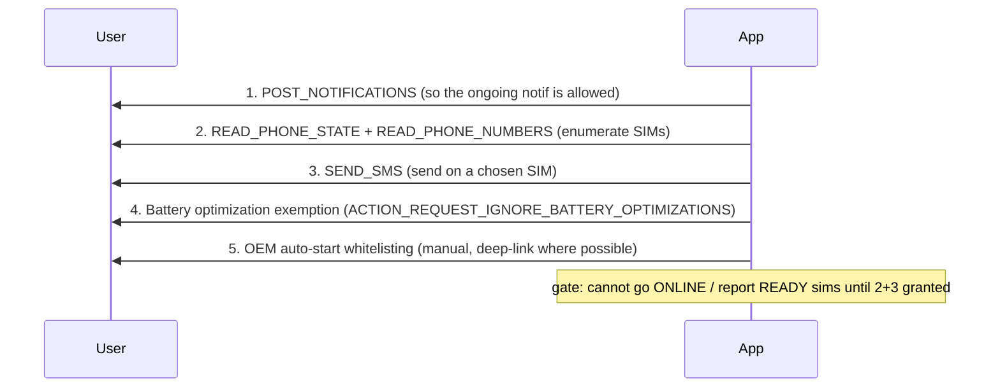
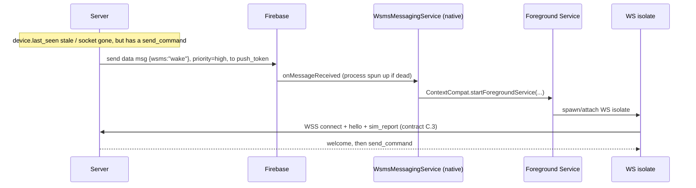
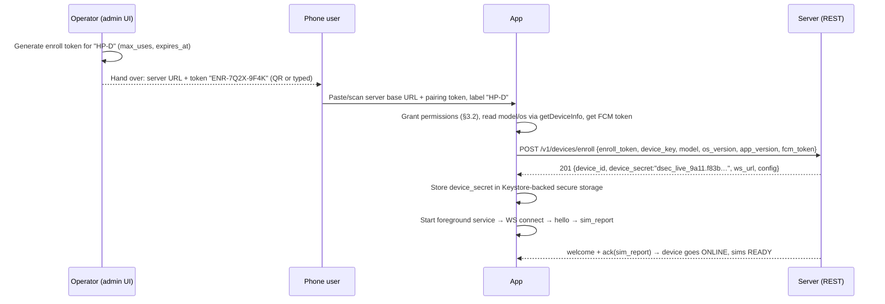
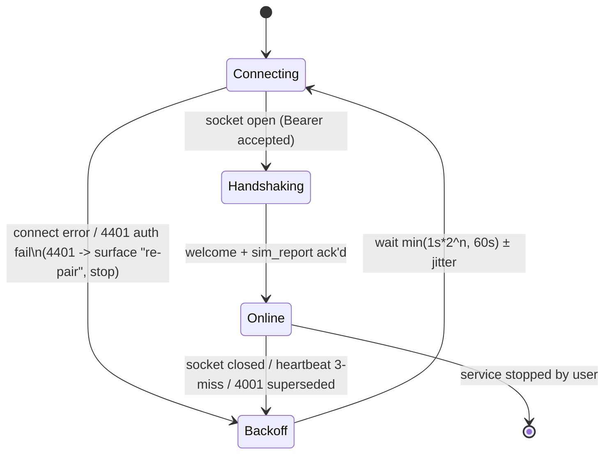

# 05 — Flutter (Android-Only) Sender App

> **Status:** Normative for the sender client. This document specifies the Flutter/Android
> app that is the **SMS sender** in WSMS-Gateway. It builds strictly on
> [`02 — Contract, Protocol & Schema`](02-contract-protocol-schema.md); every wire format,
> frame `type`, enum value, and `failure_reason_t` it uses is defined there and is **not**
> redefined here. Where this doc and the contract disagree, **the contract wins**.
>
> **Scope of "device":** one owned Android phone, dual physical SIM, running this app,
> holding one persistent WSS connection to the server (`wss://gw.example.id/v1/device/ws`).

---

## Table of contents

- [1. iOS is impossible — and exactly why](#1-ios-is-impossible)
- [2. App architecture](#2-app-architecture)
- [3. Android permissions & runtime request flow](#3-permissions)
- [4. Foreground service + FCM wake](#4-foreground-service--fcm-wake)
- [5. The Kotlin platform-channel layer](#5-platform-channel-layer)
  - [5.1 Channel & method catalog](#51-channel-catalog)
  - [5.2 (a) Enumerating SIMs via `SubscriptionManager`](#52-enumerating-sims)
  - [5.3 (b) Sending via `SmsManager.getSmsManagerForSubscriptionId` (multipart)](#53-sending)
  - [5.4 (c) SENT + DELIVERED `PendingIntent` receivers → statuses](#54-receivers)
  - [5.5 Multipart aggregation → one `delivery_report`](#55-aggregation)
- [6. Enrollment / pairing UX](#6-enrollment)
- [7. The WS client: reconnect & heartbeat loop](#7-ws-client)
- [8. `send_command` handling & the no-double-send ledger](#8-dedup)
- [9. Local send-log UI](#9-send-log)
- [10. Lifecycle, edge cases & OEM battery killers](#10-lifecycle)

---

<a name="1-ios-is-impossible"></a>

## 1. iOS is impossible — and exactly why

**The sender fleet is Android exclusively. There will never be an iOS sender build.** This is
not a scoping preference; it is a hard platform limitation:

- **iOS exposes no public API to send an SMS programmatically.** The only supported paths are
  `MFMessageComposeViewController` (opens the Messages UI and requires a human to tap *Send*)
  and `MessageUI` deep links (`sms:`) — both are user-initiated and cannot be automated,
  headless, or triggered by a server command. There is no equivalent of Android's
  `SmsManager`.
- **iOS has no multi-SIM programmatic send / subscription binding.** Even on dual-SIM/eSIM
  iPhones, there is no public API to pick a line and send on it without the user.
- **Background execution model forbids it.** Even if an API existed, iOS would not let a
  background app hold a long-lived control socket and fire sends on server push the way an
  Android **foreground service** can.

Consequences enforced by the contract:

- `devices.platform` is **always `android`**. The server **MUST reject enrollment** where
  `platform != 'android'` for a sender role (see contract A.4). An iOS build could only ever
  *monitor* — never send — so we do not ship one.
- This document therefore assumes Android API level **24+ (Android 7)** as the floor, with
  targeted behavior for **API 31/33/34/35** where the SMS, foreground-service, and
  notification-permission rules changed.

> **Play Store note (surfaced honestly):** requesting `SEND_SMS` puts an app under Google
> Play's *SMS & Call Log Permissions* policy, which effectively bars general distribution of
> a non-default-SMS app that sends SMS. **This app is not distributed through Play** — it is
> **sideloaded onto the owner's own fleet** (internal, self-hosted). That is the only
> compliant distribution channel for this permission set. This is separate from, and in
> addition to, the carrier-ToS "grey route" ban risk already documented in the contract's
> legal appendix.

---

<a name="2-app-architecture"></a>

## 2. App architecture

The app has two long-lived responsibilities that must survive Doze and process death:

1. **Hold the WSS control connection** to the server and speak the contract's frame protocol.
2. **Send SMS on a specific SIM** on `send_command`, and report `SENT`/`DELIVERED`/`FAILED`
   back as `delivery_report` frames.

Everything hangs off a **foreground service** (ongoing notification) that hosts the WS client
in a dedicated Dart isolate, plus a native **`FirebaseMessagingService`** whose only job is to
resurrect that service when Android has killed the process.

```mermaid
flowchart TB
    subgraph UI["UI isolate (Flutter, main)"]
        PAIR["Pairing / enrollment screen"]
        SIMS["SIM inventory screen"]
        LOG["Send-log screen (reads local DB)"]
        SETTINGS["Permissions & battery-opt screen"]
    end

    subgraph FGS["Foreground Service (Android, ongoing notification)"]
        ISO["WS isolate (Dart, flutter_foreground_task)"]
        WSC["WsClient — connect / heartbeat / frame router"]
        LEDGER["Dedup ledger + outbox (SQLite)"]
        ISO --- WSC
        WSC --- LEDGER
    end

    subgraph NATIVE["Native Android (Kotlin)"]
        TEL["TelephonyPlugin (MethodChannel)"]
        SUBS["SubscriptionManager — enumerate SIMs"]
        SEND["SmsSender — SmsManager.createForSubscriptionId"]
        RSENT["SmsSentReceiver (SENT PendingIntent)"]
        RDEL["SmsDeliveredReceiver (DELIVERED PendingIntent)"]
        AGG["SmsAggregator → EventChannel"]
        TEL --- SUBS
        TEL --- SEND
        SEND -.PendingIntent.-> RSENT
        SEND -.PendingIntent.-> RDEL
        RSENT --> AGG
        RDEL --> AGG
    end

    FCM["FirebaseMessagingService\n(native, high-prio data msg)"]

    UI <-->|MethodChannel| NATIVE
    WSC <-->|MethodChannel: sendSms / listSubscriptions| TEL
    AGG -->|EventChannel: delivery events| WSC
    SUBS -->|EventChannel: sim changes| WSC
    WSC <==>|WSS frames| SERVER["(Server / Gin)"]
    SERVER -.FCM wake {\"wsms\":\"wake\"}.-> FCM
    FCM -->|startForegroundService| FGS
```

### Why an isolate inside a foreground service

- `flutter_foreground_task` (maintained) runs a **separate Flutter engine + Dart isolate**
  inside a real Android foreground service, and re-hosts it after kills. The WS client, the
  frame router, and the durable outbox live there so the connection is independent of whether
  the UI (main isolate) is on screen.
- **Critical constraint:** the isolate that hosts the WS **must also own** the telephony
  `MethodChannel` and the delivery `EventChannel`, because that is where `send_command`
  arrives and where delivery events must be turned into `delivery_report` frames. The native
  side registers its channels against the foreground-service engine.
- **The durable source of truth is on-device SQLite**, not isolate memory. The dedup ledger
  (contract [E.2](02-contract-protocol-schema.md#e-idempotency): `outbox(message_id PK, …)`)
  and the send log survive process death, so a killed-and-revived app never re-sends and can
  replay un-acked reports.

### Package / module layout

```
lib/
  main.dart                     # UI isolate entry; routes pairing vs. dashboard
  fgs/
    ws_isolate.dart             # foreground-service isolate entry (@pragma vm:entry-point)
    ws_client.dart              # connect, heartbeat, backoff, frame router
    frames.dart                 # envelope + typed frame (de)serialization (contract C.1)
    outbox_dao.dart             # SQLite dedup ledger + un-acked report outbox
    telephony.dart              # MethodChannel + EventChannel Dart bindings
  data/
    enrollment_store.dart       # device_secret in flutter_secure_storage (Keystore-backed)
    send_log_dao.dart           # local send-log rows for the UI
  ui/
    pairing_screen.dart
    dashboard_screen.dart       # device status, live SIM cards, capacity
    send_log_screen.dart
    permissions_screen.dart
android/app/src/main/kotlin/id/wblue/wsms/
    TelephonyPlugin.kt          # MethodChannel handler: listSubscriptions, sendSms, perms…
    SimEnumerator.kt            # SubscriptionManager → SimInfo list + change listener
    SmsSender.kt                # SmsManager multipart send + PendingIntent construction
    SmsSentReceiver.kt          # SENT PendingIntent → failure_reason_t
    SmsDeliveredReceiver.kt     # DELIVERED PendingIntent → TP-Status → failure_reason_t
    SmsAggregator.kt            # per-message part aggregation → EventChannel sink
    WsmsMessagingService.kt     # FirebaseMessagingService: wake + token refresh
```

---

<a name="3-permissions"></a>

## 3. Android permissions & runtime request flow

### 3.1 Manifest

```xml
<!-- android/app/src/main/AndroidManifest.xml -->

<!-- Send SMS on a chosen subscription -->
<uses-permission android:name="android.permission.SEND_SMS"/>

<!-- Enumerate active subscriptions (subId, slot, carrier, mcc/mnc) -->
<uses-permission android:name="android.permission.READ_PHONE_STATE"/>
<!-- Read the SIM's own MSISDN when the carrier provisions it (API 30+) -->
<uses-permission android:name="android.permission.READ_PHONE_NUMBERS"/>

<!-- Ongoing-notification permission (API 33+) -->
<uses-permission android:name="android.permission.POST_NOTIFICATIONS"/>

<!-- Foreground service that holds the WS -->
<uses-permission android:name="android.permission.FOREGROUND_SERVICE"/>
<!-- API 34+ requires a typed FGS permission; see note below -->
<uses-permission android:name="android.permission.FOREGROUND_SERVICE_DATA_SYNC"/>
<uses-permission android:name="android.permission.FOREGROUND_SERVICE_SPECIAL_USE"/>

<uses-permission android:name="android.permission.WAKE_LOCK"/>
<uses-permission android:name="android.permission.INTERNET"/>
<uses-permission android:name="android.permission.ACCESS_NETWORK_STATE"/>

<!-- Re-arm the foreground service after a reboot -->
<uses-permission android:name="android.permission.RECEIVE_BOOT_COMPLETED"/>

<!-- Ask the user to exempt us from battery optimization (Doze) -->
<uses-permission android:name="android.permission.REQUEST_IGNORE_BATTERY_OPTIMIZATIONS"/>
```

> **We deliberately do NOT request `RECEIVE_SMS`.** Delivery/sent status arrives through our
> own **`PendingIntent` broadcasts** (registered by `SmsManager`), not through the system
> `SMS_RECEIVED` broadcast. Requesting `RECEIVE_SMS`/`READ_SMS` would make us an "SMS handler"
> and widen the Play-policy blast radius for no benefit. We only need `SEND_SMS`.

**Foreground-service type by API level** (declare on the `<service>`):

| API | `foregroundServiceType` | Why |
|---|---|---|
| 24–28 | (untyped) | No type required. |
| 29–33 | `dataSync` | Long-lived network sync. |
| 34 (Android 14) | `dataSync` **or** `specialUse` | Typed FGS mandatory. |
| 35+ (Android 15) | **`specialUse`** | `dataSync` gained a ~6h/24h runtime cap; a persistent control socket is not periodic sync, so we declare `specialUse` with a subtype and justification. |

```xml
<service
    android:name="com.pravera.flutter_foreground_task.service.ForegroundService"
    android:foregroundServiceType="specialUse"
    android:exported="false">
  <property
      android:name="android.app.PROPERTY_SPECIAL_USE_FGS_SUBTYPE"
      android:value="Persistent control connection for an owned self-hosted SMS gateway fleet"/>
</service>
```

### 3.2 Runtime request order (first launch, post-pairing)

`SEND_SMS`, `READ_PHONE_STATE`, `READ_PHONE_NUMBERS`, and `POST_NOTIFICATIONS` are
**dangerous/runtime** permissions. Battery-optimization exemption is a **special access**
intent, not a `requestPermissions` grant. The onboarding wizard walks them in this order, each
with a plain-language rationale screen first (Android hides the dialog after a second denial):



Dart uses `permission_handler` for 1–3; 4 and 5 go through the platform channel
(`requestIgnoreBatteryOptimizations`, `openAutoStartSettings`). The wizard blocks completion
until `SEND_SMS` **and** the phone permissions are granted — without them the device cannot
enumerate SIMs (`sim_report` would be empty) or send, so it stays `ENROLLED`, never `ONLINE`.

`devices.health` (contract A.4) carries `"ignoring_batt_opt": <bool>` — computed from
`PowerManager.isIgnoringBatteryOptimizations(packageName)` and reported on `hello` and every
`heartbeat` so the operator can see un-exempted phones in the fleet dashboard.

---

<a name="4-foreground-service--fcm-wake"></a>

## 4. Foreground service + FCM wake

Two mechanisms keep the device reachable; they are complementary, per the contract's transport
notes:

**(A) Foreground service** holds the WS while the process is alive. It posts a low-priority,
ongoing notification (e.g. *"WSMS sender — connected · HP-A"*) that Android will not swipe
away, exempting the socket from most background-network throttling. The WS isolate lives here.

**(B) FCM high-priority data message** revives a *killed* process. Doze, the OEM task-killer,
or a low-memory kill will eventually tear down even a foreground service. The server holds each
device's `push_token` (contract A.4) and, when it has a `send_command` for an apparently-dead
device, sends a **high-priority data-only** FCM message `{"wsms":"wake"}`. A data message with
`priority: high` is delivered even in Doze and starts the app process.



```kotlin
// WsmsMessagingService.kt
class WsmsMessagingService : FirebaseMessagingService() {
    override fun onMessageReceived(msg: RemoteMessage) {
        if (msg.data["wsms"] == "wake") {
            // Idempotent: starts the FGS only if not already running.
            FlutterForegroundTaskBridge.ensureRunning(applicationContext)
        }
    }
    override fun onNewToken(token: String) {
        // Persist locally; the WS isolate ships it to the server in the next `hello`
        // (contract lets `hello.data` carry current fcm_token) so devices.push_token
        // stays fresh without a full re-enroll.
        FcmTokenStore.save(applicationContext, token)
    }
}
```

**Server-side wake trigger** is out of scope for this doc (it lives in the Go dispatcher), but
the app's contract is: *on FCM `wake`, ensure the foreground service is running; it will
reconnect on its own.* The wake message carries **no** message payload — the SMS content
always travels over the authenticated WS `send_command`, never over FCM.

---

<a name="5-platform-channel-layer"></a>

## 5. The Kotlin platform-channel layer

Flutter cannot touch `SubscriptionManager` or `SmsManager` directly. Three channels bridge to
Kotlin.

<a name="51-channel-catalog"></a>

### 5.1 Channel & method catalog

**`MethodChannel("id.wblue.wsms/telephony")` — Dart → Kotlin (request/response):**

| Method | Args | Returns | Notes |
|---|---|---|---|
| `listSubscriptions` | — | `List<Map>` of SIM info (§5.2) | Needs `READ_PHONE_STATE`; `msisdn` needs `READ_PHONE_NUMBERS`. Maps to a contract `sim_report`. |
| `sendSms` | `{message_id, sim_subscription_id, to, body, segments, request_delivery_report}` | `{result:"accepted"\|"rejected", reason}` | Pre-flight only: verifies the subId is currently active + `SEND_SMS` held; then hands to `SmsManager`. Actual outcome arrives async via the delivery EventChannel. |
| `getPermissionStatus` | — | `{send_sms, read_phone_state, read_phone_numbers, post_notifications, ignoring_batt_opt}` bools | Drives the onboarding gate + `hello`/`heartbeat` health. |
| `requestIgnoreBatteryOptimizations` | — | `bool` (accepted) | Fires `ACTION_REQUEST_IGNORE_BATTERY_OPTIMIZATIONS`. |
| `openAutoStartSettings` | — | `void` | Best-effort deep link to OEM auto-start page (Xiaomi/Oppo/Vivo/…). |
| `getDeviceInfo` | — | `{model, os_version, android_api}` | For the enroll body + `devices` row. |
| `startService` / `stopService` | — | `void` | Start/stop the foreground service. |

**`EventChannel("id.wblue.wsms/delivery")` — Kotlin → Dart (stream):** emits one event per
**aggregated** message phase (§5.5). Event shape maps 1:1 to a contract `delivery_report`
`data` payload:

```json
{ "message_id":"018f9b2a-…", "sim_subscription_id":3, "phase":"SENT",
  "reason":"NONE", "android_result_code":-1, "parts_total":1, "parts_ok":1,
  "occurred_at":"2026-07-14T09:12:36.221Z" }
```

**`EventChannel("id.wblue.wsms/sim_changes")` — Kotlin → Dart (stream):** fires on
`SubscriptionManager.OnSubscriptionsChangedListener` (SIM hot-swap, eSIM enable/disable). The
WS isolate reacts by re-running `listSubscriptions` and sending a fresh authoritative
`sim_report`, plus a contract `status` frame with `kind: "sim_added"|"sim_removed"`.

<a name="52-enumerating-sims"></a>

### 5.2 (a) Enumerating SIMs via `SubscriptionManager`

Returns exactly the fields the contract's `sim_report.data.sims[]` expects
(`slot_index`, `subscription_id`, `carrier_name`, `mcc`, `mnc`, `msisdn?`, `iccid`, `state`,
`health`). The server owns operator resolution (mcc/mnc first, msisdn prefix as confirmation)
— the app **does not** compute `operator_t`.

```kotlin
// SimEnumerator.kt
@SuppressLint("MissingPermission") // caller guarantees READ_PHONE_STATE granted
fun listSubscriptions(ctx: Context): List<Map<String, Any?>> {
    val sm = ctx.getSystemService(SubscriptionManager::class.java)
        ?: return emptyList()
    val subs = sm.activeSubscriptionInfoList ?: return emptyList()
    return subs.map { info ->
        val subId = info.subscriptionId
        // MCC/MNC: string getters on API 29+; fall back to the int getters below.
        val mcc = if (Build.VERSION.SDK_INT >= 29) info.mccString
                  else info.mcc.takeIf { it != 0 }?.toString()
        val mnc = if (Build.VERSION.SDK_INT >= 29) info.mncString
                  else info.mnc.takeIf { it != 0 }?.toString()
        // number is frequently null: carrier may not provision it; needs READ_PHONE_NUMBERS
        val number = try { info.number?.takeIf { it.isNotBlank() } } catch (_: SecurityException) { null }
        mapOf(
            "slot_index"      to info.simSlotIndex,          // stable within a device
            "subscription_id" to subId,                      // UNSTABLE across reboot/swap
            "carrier_name"    to info.carrierName?.toString(),
            "mcc"             to mcc,                          // "510" = Indonesia
            "mnc"             to mnc,                          // 10 Tsel, 01 Indosat, 11 XL, 89 Tri, 09 Smartfren…
            "msisdn"          to number,                       // often null — normalized server-side
            "iccid"           to (info.iccId?.takeIf { it.isNotBlank() }),
            "state"           to "READY",                      // see caveat below
            "signal_dbm"      to signalDbmFor(ctx, subId),     // TelephonyManager per-sub, optional
            "radio"           to radioTypeFor(ctx, subId),     // "LTE"/"NR"/… best-effort
            "roaming"         to sm.isNetworkRoaming(subId)
        )
    }
}
```

Caveats baked into the contract that the app respects:

- **`subscription_id` is unstable.** It is meaningful only *on this device, right now*. It is
  reported so the server can echo it back in `send_command.sim_subscription_id` (which local
  `SmsManager` to bind), but the server keys the SIM by its own `sim_id` (contract 0.1).
- **`msisdn` is usually `null`.** `SubscriptionInfo.getNumber()` needs `READ_PHONE_NUMBERS`
  (API 30+) *and* carrier provisioning; Indonesian consumer SIMs frequently don't expose it.
  The app never fabricates a number.
- **`state`.** A slot with an active subscription is reported `READY`. If a slot the server
  previously knew about vanishes from a later `sim_report`, the *server* flips that `sim` to
  `ABSENT` (contract C.4) — the app just stops listing it.

<a name="53-sending"></a>

### 5.3 (b) Sending via `SmsManager.getSmsManagerForSubscriptionId` (multipart)

Binding to the correct **subscription** is the whole point of dual-SIM routing: the send goes
out on the SIM the server chose. The API to obtain a per-subscription `SmsManager` differs by
level; both paths are shown, honoring the contract's stated `SmsManager.getSmsManagerForSubscriptionId(subId)` (API 22+) while using the non-deprecated `createForSubscriptionId` on API 31+.

```kotlin
// SmsSender.kt
const val ACTION_SENT      = "id.wblue.wsms.SMS_SENT"
const val ACTION_DELIVERED = "id.wblue.wsms.SMS_DELIVERED"

@Suppress("DEPRECATION")
private fun smsManagerFor(ctx: Context, subId: Int): SmsManager =
    if (Build.VERSION.SDK_INT >= Build.VERSION_CODES.S)          // API 31+
        ctx.getSystemService(SmsManager::class.java).createForSubscriptionId(subId)
    else                                                          // API 22..30
        SmsManager.getSmsManagerForSubscriptionId(subId)

/** Returns "accepted" if handed to the radio, or "rejected"+reason on a pre-flight failure. */
fun send(
    ctx: Context, messageId: String, subId: Int,
    to: String, body: String, wantDelivery: Boolean
): Pair<String, String> {
    // Pre-flight: subscription still active? (guards SIM pulled between routing and dispatch)
    val sm = ctx.getSystemService(SubscriptionManager::class.java)
    val stillActive = sm?.getActiveSubscriptionInfo(subId) != null
    if (!stillActive) return "rejected" to "SIM_ABSENT"          // -> contract failure_reason_t

    val smsManager = smsManagerFor(ctx, subId)
    val parts = smsManager.divideMessage(body)                   // GSM7 153 / UCS2 67 per part
    val n = parts.size

    // Register the aggregator's expectation BEFORE sending (so no PendingIntent races it).
    SmsAggregator.begin(messageId, subId, n)

    val sentPIs = ArrayList<PendingIntent>(n)
    val delPIs  = if (wantDelivery) ArrayList<PendingIntent>(n) else null
    for (i in 0 until n) {
        sentPIs.add(pendingIntent(ctx, ACTION_SENT, messageId, subId, i, n))
        delPIs?.add(pendingIntent(ctx, ACTION_DELIVERED, messageId, subId, i, n))
    }

    return try {
        if (n == 1) {
            smsManager.sendTextMessage(to, null, body, sentPIs[0], delPIs?.get(0))
        } else {
            smsManager.sendMultipartTextMessage(to, null, parts, sentPIs, delPIs)
        }
        "accepted" to "NONE"
    } catch (e: SecurityException) {   // SEND_SMS revoked mid-flight
        "rejected" to "GENERIC_FAILURE"
    } catch (e: IllegalArgumentException) {
        "rejected" to "NULL_PDU"
    }
}

/** One distinct PendingIntent per (message, action, part) so results never collide.
 *  Unique data Uri + FLAG_IMMUTABLE (mandatory on API 31+). */
private fun pendingIntent(
    ctx: Context, action: String, messageId: String, subId: Int, part: Int, total: Int
): PendingIntent {
    val intent = Intent(action).apply {
        setPackage(ctx.packageName)                              // explicit → not exported
        data = Uri.parse("wsms://msg/$messageId/$action/$part")  // makes each PI unique
        putExtra("message_id", messageId)
        putExtra("sub_id", subId)
        putExtra("part", part)
        putExtra("parts_total", total)
    }
    val flags = PendingIntent.FLAG_UPDATE_CURRENT or PendingIntent.FLAG_IMMUTABLE
    val requestCode = (messageId + action + part).hashCode()
    return PendingIntent.getBroadcast(ctx, requestCode, intent, flags)
}
```

Notes:

- **Segment count is authoritative from the server** (`send_command.segments`, contract 0.5).
  The device still calls `divideMessage` because that is what `sendMultipartTextMessage`
  requires and it must register one `PendingIntent` per real part; the two agree because both
  use GSM-7 153 / UCS-2 67 per-part math. The app never re-computes `encoding`/cost.
- **Receivers are dynamically registered** by the foreground service with
  `RECEIVER_NOT_EXPORTED` (mandatory on API 34+), scoped to `ACTION_SENT` / `ACTION_DELIVERED`
  with an `IntentFilter` that includes the `wsms` scheme data. Explicit-package intents keep
  them un-exported.

<a name="54-receivers"></a>

### 5.4 (c) SENT + DELIVERED `PendingIntent` receivers → statuses

The receivers translate raw Android results into the contract's `failure_reason_t` using the
**exact mapping table in contract A.2**. The device computes the reason; the server stores it.

**SENT receiver** — `resultCode` is one of `Activity.RESULT_OK` / `SmsManager.RESULT_ERROR_*`:

```kotlin
// SmsSentReceiver.kt
class SmsSentReceiver : BroadcastReceiver() {
    override fun onReceive(ctx: Context, intent: Intent) {
        val messageId = intent.getStringExtra("message_id") ?: return
        val part      = intent.getIntExtra("part", 0)
        val total     = intent.getIntExtra("parts_total", 1)
        val subId     = intent.getIntExtra("sub_id", -1)

        val reason = when (resultCode) {                              // resultCode from the PI broadcast
            Activity.RESULT_OK                          -> "NONE"                     // -> SENT
            SmsManager.RESULT_ERROR_GENERIC_FAILURE     -> "GENERIC_FAILURE"
            SmsManager.RESULT_ERROR_NO_SERVICE          -> "NO_SERVICE"
            SmsManager.RESULT_ERROR_NULL_PDU            -> "NULL_PDU"
            SmsManager.RESULT_ERROR_RADIO_OFF           -> "RADIO_OFF"
            SmsManager.RESULT_ERROR_LIMIT_EXCEEDED      -> "LIMIT_EXCEEDED"
            SmsManager.RESULT_ERROR_FDN_CHECK_FAILURE   -> "FDN_CHECK_FAILURE"
            SmsManager.RESULT_ERROR_SHORT_CODE_NOT_ALLOWED,
            SmsManager.RESULT_ERROR_SHORT_CODE_NEVER_ALLOWED -> "SHORT_CODE_NOT_ALLOWED"
            else                                        -> "GENERIC_FAILURE"
        }
        SmsAggregator.onPart(ctx, messageId, subId, phase = "SENT",
            part = part, total = total, androidResult = resultCode, reason = reason)
    }
}
```

**DELIVERED receiver** — the broadcast carries an SMS-STATUS-REPORT PDU; parse its TP-Status
and bucket per the contract's status ranges (`0x00` delivered → `NONE`; `0x20–0x3F` →
`DELIVERY_TEMP_ERROR`; `0x40–0x7F` → `DELIVERY_PERMANENT_ERROR`):

```kotlin
// SmsDeliveredReceiver.kt
class SmsDeliveredReceiver : BroadcastReceiver() {
    override fun onReceive(ctx: Context, intent: Intent) {
        val messageId = intent.getStringExtra("message_id") ?: return
        val part      = intent.getIntExtra("part", 0)
        val total     = intent.getIntExtra("parts_total", 1)
        val subId     = intent.getIntExtra("sub_id", -1)

        val pdu    = intent.getByteArrayExtra("pdu")
        val format = intent.getStringExtra("format")             // "3gpp" / "3gpp2"
        val status = if (pdu != null)
            SmsMessage.createFromPdu(pdu, format).status         // TP-Status
        else -1

        val reason = when (status) {
            0x00                 -> "NONE"                        // delivered -> DELIVERED
            in 0x20..0x3F        -> "DELIVERY_TEMP_ERROR"         // SENT stays SENT (still trying)
            in 0x40..0x7F        -> "DELIVERY_PERMANENT_ERROR"    // -> FAILED
            else                 -> "UNKNOWN"
        }
        SmsAggregator.onPart(ctx, messageId, subId, phase = "DELIVERED",
            part = part, total = total, androidResult = status, reason = reason)
    }
}
```

<a name="55-aggregation"></a>

### 5.5 Multipart aggregation → one `delivery_report`

The contract requires **one** `SENT` and **one** `DELIVERED` per message even when the body is
multipart, with `parts_ok`/`parts_total` exposing partials. `SmsAggregator` collapses N
per-part callbacks into one phase event, then pushes it onto the delivery `EventChannel`:

```kotlin
// SmsAggregator.kt  (sketch — thread-safe map keyed by messageId+phase)
object SmsAggregator {
    private data class Agg(var total: Int, var ok: Int = 0, var done: Int = 0,
                           var firstReason: String = "NONE", var worstResult: Int = 0)

    fun begin(messageId: String, subId: Int, total: Int) { /* seed SENT & DELIVERED aggs */ }

    fun onPart(ctx: Context, messageId: String, subId: Int, phase: String,
               part: Int, total: Int, androidResult: Int, reason: String) {
        val agg = /* get-or-create for (messageId, phase) */ TODO()
        agg.done += 1
        if (reason == "NONE") agg.ok += 1
        else if (agg.firstReason == "NONE") { agg.firstReason = reason; agg.worstResult = androidResult }

        val hardFail = reason in setOf("RADIO_OFF","NO_SERVICE","SIM_ABSENT","NULL_PDU",
                                       "GENERIC_FAILURE","DELIVERY_PERMANENT_ERROR")
        // Emit early on first hard failure; otherwise wait for all parts.
        if (hardFail || agg.done == agg.total) {
            val outPhase = if (hardFail && phase == "SENT") "FAILED" else phase
            emit(ctx, mapOf(
                "message_id"          to messageId,
                "sim_subscription_id" to subId,
                "phase"               to outPhase,               // SENT | DELIVERED | FAILED
                "reason"              to agg.firstReason,        // failure_reason_t
                "android_result_code" to agg.worstResult,
                "parts_total"         to agg.total,
                "parts_ok"            to agg.ok,
                "occurred_at"         to Instant.now().toString()// RFC3339 UTC ms
            ))
        }
    }
    private fun emit(ctx: Context, data: Map<String, Any?>) { /* EventChannel sink.success */ }
}
```

Resulting event → the WS isolate wraps it in the contract envelope and sends a
`delivery_report` frame:

```json
{ "type":"delivery_report", "id":"01J8ZS…", "ts":1752483156221,
  "data": { "message_id":"018f9b2a-…", "sim_subscription_id":3, "phase":"SENT",
            "reason":"NONE", "android_result_code":-1,
            "parts_total":1, "parts_ok":1, "occurred_at":"2026-07-14T09:12:36.221Z" } }
```

Server semantics (contract C.4): `SENT` → `messages.status=SENT` + `sent_today += segments`;
`DELIVERED` → terminal `DELIVERED`; `FAILED` → server decides retry vs. terminal per the state
machine. The device never decides retry — it only reports facts.

---

<a name="6-enrollment"></a>

## 6. Enrollment / pairing UX

A fresh phone is bound to the fleet **before** any WS opens, using the one-time
`enrollment_tokens` mechanism (contract A.9, C.2). No rogue phone can register itself.



### 6.1 Pairing screen inputs

- **Server base URL** — e.g. `https://gw.example.id`. The app derives the REST enroll endpoint
  (`{base}/v1/devices/enroll`) and later the `ws_url` returned by the server (contract C.2). A
  QR encodes `{base_url, token}` so the operator can scan instead of type.
- **Pairing token** — the raw `enroll_token` (e.g. `ENR-7Q2X-9F4K`); the server checks its
  `sha256` against `enrollment_tokens.token_hash`, unexpired, `uses < max_uses`.
- **Device label** — becomes `devices.device_key` (e.g. `HP-D`); unique, admin-meaningful.

### 6.2 Enroll request / response (verbatim contract C.2)

```http
POST /v1/devices/enroll
Content-Type: application/json

{ "enroll_token":"ENR-7Q2X-9F4K", "device_key":"HP-D",
  "model":"Samsung SM-A155F", "os_version":"Android 14",
  "app_version":"1.0.0", "fcm_token":"e0j…:APA91b…" }
```

```json
{ "device_id":"9a11-…",
  "device_secret":"dsec_live_9a11.f83b…",
  "ws_url":"wss://gw.example.id/v1/device/ws",
  "config": { "heartbeat_sec":25, "ack_timeout_sec":15 } }
```

### 6.3 Secret storage & loss

`device_secret` is written to `flutter_secure_storage`, which on Android is backed by the
**Android Keystore** (hardware-backed on capable devices). It is used verbatim as the WS bearer
credential (`Authorization: Bearer dsec_live_9a11.f83b…`). Losing it (app data cleared, phone
wiped) means the row's `SecretHash` no longer matches → the phone must **re-enroll with a fresh
token**. The app surfaces a "Re-pair this device" action for that case.

After enroll, the app immediately runs `listSubscriptions` and sends the first authoritative
`sim_report`; the phone is not counted as capacity until the server has acked it and at least
one SIM is `READY`.

---

<a name="7-ws-client"></a>

## 7. The WS client: reconnect & heartbeat loop

One persistent WSS connection per device, single-connection-enforced by the server (contract
C.3: a second connect closes the older with `4001 superseded`). The isolate owns the socket,
an outbound queue, a pending-ack map, and the backoff timer.

### 7.1 Connect & handshake (contract C.3)

```dart
Future<void> connect() async {
  final secret = await enrollmentStore.deviceSecret();     // dsec_live_…
  final ch = IOWebSocketChannel.connect(
    Uri.parse(wsUrl),
    headers: {'Authorization': 'Bearer $secret'},
    pingInterval: const Duration(seconds: 20),             // WS-level ping (contract C.1)
  );
  _sink = ch.sink;
  ch.stream.listen(_onFrame, onDone: _onClosed, onError: _onError);
  // Handshake: welcome (server) -> hello -> sim_report -> ack (contract C.3)
  // hello carries live health + current fcm_token so the server refreshes push_token.
  _send(Frame('hello', data: {
    'device_id': deviceId, 'app_version': appVersion,
    'battery': await _battery(), 'ignoring_batt_opt': await _ignoringBattOpt(),
    'fcm_token': await FcmTokenStore.current(),
  }));
  _send(Frame('sim_report', data: {'sims': await telephony.listSubscriptions()}));
}
```

Every frame is the contract envelope `{ "type", "id":<ULID>, "ts":<epoch ms>, "data" }`
(contract C.1). `id` is a per-connection-unique ULID used to correlate acks; `ts` is
`DateTime.now().millisecondsSinceEpoch`.

### 7.2 Heartbeat, ack tracking, and the two ack layers

The device sends `heartbeat` every `config.heartbeat_sec` (default 25s) and expects a transport
`ack` within 10s; **3 consecutive misses → force reconnect** (contract C.6). Server WS-level
ping every 20s with a 60s read deadline keeps NAT/proxy paths warm.

```dart
void _startHeartbeat() {
  _hbTimer = Timer.periodic(Duration(seconds: cfg.heartbeatSec), (_) async {
    final f = Frame('heartbeat', data: {
      'battery': await _battery(),
      'ignoring_batt_opt': await _ignoringBattOpt(),
      'sims_health': await telephony.coarseSimHealth(),
    });
    _sendAwaitingAck(f, onTimeout: () {         // 10s per contract C.6
      if (++_hbMisses >= 3) _reconnect(reason: 'heartbeat_timeout');
    });
  });
}
```

The client distinguishes the contract's **two ack layers** (C.6) and never conflates them:

- **Transport `ack`** (`data.ref = <frame.id>`) confirms *receipt*. The device waits for it
  on `sim_report`, `heartbeat`, `status`, and every `delivery_report`. Un-acked
  `delivery_report`s go to a small on-device **outbox** and are replayed on reconnect.
- **Application `send_ack`** confirms the device *accepted a send job*; it is the device's own
  reply and doubles as the transport ack for `send_command` (the server does not additionally
  ack a command).

### 7.3 Reconnect / backoff / resume



**Backoff:** `min(1s · 2^n, 60s)` with ±20% jitter, reset to 0 on a clean handshake. Close
codes are handled per contract C.3: `4401` (auth failure) stops the loop and shows *re-pair
required*; `4403` (device disabled) stops and shows *device disabled by admin*; `4001`
(superseded) is treated as a benign reconnect (another session took over — usually a duplicate
process, resolved by the single-connection rule).

**Resume (contract C.6):** on every (re)connect the device re-sends `sim_report` and **replays
every un-acked `delivery_report`** from its outbox. It does **not** ask the server to re-issue
`send_command`s; for any `DISPATCHED` message with no terminal report the server relies on the
device's idempotency ledger (§8) to reconcile — this is what makes "reconnect mid-flight" safe
rather than duplicating.

---

<a name="8-dedup"></a>

## 8. `send_command` handling & the no-double-send ledger

This is the device half of the contract's **no-double-send guarantee** (contract E, guard #2).
`send_command.message_id` is the device-side idempotency key. The ledger is durable SQLite so
it survives process death — an app that is killed after sending but before reporting must
**not** send again on revival.

```sql
-- on-device SQLite (contract E.2)
CREATE TABLE outbox (
  message_id          TEXT PRIMARY KEY,   -- send_command.message_id (UUIDv7)
  sim_subscription_id INTEGER NOT NULL,
  phase               TEXT NOT NULL,       -- ACCEPTED | SENT | DELIVERED | FAILED
  last_report_json    TEXT,                -- last delivery_report.data we emitted
  parts_total         INTEGER,
  parts_ok            INTEGER,
  created_at          INTEGER NOT NULL,
  updated_at          INTEGER NOT NULL
);
```

### 8.1 The command handler (the anti-double-send handshake)

```dart
Future<void> _onSendCommand(Frame cmd) async {
  final d = cmd.data;
  final messageId = d['message_id'] as String;

  // Guard #2: INSERT OR IGNORE. If the row already exists, we have seen this message.
  final firstTime = await outbox.insertIfAbsent(
    messageId: messageId,
    subId: d['sim_subscription_id'] as int,
    phase: 'ACCEPTED',
  );

  if (!firstTime) {
    // Already handled once. NEVER call SmsManager again.
    _send(Frame('send_ack', data: {
      'ref': cmd.id, 'message_id': messageId,
      'result': 'duplicate', 'reason': 'NONE',
      'sim_subscription_id': d['sim_subscription_id'],
    }));
    final last = await outbox.lastReport(messageId);       // re-emit last known report
    if (last != null) _send(Frame('delivery_report', data: last));
    return;
  }

  // First time: pre-flight + hand to SmsManager (native).
  final res = await telephony.sendSms(
    messageId: messageId,
    subId: d['sim_subscription_id'] as int,
    to: d['to'] as String,
    body: d['body'] as String,
    segments: d['segments'] as int,
    requestDeliveryReport: d['request_delivery_report'] as bool? ?? true,
  );

  _send(Frame('send_ack', data: {
    'ref': cmd.id, 'message_id': messageId,
    'result': res.result,                                   // accepted | rejected
    'reason': res.reason,                                   // failure_reason_t
    'sim_subscription_id': d['sim_subscription_id'],
  }));
  // From here, SENT/DELIVERED/FAILED arrive on the delivery EventChannel (§5.5),
  // are persisted to outbox, and shipped as delivery_report frames.
}
```

Key rules straight from the contract:

- The server **redelivers the same `send_command` with the same `message_id`** (only the frame
  `id` changes) if it doesn't get a `send_ack` within `ack_timeout_sec` (15s), up to 3
  transport redeliveries (contract C.6). The `INSERT OR IGNORE` makes every redelivery after
  the first return `send_ack:duplicate` + a replay of the last report — **`SmsManager` is
  called at most once per `message_id`.**
- `send_ack:rejected` (e.g. `SIM_ABSENT`, `RADIO_OFF`, `QUOTA_EXCEEDED`) authorizes the server
  to reroute (contract D). `duplicate` means "I already have it" — the server treats it as
  accepted and waits for the (re-sent) report.
- On phase updates the handler upserts `outbox.phase` + `last_report_json` **before** emitting
  the frame, so a crash between DB-write and network-send still lets reconnect replay resolve
  it. Terminal-phase rows are retained for the send log, then pruned by a retention job.

### 8.2 `cancel` handling (contract C.5)

```dart
Future<void> _onCancel(Frame f) async {
  final messageId = f.data['message_id'] as String;
  final row = await outbox.get(messageId);
  if (row == null || row.phase == 'ACCEPTED') {           // not yet handed to SmsManager
    await outbox.markCancelled(messageId);
    _send(Frame('ack', data: {'ref': f.id, 'cancelled': true}));
  } else {                                                 // already sent — cannot unsend
    _send(Frame('ack', data: {'ref': f.id, 'cancelled': false}));
    // the normal delivery_report still flows; server keeps SENT.
  }
}
```

---

<a name="9-send-log"></a>

## 9. Local send-log UI

A read-only operational view, backed by a local `send_log` table the WS isolate writes on
every phase change. It gives the phone-holder on-device visibility without needing the server
dashboard, and is the first stop when debugging a specific number.

`send_log` row (mirrors the fields the operator cares about; a superset of `outbox`):

| Column | Source |
|---|---|
| `message_id` | `send_command.message_id` |
| `to` | `send_command.to` (masked in UI: `+62812•••7890`) |
| `sim_slot` / `carrier_name` | resolved from `sim_subscription_id` via the SIM inventory |
| `segments` / `encoding` | `send_command` (server-computed) |
| `phase` | `ACCEPTED → SENT → DELIVERED` / `FAILED` |
| `reason` | last `failure_reason_t` |
| `parts_ok/parts_total` | aggregator |
| `attempt` | `send_command.attempt` |
| `created_at` / `updated_at` | local clock |

Dashboard tab shows, per the contract's fleet model:

- **Device status** — `ONLINE`/`OFFLINE`, battery %, charging, `ignoring_batt_opt` (red if
  false — the #1 cause of dropped sockets), current `session_id`.
- **SIM cards** — one card per slot: `carrier_name`, `slot_index`, live `state`,
  `sent_today / daily_quota` progress bar, `last_sent_at`, and a per-SIM `COOLDOWN` countdown
  when pacing is active. These mirror the server's `sims` fields but are the device's live view.
- **Send log** — reverse-chronological list with a phase chip (`SENT`/`DELIVERED`/`FAILED`),
  filterable by phase and number, tap-through to the raw last `delivery_report` JSON for
  forensics. Body text is **not** persisted beyond what's needed to retry the in-flight send
  (privacy): terminal rows keep metadata, not message content.

Privacy/security notes: MSISDNs are masked in the list view; the raw body is dropped from
`outbox` once a message reaches a terminal phase; the send log is local-only and never leaves
the phone except as the structured `delivery_report` events already defined by the contract.

---

<a name="10-lifecycle"></a>

## 10. Lifecycle, edge cases & OEM battery killers

### 10.1 SIM hot-swap / airplane mode

The `SubscriptionManager.OnSubscriptionsChangedListener` fires on SIM insert/remove and eSIM
toggles. The app re-runs `listSubscriptions`, sends a fresh **authoritative** `sim_report`, and
emits a contract `status` frame:

```json
{ "type":"status", "id":"01J8…", "ts":1752483200000,
  "data": { "kind":"sim_removed", "slot_index":1, "detail":"user ejected SIM" } }
```

`kind` uses the contract's closed set: `sim_added|sim_removed|radio_off|radio_on|battery_low|
batt_opt_revoked|shutting_down`. A slot that disappears from the `sim_report` is marked
`ABSENT` by the server; an in-flight send on a just-removed SIM surfaces as
`send_ack:rejected / SIM_ABSENT` (pre-flight) or a `delivery_report FAILED / SIM_ABSENT`, both
of which are **not-sent evidence** that authorize a reroute (contract D).

### 10.2 Reboot

A `BOOT_COMPLETED` receiver re-starts the foreground service, which reconnects and re-reports.
Because `subscription_id` is **not stable across reboot**, the fresh `sim_report` refreshes it
and the server re-binds `sim_id → subscription_id` (contract A.5, 0.1). Any `DISPATCHED`
messages whose reports were lost across the reboot are resolved by the outbox replay + the
device idempotency ledger — never by a blind re-send.

### 10.3 OEM aggressive battery killers (surfaced to the owner)

Stock Android's battery-optimization exemption is necessary but **not sufficient** on several
Chinese OEM skins (Xiaomi/MIUI/HyperOS, Oppo/ColorOS, Vivo/FuntouchOS, Huawei/EMUI, Samsung to
a lesser degree). They kill background apps regardless of the exemption unless the app is
**manually whitelisted / auto-start enabled**. Mitigations shipped:

- The onboarding wizard deep-links to the OEM auto-start settings page where the API allows
  (`openAutoStartSettings`) and shows per-OEM instructions otherwise (reference:
  dontkillmyapp.com guidance).
- The FCM `{"wsms":"wake"}` path is the safety net when the OS kills us anyway — it revives the
  process and the socket.
- The dashboard flags `ignoring_batt_opt == false` in red; the server can see it in
  `devices.health` and the operator can chase the phone-holder.

This is a **deliverability/reliability** measure — keeping our own owned fleet reachable — not
any form of carrier detection-evasion.

### 10.4 Pacing & anti-ban hygiene (device side)

The server pushes pacing knobs on `send_command.pacing` (`min_gap_ms`, `jitter_ms`) and via the
`config` frame (`per_sim` quotas/gaps). The device **honors** them: it serializes sends per SIM
and inserts `min_gap_ms + rand(0..jitter_ms)` between sends on the same subscription, reflecting
the SIM's transient `COOLDOWN` in the UI. This is framed strictly as **ToS-compliant, human-like
pacing and per-SIM quota discipline** (contract legal appendix) — the app does not implement any
detection-evasion beyond ordinary rate-limiting hygiene, and the ban risk of sending A2P traffic
over consumer SIMs remains real and is surfaced to the owner, not hidden.

---

## Appendix A — Platform-channel method list (quick reference)

**`MethodChannel id.wblue.wsms/telephony` (Dart → Kotlin)**
`listSubscriptions` · `sendSms(message_id, sim_subscription_id, to, body, segments, request_delivery_report)` ·
`getPermissionStatus` · `requestIgnoreBatteryOptimizations` · `openAutoStartSettings` ·
`getDeviceInfo` · `startService` · `stopService`

**`EventChannel id.wblue.wsms/delivery` (Kotlin → Dart)** — aggregated
`{message_id, sim_subscription_id, phase, reason, android_result_code, parts_total, parts_ok, occurred_at}`
→ becomes a contract `delivery_report`.

**`EventChannel id.wblue.wsms/sim_changes` (Kotlin → Dart)** — SIM add/remove/enable → triggers a
fresh `sim_report` + `status` frame.

## Appendix B — Contract cross-reference

| This doc | Contract section |
|---|---|
| iOS impossible / android-only enforcement | A.4 (`devices.platform`) |
| SIM fields reported | A.5 (`sims`), C.4 (`sim_report`) |
| `subscription_id` unstable, keyed by `sim_id` | 0.1 |
| Android result-code → `failure_reason_t` | A.2 mapping tables |
| `send_command` / `send_ack` / `delivery_report` shapes | C.4, C.5 |
| Enrollment REST + `device_secret` | A.9, C.2 |
| Handshake, single-connection, close codes | C.3 |
| Ack layers, timeouts, resume | C.6 |
| No-double-send ledger (`outbox`) | E.2 |
| Retry / reroute only on not-sent evidence | D, E.3 |
| Pacing / quota / legal | A.5, legal appendix |
