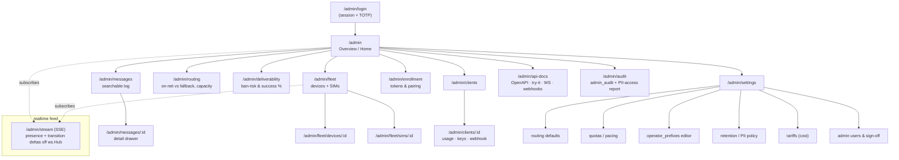
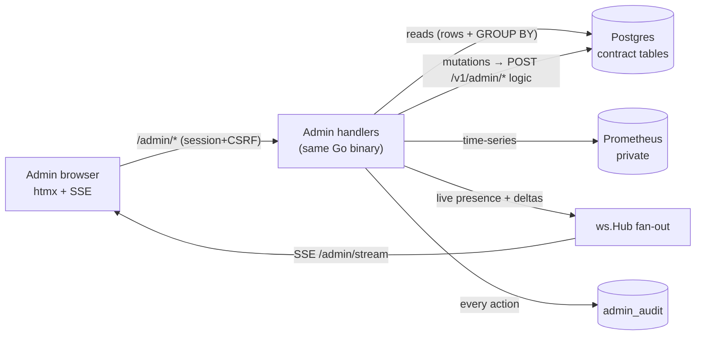
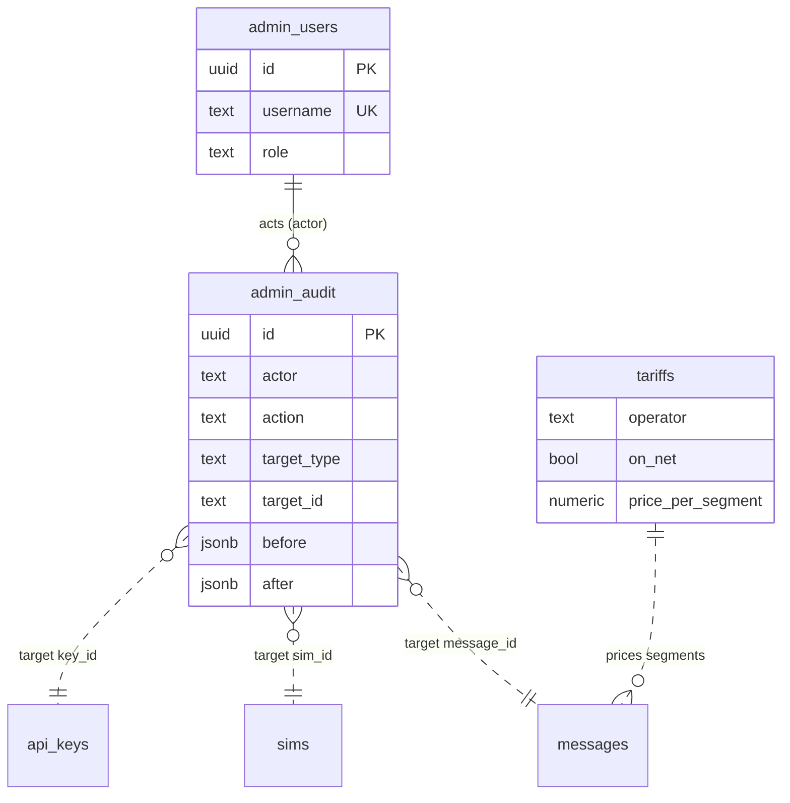

# 07 — Admin Management (Web Dashboard)

> **Status:** Design. Builds **strictly** on [`02 — Contract, Protocol & Schema`](02-contract-protocol-schema.md)
> (the SSoT) and wires in the operational behaviour from [`03 — Routing Engine`](03-routing-engine.md),
> [`04 — Go Backend`](04-go-server.md), and [`06 — Security, Legal & Operations`](06-security-legal-ops.md).
> Every table, column, enum value, REST path, WS `frame.type`, scope, close code, and metric
> referenced here is defined in those docs — this document **does not redefine the wire contract
> or schema**; it consumes them. Where this doc and doc 02 disagree, **doc 02 wins.**
>
> The admin dashboard is a **read-mostly operator console** over the same Postgres store, plus a
> **live channel off the `ws.Hub`** for realtime tiles, plus a thin set of **privileged mutations**
> that doc 06 already names (`POST /v1/admin/*`, scope `admin`). It introduces a small number of
> **ops-owned, additive tables** (`admin_users`, `admin_audit`, `tariffs`) that carry **no message
> content** and never touch the client/device wire protocol.
>
> **Scope terms** (per doc 06): **Owner** = WBlue, holds the SIM fleet and the ban/legal risk.
> **Operator** = whoever runs the gateway day-to-day. **Support / Integrator-support** = helps
> clients debug deliveries. **Client** = an external system calling the REST API. **Device** = an
> owned dual-SIM Android phone.

---

## Table of contents

- [1. Design principles](#1-design-principles)
- [2. Goals & personas](#2-goals--personas)
- [3. Roles & access model (RBAC)](#3-roles--access-model-rbac)
- [4. Information architecture](#4-information-architecture)
  - [4.0 Route map](#40-route-map)
  - [4.1 Overview / Home](#41-overview--home)
  - [4.2 Messages](#42-messages)
  - [4.3 Fleet — devices & SIMs](#43-fleet--devices--sims)
  - [4.4 Routing insight](#44-routing-insight)
  - [4.5 Deliverability & ban-risk](#45-deliverability--ban-risk)
  - [4.6 Clients & API keys](#46-clients--api-keys)
  - [4.7 Enrollment](#47-enrollment)
  - [4.8 Settings](#48-settings)
- [5. Integrated API documentation](#5-integrated-api-documentation)
- [6. Tech & integration](#6-tech--integration)
  - [6.1 Recommended stack](#61-recommended-stack)
  - [6.2 How the admin reads data](#62-how-the-admin-reads-data)
  - [6.3 Admin authentication & RBAC](#63-admin-authentication--rbac)
  - [6.4 PII handling (critical)](#64-pii-handling-critical)
- [7. What NOT to show — anti-patterns](#7-what-not-to-show--anti-patterns)
- [8. Additive data model (admin-owned tables)](#8-additive-data-model-admin-owned-tables)

---

<a name="1-design-principles"></a>

## 1. Design principles

1. **One source of truth, never a parallel store.** Every number on every screen resolves to a
   contract table (`messages`, `message_events`, `sims`, `devices`, `clients`, `api_keys`,
   `operator_prefixes`, `enrollment_tokens`) or to a Prometheus series that is itself derived from
   them (doc 06 §3.4). The admin adds aggregations, not vocabulary.
2. **Realtime from the hub, history from SQL/Prometheus.** Presence and in-flight state come live
   off `ws.Hub`; trends and rollups come from indexed SQL or the local Prometheus. Each tile
   **declares its source and whether it is live or a rollup** (§4.1) so nobody mistakes a 15-second-old
   gauge for a real-time one.
3. **Mask by default, unmask by exception, audit every reveal.** `messages.body`,
   `messages.target_msisdn`, and `sims.msisdn` are regulated personal data / secrets (doc 06 §1.1,
   §2.6). They render masked to everyone; a role-gated per-record reveal writes an `admin_audit`
   row (§6.4).
4. **Every mutation is auditable and reversible-in-intent.** Disabling a SIM, revoking a key,
   issuing an enrollment token, resending a message, changing a quota — all go through the same
   admin action path that writes `admin_audit` (doc 06 §1.9) with `before`/`after`.
5. **Surface the ban risk, never hide it.** Doc 06 §2 is blunt: consumer-SIM A2P is a grey route and
   SIMs get banned. The dashboard's #1 job after "is the fleet up" is to make a probable ban
   **impossible to miss** (§4.5) — not to bury it behind a green checkmark.
6. **Self-hosted, no external calls.** No CDN scripts, no external fonts, no analytics, no map tiles.
   Strict `Content-Security-Policy: default-src 'self'`. The console runs fully offline on the
   private network (doc 06 §1.1 boundary rules).
7. **The admin is not the client API.** Human operators authenticate with `admin_users` sessions
   (§6.3), **not** `wsms_…` bearer tokens. The client `admin` scope exists only for *automation* of
   the same privileged actions.

---

<a name="2-goals--personas"></a>

## 2. Goals & personas

The owner asked, specifically, to see **which numbers were sent to, the messages that were sent, the
API docs, "all integrated"** — and to **deep-check what is genuinely worth showing**. That reduces to
a small set of at-a-glance questions per persona. Every question below maps to exactly one screen
that answers it in one look.

| Persona | Role (§3) | Top questions to answer *at a glance* | Answered by |
|---|---|---|---|
| **Owner (WBlue)** | `owner` | *Is the fleet healthy right now?* · *Are my SIMs about to get banned or hit quota?* · *What is today costing me (on-net vs off-net)?* · *Is volume creeping toward the "switch to licensed A2P" trigger?* | Overview (§4.1), Ban-risk (§4.5), Routing insight (§4.4) |
| **Operator (runs the gateway)** | `operator` | *Which phone/SIM is offline, cooling down, quota-capped, or force-stop-dead?* · *Which SIM is being hammered?* · *Do I need to disable/swap a SIM or re-enroll a phone?* · *Is the queue backing up?* | Fleet (§4.3), Overview queue tiles (§4.1), Enrollment (§4.7) |
| **Support / integrator-support** | `support` | *Did message X deliver, and if not, why?* · *Which SIM/device sent it, on-net or fallback?* · *What number was it sent to?* (unmask, audited) · *Was the client's webhook delivered?* | Messages log + detail drawer (§4.2), Clients (§4.6) |
| **Developer / integrator** | `readonly` + API docs | *How do I submit a send / read status / handle webhooks?* · *What are the exact fields, enums, error codes, WS frames?* · *Can I try a call without sending a real SMS?* | Integrated API docs (§5), sandbox try-it |
| **Auditor / compliance** | `readonly` | *Who unmasked which number and why?* · *Who revoked which key / disabled which SIM?* · *Is retention being enforced?* | `admin_audit` views (§6.3/§6.4), Settings → retention (§4.8) |

**The four "hero" questions** the Overview must answer without a click, because they map directly to
the risks in doc 00 §8 and the alerts in doc 06 §3.6:

1. *Is the fleet healthy?* → devices ONLINE/total + SIMs READY/total + `/v1/readyz`.
2. *Did message X deliver?* → search by `message_id` / masked MSISDN / `dedup_key` → status + timeline.
3. *Which SIM is about to hit quota / at ban risk?* → `sent_today`/`daily_quota` gauges + ban-suspect panel.
4. *Why did sends to `<operator>` start failing?* → per-operator success %, failure-reason breakdown, on-net vs fallback drift.

---

<a name="3-roles--access-model-rbac"></a>

## 3. Roles & access model (RBAC)

Admin roles are **distinct from the contract's API-key scopes** (`messages:write`, `messages:read`,
`devices:read`, `sims:read`, `admin` — doc 02 §A.3, doc 06 §1.6). API-key scopes gate *machine*
callers of `/v1`; admin roles gate *human* operators of the console. Four roles, least-privilege by
default:

| Capability | `owner` | `operator` | `support` | `readonly` |
|---|:--:|:--:|:--:|:--:|
| View dashboards (masked) | ✅ | ✅ | ✅ | ✅ |
| **Unmask a single MSISDN** (audited, reason required) | ✅ | ✅ | ✅ (with reason) | ❌ |
| **Reveal a single message body** (audited, reason required) | ✅ | ✅ | ⚠️ opt-in per-client | ❌ |
| Resend / cancel a message | ✅ | ✅ | ⚠️ cancel only | ❌ |
| Export CSV (masked) | ✅ | ✅ | ✅ | ✅ |
| Export CSV (**unmasked**) | ✅ | ❌ | ❌ | ❌ |
| Disable/enable SIM, force cooldown, re-request `sim_report` | ✅ | ✅ | ❌ | ❌ |
| Disable/enable device, trigger FCM wake | ✅ | ✅ | ❌ | ❌ |
| Issue / revoke enrollment tokens | ✅ | ✅ | ❌ | ❌ |
| Issue / rotate / revoke API keys | ✅ | ⚠️ issue+rotate | ❌ | ❌ |
| Suspend / unsuspend client | ✅ | ✅ | ❌ | ❌ |
| Rotate client webhook secret | ✅ | ⚠️ | ❌ | ❌ |
| Edit `operator_prefixes` table | ✅ | ⚠️ | ❌ | ❌ |
| Edit routing/pacing/quota **defaults**, tariffs, retention policy | ✅ | ❌ | ❌ | ❌ |
| Manage `admin_users`, reset 2FA, capture owner sign-off (doc 06 §2.7) | ✅ | ❌ | ❌ | ❌ |
| View `admin_audit` / PII-access report | ✅ | ✅ (own scope) | ❌ | ❌ |

Legend: ✅ allowed · ⚠️ allowed with a constraint noted · ❌ hidden from the UI *and* rejected server-side.

RBAC is enforced **server-side** (route middleware), not merely by hiding buttons. A `readonly`
POST to a mutation route returns `403` and is logged. `owner`/`operator` accounts **MUST** have TOTP
2FA (§6.3).

---

<a name="4-information-architecture"></a>

## 4. Information architecture

<a name="40-route-map"></a>

### 4.0 Route map

All admin routes live under `/admin` on the same gateway process, in a Gin group behind session
auth + CSRF + RBAC middleware (§6.3) — completely separate from the `/v1` client API group.



| Route | Screen | Primary tables / sources | Min role |
|---|---|---|---|
| `/admin` | Overview / Home | `messages`, `sims`, `devices` + hub + Prometheus | `readonly` |
| `/admin/messages` | Message log | `messages` (+ join `clients`, `sims`, `devices`) | `readonly` |
| `/admin/messages/:id` | Message detail drawer | `messages` + `message_events` | `readonly` |
| `/admin/fleet` | Devices + SIMs | `devices`, `sims` + hub registry | `readonly` |
| `/admin/routing` | Routing insight | `routing_*` metrics + `messages` rollups | `readonly` |
| `/admin/deliverability` | Ban-risk & success | `messages`, `message_events`, `sim_*` metrics | `readonly` |
| `/admin/clients` | Clients & keys | `clients`, `api_keys`, `message_events` (webhooks) | `support` |
| `/admin/enrollment` | Tokens & pairing | `enrollment_tokens`, `devices` | `operator` |
| `/admin/settings` | Config | `operator_prefixes`, `tariffs`, config, `admin_users` | `operator`/`owner` |
| `/admin/api-docs` | Integrated API docs | vendored OpenAPI + Scalar/Redoc | `readonly` |
| `/admin/audit` | Audit & PII-access | `admin_audit` | `operator`/`owner` |
| `/admin/stream` | SSE realtime feed | `ws.Hub` fan-out + PG `LISTEN/NOTIFY` | (session) |

---

<a name="41-overview--home"></a>

### 4.1 Overview / Home

The single screen the owner and operator glance at all day. Layout: a **fleet-health banner**
(pinned, always live), a **KPI tile strip**, then **time-series charts**. Every element states its
data source and refresh mode. "Live" = pushed over SSE from the hub. "Rollup" = SQL/Prometheus,
refreshed on an interval (default 15 s) via htmx polling of a partial.

#### KPI tiles

| Tile | Question it answers | Exact source (doc 02 table.column / aggregate) | Live vs Rollup |
|---|---|---|---|
| **Devices online / total** | Is the fleet up? | live count of `ws.Hub` registered conns, reconciled to `devices.status = 'ONLINE'` vs `count(devices WHERE deleted_at IS NULL AND status != 'DISABLED')`. Mirrors `wsms_devices_online`. | **Live** (hub) |
| **SIMs ready / total** | Can I send right now? | `count(sims WHERE status='READY' AND enabled AND sent_today + 1 <= daily_quota)` vs total non-deleted. Mirrors `wsms_sims_ready{operator}`. | Rollup (15 s) + live nudge on `sim_report`/`status` |
| **`/v1/readyz` status** | One-glance go/no-go | probes `GET /v1/readyz` (doc 02 §B.8): 200 iff DB up **and** ≥1 device ONLINE **and** ≥1 SIM READY; else shows the `reasons[]`. | **Live** (probe every 10 s) |
| **Throughput (sends/min)** | Are we moving traffic? | `rate(wsms_sim_sent_segments_total[5m])` × 60, or `count(message_events WHERE event_type='SENT')` bucketed per minute. | Rollup |
| **Delivery success %** | Are messages arriving? | `DELIVERED / (DELIVERED + FAILED)` over the window from `messages.status`, or recording rule `wsms:delivery_success_ratio:5m` (doc 06 §3.4). | Rollup |
| **Status split** (SENT_UNCONFIRMED · DELIVERED · FAILED) | *Where* are messages ending up? | grouped `count(messages) GROUP BY status` over window: **SENT_UNCONFIRMED** = left the phone, no delivery report — a normal terminal outcome on many IDN routes, NOT failure ([08-amendments](08-amendments.md) F4); **DELIVERED** = confirmed `0x00`; **FAILED** = terminal failure. | Rollup |
| **Queue depth** (QUEUED · ROUTING · DISPATCHED) | Is demand outrunning supply? | `count(messages) GROUP BY status WHERE status IN ('QUEUED','ROUTING','DISPATCHED')`. Mirrors `wsms_queue_depth{status}`. | Rollup (5 s) |
| **On-net vs fallback %** | Am I paying for off-net sends? | `sum(routing_decisions_total{on_net="true"}) / sum(routing_decisions_total)` (doc 03 §12); per-message truth from the `ROUTED` `message_events.raw`. | Rollup |
| **Per-operator volume** | Where is traffic going? | `count(messages) GROUP BY target_operator` (and `assigned_operator` via `assigned_sim_id → sims.operator`) over window. | Rollup |
| **Cost today** | What is today costing? | `Σ(segments)` today split by on-net/off-net × `tariffs` (§4.8, §8). On-net ≈ 0; off-net = `segments × tariff[assigned_operator]`. Contract §0.6: cost is derived from `segments`, not stored. | Rollup |
| **Reroute rate** | Radio/SIM instability? | `rate(wsms_reroutes_total[10m])` / `count(message_events WHERE event_type='REROUTED')`. | Rollup |
| **Ban-risk badge** | Any SIM likely banned? | worst of: `SimBanSuspected` firing, any SIM auto-`DISABLED` by hard trip (doc 03 §8.2), any SIM `sent_today/daily_quota > 0.9`. Deep-links to §4.5. | **Live-ish** (30 s) |

> **On the `on_net` field.** `on_net` is **not a stored `messages` column** in doc 02 — it is
> *derived* as `sameOperator(assigned_sim.operator, target_operator)` (doc 03 §5.2; `UNKNOWN` never
> matches). Because `sims.operator` can be re-reconciled after a SIM swap, the **stable historical
> record** of the actual decision is the `ROUTED`/`DISPATCH` row in `message_events` (carries
> `SIMID`) and the `routing_decisions_total{on_net}` metric. The admin uses the metric for
> time-series and the event for per-message truth — it never trusts a live re-join for history.
> *(Ops recommendation: have the routing engine also stamp `on_net` into `message_events.raw` at
> `ROUTED` time — `raw` is contract-blessed free-form JSONB (§A.7) — so per-message on-net survives
> a later SIM reconciliation without a schema change.)*

#### Charts

| Chart | Series | Source |
|---|---|---|
| Throughput over time | sends/min (`event_type='SENT'`) vs delivered/min (`event_type='DELIVERED'`) | `message_events` bucketed / Prometheus |
| Terminal-outcome stacked area | DELIVERED / FAILED / EXPIRED / CANCELLED per interval | `wsms_messages_terminal_total{status}` |
| Per-operator volume (stacked bar) | on-net vs off-net segments per `target_operator` | `messages` rollup + `on_net` |
| Success % per operator (small multiples/sparklines) | one sparkline per `operator_t` | `wsms:delivery_success_ratio:5m` |
| Queue-depth over time | QUEUED / ROUTING / DISPATCHED | `wsms_queue_depth{status}` |
| SIM load heatmap | `sent_today / daily_quota` per SIM, colour-ramped | `sims.sent_today`, `sims.daily_quota` |

ASCII sketch of the Overview (opinionated layout):

```
┌───────────────────────────────────────────────────────────────────────────┐
│ FLEET  ● 4/5 devices online   ● 7/10 SIMs ready   readyz: OK               │  live
│ ⚠ BAN-RISK: 1 SIM auto-disabled (HP-C slot1 TRI) — review                  │
├──────────────┬──────────────┬──────────────┬──────────────┬───────────────┤
│ Throughput   │ Success %    │ Status split │ Queue depth  │ On-net / FB    │
│ 38 /min      │ 91.4%        │ D 812  S 44  │ Q 12 R 3 D 5 │ 78% / 22%      │
│ ▁▂▄▆█▆▄      │ ▇▇▇▆▇▇▇      │ F 33         │ ▂▂▁▃▂        │ ▇▇▆▇▇          │
├──────────────┴──────────────┴──────┬───────┴──────────────┴───────────────┤
│ Per-operator volume (on/off-net)   │ Cost today: on-net ~0 · off-net Rp …  │
│ TSEL ███░  IST ██   XL █    TRI ▏  │ Reroutes: 1.2/min                     │
└────────────────────────────────────┴───────────────────────────────────────┘
```

---

<a name="42-messages"></a>

### 4.2 Messages

This is the owner's literal ask — *which numbers were sent to, and the messages that were sent* —
done as a searchable, filterable log with a forensic detail drawer. **PII is masked by default**
(§6.4).

#### Columns

| Column | Field / source | Notes |
|---|---|---|
| `message_id` | `messages.id` (UUIDv7) | short-form + click-to-copy; sortable = creation order |
| Created | `messages.created_at` | relative + absolute (UTC, ms) |
| To | `messages.target_msisdn` | **masked** `+62812****7890`; per-row **unmask** control → audited reveal (§6.4) |
| Target op | `messages.target_operator` (`operator_t`) | badge; `UNKNOWN` flagged |
| Assigned op | `assigned_sim_id → sims.operator` | shows **on-net** ✅ / **fallback** ⚠️ vs target |
| Client | `messages.client_id → clients.name` | link to client detail |
| Device / SIM | `assigned_device_id → devices.device_key` + `assigned_sim_id → sims.slot_index` | e.g. `HP-A · slot 0`; never shows `subscription_id` (unstable, doc 02 §0.1) |
| Enc | `messages.encoding` (`encoding_t`) | GSM7 / UCS2 |
| Seg | `messages.segments` | drives cost + quota |
| Status | `messages.status` (`message_status_t`) | badge + inline mini-timeline dots |
| Attempts | `messages.attempts` / `messages.max_attempts` | e.g. `2/3` |
| Reason | `messages.last_reason` (`failure_reason_t`) + `last_detail` | only meaningful on non-`NONE` |
| Cost | `segments × tariffs[assigned_operator, on_net]` | derived (§4.8) |
| Dedup | `messages.dedup_key` | idempotency key, per client |
| Expires | `messages.expires_at` | TTL countdown for non-terminal |

#### Filters

- **Status** (multi-select over `message_status_t`): QUEUED · ROUTING · DISPATCHED · AWAITING_ACK ·
  SENT · SENT_UNCONFIRMED · DELIVERED · FAILED · EXPIRED · CANCELLED.
  `AWAITING_ACK` and the terminal `SENT_UNCONFIRMED` are added by [08-amendments](08-amendments.md)
  (F1, F4); include them once the amendments land.
- **Target operator** / **Assigned operator** (`operator_t`), and an **on-net / fallback** toggle.
- **Client** (`client_id`), **Device** (`assigned_device_id`), **SIM** (`assigned_sim_id`).
- **Date range** on `created_at` (and secondary on `sent_at` / `delivered_at`).
- **Failure reason** (`failure_reason_t`), **routing policy** (`routing_policy_t`), **priority**.
- **`dedup_key`** exact match; **`metadata.key=val`** (mirrors `GET /v1/messages` filters, doc 02 §B.5).
- **Free-text**: over `message_id`, masked MSISDN suffix, `client.name`, `metadata`. **Body
  substring search is off by default** (PII) and, where enabled for a role, is audited like an
  unmask (§6.4).
- Cursor pagination (doc 02 §B.1 `?limit&cursor`), same engine as the client list endpoint.

#### Detail drawer — `/admin/messages/:id`

Everything needed to answer *"did it deliver, and why / why not?"* in one panel:

1. **Header** — `message_id`, status badge, `client.name`, `routing_policy`, `priority`,
   `created_at`, `expires_at`, and the **on-net verdict**: `assigned_operator` vs `target_operator`
   with a plain-language line (*"Telkomsel target → sent on an XL SIM (fallback, off-net)"*).
2. **Lifecycle timestamps** — `dispatched_at`, `sent_at`, `delivered_at`, `terminal_at`, with two
   computed latencies: **dispatch latency** (`created_at → sent_at`) and **delivery latency**
   (`sent_at → delivered_at`). Mirrors `GET /v1/messages/:id` `timeline` (doc 02 §B.4).
3. **Full status timeline** — the append-only `message_events` for this `message_id`, ordered by
   `created_at` (doc 02 §A.7). Each row renders `event_type` (`CREATED`, `ROUTED`, `REROUTED`,
   `DISPATCH`, `SEND_ACCEPTED`, `SEND_REJECTED`, `SENT`, `DELIVERED`, `FAILED`, `EXPIRED`,
   `CANCELLED`, `RETRY_SCHEDULED`, `WEBHOOK_SENT`), the `from_status → to_status` edge, `sim_id`,
   `device_id`, `attempt`, `reason`, `detail`, and an expandable **`raw`** blob — the verbatim
   device payload (`android_result_code`, `parts_ok/parts_total`, `phase`) that came off the WS
   `delivery_report`/`send_ack` frames (doc 02 §C.4). This *is* "every WS frame / ack / delivery
   report" the owner asked for, because ingress persists each into `message_events`.
4. **Routing decision — the "why"** — reconstructed from the `ROUTED`/`REROUTED` events: which SIM
   was chosen, on which device, whether it was an **on-net match or fallback**, and the per-attempt
   history. If the message was rerouted, the **tried set** (doc 03 §11, `route:tried:{message_id}`)
   and each attempt's `reason` explain the churn — e.g. *"attempt 1 → HP-A slot 0 (Telkomsel),
   rejected `RADIO_OFF`; attempt 2 → HP-B slot 1 (Telkomsel), SENT."* Ambiguous-outcome messages
   are labelled *"kept on same SIM (no reroute) — awaiting device idempotency ledger"* per contract
   §D/§E, so support understands why the server *didn't* retry.
5. **Body** — masked by default (shows `encoding`, `segments`, `body_len`, and a `••••` placeholder);
   a role-gated **reveal** writes an `admin_audit` `pii.reveal.body` row (§6.4).
6. **Webhook deliveries** — the `WEBHOOK_SENT` events for this message: target URL
   (`callback_url` or client `webhook_url`), attempt count, result (`ok`/`retry`/`dropped`), HTTP
   code, and the `X-WSMS-Event` name (doc 02 §B.9). This is how support answers *"we sent it — did
   your endpoint accept it?"*.
7. **Actions** (RBAC-gated):
   - **Cancel** → `POST /v1/messages/:id/cancel` (doc 02 §B.6). Allowed only from `QUEUED` /
     `ROUTING` / `DISPATCHED`; `409` from `SENT`/`DELIVERED`. Best-effort WS `cancel` race.
   - **Resend** → creates a **new** message (new `message_id`) copying `to`/`body`/`routing_policy`,
     with `metadata.resend_of = <original id>`. It **never** reuses the original `message_id` — that
     would break the device idempotency ledger and the no-double-send guarantee (contract §E). Only
     offered for terminal `FAILED`/`EXPIRED`/`CANCELLED`.
   - Both actions write `admin_audit`.

#### Export

- **CSV export** of the current filtered result set. Columns = the log columns above.
- **Masked by default** for all roles. **Unmasked export is `owner`-only**, requires a typed reason,
  and writes an `admin_audit` `export.messages` row with `{ filter, row_count, pii_included: true }`
  (§6.4).
- Row cap on synchronous export (e.g. 10k); larger exports run as a background job and drop a
  download link — the job itself is audited. Exports are **download-only**; the console never emails
  or uploads them anywhere (self-hosted, no external egress).

---

<a name="43-fleet--devices--sims"></a>

### 4.3 Fleet — devices & SIMs

Two linked views: a **devices list** and, under each device (and as a global SIMs table), **SIM
cards**. Presence is **live off `ws.Hub`**; the rest is `devices`/`sims` columns.

#### Devices list — columns

| Column | Source | Notes |
|---|---|---|
| Device | `devices.device_key` | human label (`HP-A`) |
| Status | `devices.status` (`device_status_t`) | ENROLLED / **ONLINE** / OFFLINE / DISABLED — **live** from hub |
| Last seen | `devices.last_seen_at` | relative; drives staleness |
| App version | `devices.app_version` | flagged **outdated** vs the "latest" set in Settings |
| Model / OS | `devices.model`, `devices.os_version` | |
| Battery | `devices.health->>'battery_pct'` + `charging` | from heartbeat JSONB (doc 02 §A.4) |
| **Wake health** | derived (below) | the force-stop-dead early warning |
| SIMs | `count(sims WHERE device_id=…)` + ready summary | e.g. `2 (1 ready)` |
| Session | `devices.session_id` present | single-connection rule (contract §C.3) |

**Wake-health / force-stop-dead detection** — a derived GREEN/AMBER/RED indicator, because an
OEM battery killer (doc 00 R3) can force-stop the app so it neither sends nor reconnects:

- **GREEN** — `status='ONLINE'`, `last_seen_at` within `2 × heartbeat_sec`, and
  `health->>'ignoring_batt_opt' = true`.
- **AMBER** — online but a risk flag is set: `ignoring_batt_opt=false`, `doze=true`, low
  `battery_pct` and not charging, or app version outdated.
- **RED — probable force-stop-dead** — was ONLINE, now `status='OFFLINE'` **and** `last_seen_at`
  older than the reconnect grace **and** an FCM wake was already sent without a reconnect (the
  gateway holds `devices.push_token` and sends `{"wsms":"wake"}`, doc 02 §C). This is the actionable
  "go physically check / re-open the app" alert, not just "offline".

**Device actions** (RBAC): **Disable** (`status=DISABLED` → next/forced handshake gets close
**4403**, and its SIMs leave the routing pool immediately — doc 06 §1.5); **Re-request `sim_report`**
(push a WS `ping`/`config` to prompt a fresh inventory); **Send FCM wake** (manual revive);
**Re-enroll** (jump to Enrollment to mint a token). All audited.

#### SIM cards — fields & actions

Per SIM (`sims` row), the routing target:

| Field | Source | Why it's shown |
|---|---|---|
| Device · slot | `device_id → device_key` + `slot_index` | stable physical identity (not `subscription_id`) |
| Operator | `sims.operator` (`operator_t`) | with a **derivation badge**: MNC / own-MSISDN / carrier-name / **manual override** — the precedence ladder in doc 03 §3. If `sims.health->>'operator_override'` is set, show a "LOCKED override" chip. |
| Carrier name | `sims.carrier_name` | display-only; explicitly *not* trusted for routing (doc 03 §3) |
| MSISDN | `sims.msisdn` | **masked**; often NULL (Android rarely exposes it, doc 02 §A.5) |
| MCC / MNC | `sims.mcc` / `sims.mnc` | `510`/`10` = Telkomsel, etc. |
| SIM status | `sims.status` (`sim_status_t`) | READY / COOLDOWN / QUOTA_EXCEEDED / ABSENT / DISABLED / UNKNOWN |
| Enabled | `sims.enabled` | admin master switch |
| **Quota today** | `sims.sent_today` / `sims.daily_quota` | progress bar + %; the ban-hygiene cap (doc 03 §7) |
| Rate window | `sims.sent_window` | current short-window pacing load (least-loaded ranking input) |
| Last used (LRU) | `sims.last_sent_at` | rotation / idle indicator |
| Radio health | `sims.health` (`signal_dbm`, `radio`, `roaming`) | weak signal deprioritises the SIM |
| Cooldown / quarantine | `sims.status='COOLDOWN'`, `health` snapshot of `cooldown_until`, `quarantines_24h`, `ewma_fail_rate` (doc 03 §8.3) | ban-risk trend |
| Recent failures | `count(message_events WHERE sim_id=… AND reason IN (sender-side set))` last N | spike = ban signal |

**SIM actions** (RBAC): **Disable** (`enabled=false` → dropped from `RoutingCandidates`, doc 03 §4);
**Force cooldown** (set `status='COOLDOWN'`); **Re-request `sim_report`**; **Set operator override**
(writes `sims.health.operator_override`, doc 03 §3.3); **Edit `daily_quota` / pacing** (pushes a WS
`config` frame, doc 02 §C.5). All audited; "disable a suspected-banned SIM" is the doc 06 §3.7
runbook one-liner.

---

<a name="44-routing-insight"></a>

### 4.4 Routing insight

Answers *"is my SIM mix right, and where am I paying for fallback?"* — sourced from the routing
metrics (doc 03 §12) and `messages` rollups.

| Panel | What it shows | Source |
|---|---|---|
| **On-net vs fallback over time** | the drift the owner cares about for cost | `routing_decisions_total{on_net}`, `routing_fallback_total{target_operator}` |
| **Per-operator capacity vs demand** | supply (Σ READY SIMs × remaining quota per `operator`) vs demand (message volume per `target_operator`); flags operators where demand > supply → *"buy more SIMs on this operator"* | `sims` aggregate + `messages` rollup; `routing_fallback_total{target_operator}` |
| **Per-SIM load distribution** | *is one SIM being hammered?* — bar/heatmap of `sim_selected_total{sim_id}` and `sent_today` across the fleet; a spike on one SIM is both a fairness and a **ban** problem | `sim_selected_total`, `sims.sent_today` |
| **UNKNOWN-operator rate** | share of sends where `target_operator='UNKNOWN'` (prefix table gaps / new-ported ranges) — deep-links to the `operator_prefixes` editor (§4.8) | `count(messages WHERE target_operator='UNKNOWN')`, `route_no_route_total` |
| **Reroute churn** | routing instability by reason | `wsms_reroutes_total{reason}` |

---

<a name="45-deliverability--ban-risk"></a>

### 4.5 Deliverability & ban-risk

The plan calls SIM bans the **#1 risk** (doc 00 §8 R1, doc 06 §2). This screen turns "SIMs silently
dying" into something visible and actionable — its whole reason to exist.

| Panel | What it shows | Source |
|---|---|---|
| **Success % per SIM / operator** | `DELIVERED / (DELIVERED+FAILED)` grouped by `assigned_sim_id` and by `operator`; a sudden drop on one SIM is a block signature | `messages` rollup / `wsms:delivery_success_ratio:5m` |
| **Failure-reason breakdown** | `messages.last_reason` / `message_events.reason` grouped by `failure_reason_t`, **split sender-side vs recipient-side**: sender-side ban signals (`NO_SERVICE`, `GENERIC_FAILURE`, `RADIO_OFF`, `SHORT_CODE_NOT_ALLOWED`, `FDN_CHECK_FAILURE`, `LIMIT_EXCEEDED`) vs recipient-side (`DELIVERY_*`) which are *not* the SIM's fault (doc 03 §8.1) | `message_events`, `wsms_sim_failures_total{sim_id,reason}` |
| **Send-rate spikes per SIM** | `rate(wsms_sim_sent_segments_total[5m])` per SIM vs its trailing baseline — the early warning that a SIM is being pushed into ban-visible territory | Prometheus |
| **SIMs trending toward quota** | list of SIMs where `sent_today / daily_quota > 0.8`, sorted; who will cap out soon | `sims.sent_today`, `sims.daily_quota` |
| **Ban-suspect panel** | SIMs matching `SimBanSuspected` (doc 06 §3.6), SIMs hard-tripped to `DISABLED` by the circuit breaker (`quarantines_24h ≥ threshold_hard`, doc 03 §8.2), and their recent failure timeline — with a **Disable & flag for swap** action | `sim_quarantine_total`, `sims`, `message_events` |
| **Fleet attrition** | count of SIMs in `COOLDOWN` / `DISABLED` over time — the "consumable SIM" reality (doc 00 R1) | `sims.status` history |
| **Off-ramp gauge** | rolling daily segment volume vs the doc 06 §2.4 "switch to licensed A2P" thresholds; a persistent, honest nudge | `messages` rollup + Settings thresholds |

---

<a name="46-clients--api-keys"></a>

### 4.6 Clients & API keys

| View | Content | Source |
|---|---|---|
| **Clients list** | `clients.name`, `status` (active/suspended), `rate_limit_per_sec`, key count, webhook set?, 24h/7d volume, success %, last-submit | `clients`, `api_keys`, `messages` |
| **Client detail → usage** | submit volume, accepted vs rejected (`wsms_messages_submitted_total{client,result}`), **rate-limit status** (`wsms_rate_limited_total{client}` — how often they hit `429`), success %, per-operator mix | metrics + `messages` |
| **Client detail → API keys** | per `api_keys` row: `key_id` (public prefix, safe to show), `scopes`, `last_used_at`, `expires_at`, `revoked_at`, `created_at`. **Never** the secret or `secret_hash` | `api_keys` |
| **Client detail → webhook** | `webhook_url`, subscribed events, `require_signing` flag; **delivery health** = `WEBHOOK_SENT` results (`ok`/`retry`/`dropped`, `wsms_webhook_delivery_total`), failed-attempt list, `wsms_webhook_queue_depth`; a **send test webhook** button (signed, to their URL) and **replay failed** | `message_events`, metrics |
| **Client detail → audit** | `admin_audit` filtered to this client (key issue/revoke, suspend, secret rotate) | `admin_audit` |

**Key lifecycle actions** (doc 06 §1.3, RBAC-gated):

- **Issue key** → `POST /v1/admin/clients/:id/keys` with requested `scopes` + optional `expires_at`;
  server returns the **full `wsms_<env>_<keyid>.<secret>` token exactly once** — the UI shows a
  copy-once panel and never stores or re-displays the secret.
- **Rotate** → issue a new key, keep the old live during an overlap window, then set `revoked_at`
  once `last_used_at` on the old key goes idle (zero-downtime rotation, doc 06 §1.3).
- **Revoke** → set `revoked_at`; takes effect immediately (≤5 s auth cache).
- **Suspend / unsuspend client** → `clients.status`; surfaces the **anomaly auto-suspend** state
  (doc 06 §1.7 #5) with the reason, and requires an `admin`/`owner` unsuspend.
- **Rotate webhook secret** → re-issues `clients.webhook_secret` (stored encrypted, never shown).

Every action writes `admin_audit` with `before`/`after` and `actor_key_id`/actor.

---

<a name="47-enrollment"></a>

### 4.7 Enrollment

Manage the one-time provisioning secrets that bind a fresh phone (doc 02 §A.9, doc 06 §1.5).

- **Token list** — `enrollment_tokens`: `label` (intended `device_key`, e.g. `HP-D`), `uses` /
  `max_uses`, `expires_at`, `created_at`, and a derived **status** (active / consumed / expired).
  The raw token is **never** stored or shown after creation (only `token_hash` = `sha256`).
- **Issue token** — form: `label`, `max_uses` (default 1), TTL (default ≤ 24 h, doc 06 §1.5).
  Returns the `ENR-XXXX-XXXX` **once**, rendered as text **and a QR code** (generated locally, no
  external service) to scan into the phone. Writes `admin_audit`.
- **Revoke token** — expire immediately (set `expires_at = now`).
- **Pairing status** — which `devices` enrolled from which token (link via the enroll flow),
  recent enrollments, and any rejected attempts (bad/expired/`platform != 'android'` — the
  Android-only enforcement, doc 02 §A.4 / doc 06 §1.5).

---

<a name="48-settings"></a>

### 4.8 Settings

Owner-centric configuration (mostly `owner`; some `operator`). Each save writes `admin_audit`.

| Group | Controls | Backing |
|---|---|---|
| **Routing defaults** | default `routing_policy_t`, ranking `Weights` (doc 03 §6.2), `Grace`, `MaxAttempts`, reroute backoff | config / engine params |
| **Quotas & pacing** | default `daily_quota`, `perSimRate`, `burst`, `min_gap_ms`, `jitter_ms`, `windowMinutes` (doc 03 §7.3); per-SIM overrides pushed via WS `config` frame | `sims` + config |
| **Operator prefix table** | CRUD over `operator_prefixes` (`prefix`, `operator`, `note`, `active`) — add a new/ported range without redeploy; hot-reloads via `LISTEN/NOTIFY` (doc 02 §A.8). Read-only reference of the MCC/MNC map and a note that a per-SIM fix uses `sims.health.operator_override` (doc 03 §3.3) | `operator_prefixes` |
| **Retention / PII policy** | `WSMS_MSG_RETENTION_DAYS` (default 30, doc 06 §2.6) with a live "next purge" countdown; masking defaults; who may unmask/export; capture the **owner sign-off checklist** (doc 06 §2.7) into `admin_audit` | config + `admin_audit` |
| **Quarantine thresholds** | `threshold_soft`, `threshold_hard`, cooldown `base`/`cap` (doc 03 §8.2) | config |
| **Tariffs (cost)** | per-`operator_t`, on-net vs off-net price-per-segment — the only input the Cost tiles need beyond `segments` (contract §0.6) | `tariffs` (§8) |
| **Off-ramp thresholds** | the volume triggers for the §4.5 off-ramp gauge (doc 06 §2.4) | config |
| **Admin users** | (owner only) create/disable `admin_users`, assign roles, reset TOTP 2FA | `admin_users` |

---

<a name="5-integrated-api-documentation"></a>

## 5. Integrated API documentation

The owner asked for the API docs to live **inside** the admin, "all integrated" — not a separate
site. It mounts at `/admin/api-docs` and is fully self-hosted.

### 5.1 Spec: OpenAPI 3.1, generated from the Go handlers

- The **client REST API** (doc 02 §B) is described by an **OpenAPI 3.1** document. Recommended
  approach: annotate the Gin handlers (`internal/api/handlers/*`) and DTOs (`internal/api/dto.go`)
  with **`swaggo/swag`** and generate `openapi.json` at build time; **or** hand-author
  `deploy/openapi.yaml` and keep it in the repo. Either way the spec is a build artifact **vendored
  into the binary** (`go:embed`) so the served docs are pinned to the running code and cannot drift.
- The spec covers, verbatim from doc 02: `POST /v1/messages`, `/messages/batch`,
  `GET /v1/messages`, `GET /v1/messages/:id` (`?include=events`), `POST /v1/messages/:id/cancel`,
  `GET /v1/devices`, `/devices/:id`, `GET /v1/sims`, `GET /v1/stats`, `GET /v1/healthz`, `/readyz`,
  and `POST /v1/devices/enroll`; the **error envelope** and its `code` set (`UNAUTHENTICATED`,
  `FORBIDDEN`, `INVALID_MSISDN`, `VALIDATION_ERROR`, `BODY_TOO_LONG`, `RATE_LIMITED`, `NOT_FOUND`,
  `CONFLICT`, `NO_ROUTE_AVAILABLE`, `INTERNAL`); the `Authorization: Bearer wsms_<env>_<keyid>.<secret>`
  scheme; the `Idempotency-Key` header; cursor pagination; and the `X-RateLimit-*` / `Retry-After`
  response headers.

### 5.2 Rendering: Scalar or Redoc, self-hosted, no CDN

- Render with **Scalar** (recommended for its cleaner "try-it" panel) or **Redoc**, with the
  JS/CSS **vendored locally** and served under the same strict CSP (`default-src 'self'`) — no
  external CDN, no Google Fonts. Assets are `go:embed`-ed alongside the spec.

### 5.3 Live "try it" against a sandbox

- The try-it panel is wired to a **sandbox**, never production: it uses a `WSMS_ENV=test` API key
  (`wsms_test_…`) bound to a dedicated **test client**, and sends are serviced only by the
  **simulated-device harness / dry-run app** (doc 06 §4.2) so **no real SMS is emitted** and no
  quota/ban risk is incurred.
- A short-lived, scoped sandbox key is minted per admin session, rate-limited, and every sandbox
  send is tagged `metadata.sandbox=true` and routed exclusively to virtual/dry-run devices.

### 5.4 Webhook / callback reference

- A dedicated page documents the **outbound webhook** contract (doc 02 §B.9): the event names
  (`message.routed`, `message.dispatched`, `message.sent`, `message.delivered`, `message.failed`,
  `message.expired`, `message.cancelled`), the JSON payload schema (including `on_net`,
  `assigned_operator`, `previous_status`, `reason`, `attempt`), the `X-WSMS-Event` /
  `X-WSMS-Delivery` / `X-WSMS-Signature` headers, the **HMAC-SHA256 verification** algorithm
  (`signed_payload = "{t}." + raw_body`, constant-time compare, reject `|now−t| > 300s`), and the
  at-least-once retry / backoff behaviour.

### 5.5 WS protocol reference

- A read-only reference page for the **device ↔ server WebSocket protocol** (doc 02 §C): the frame
  envelope (`type`/`id`/`ts`/`data`), both frame catalogs (device→server: `hello`, `sim_report`,
  `heartbeat`, `send_ack`, `delivery_report`, `status`, `ack`; server→device: `welcome`,
  `send_command`, `cancel`, `config`, `ping`, `ack`), the two-layer ack semantics, and the close
  codes (`4001` superseded, `4401` auth, `4403` disabled — doc 02 §C.3; `4002` send-overflow — doc 04). No try-it here —
  the WS is device-secret-authenticated, not a client surface — but the harness (doc 06 §4.2) is
  linked as the way to exercise it.

### 5.6 Copy-paste code samples

- For each client operation (submit, batch, get, list, cancel, verify-webhook): ready-to-run
  **curl**, **Go**, **Node**, and **PHP** snippets, using the exact field names and the
  `wsms_<env>_…` bearer format. Generated from the spec where possible so they stay in sync.

### 5.7 Versioning

- The spec's `info.version` is tied to the build (`wsms_build_info{version,commit}`, doc 06 §3.4)
  and the API is pinned under `/v1`. The docs page shows the running version + commit, offers a
  **download of `openapi.json`**, and keeps a short changelog. Because the spec is embedded in the
  binary, "the docs" and "the code" ship as one unit and cannot disagree.

---

<a name="6-tech--integration"></a>

## 6. Tech & integration

<a name="61-recommended-stack"></a>

### 6.1 Recommended stack — server-rendered Go + htmx (not a SPA)

**Recommendation: server-rendered Go `html/template` + htmx, with a thin sprinkle of vanilla JS for
charts and SSE. Do not build a separate SPA.**

Rationale for this specific, small, owned deployment (3–10 phones, single Go binary, doc 04 §1):

- **One process, one deployable.** The gateway is already a single Go binary behind Caddy (doc 06
  §3.1). Server-rendered admin handlers mount in the same binary under `/admin`, reusing the same
  `store.Stores` (GORM) and the same `ws.Hub`. No second service, no Node toolchain, no separate
  build/deploy pipeline, no CORS surface, no bundler.
- **htmx covers the interaction model.** The admin is filter → table → drawer → occasional action.
  htmx does exactly that with server-rendered partials: `hx-get` for filtered/paginated tables and
  the detail drawer, `hx-post` for actions with CSRF headers, `hx-sse` (or native `EventSource`)
  for live tiles. That is ~1 small JS dependency (vendored) versus a whole SPA framework, router,
  and state layer.
- **CSP-friendly and offline.** Everything is `self`-hosted; no external scripts/fonts/telemetry.
  A SPA would tempt CDN pulls and complicate the strict CSP.
- **PII stays server-side.** Masking/unmasking and RBAC are enforced in the handler that renders the
  cell; the browser never receives unmasked data it isn't entitled to. A SPA that fetches JSON would
  push that trust boundary into the client.
- **Where JS is genuinely needed:** charts (vendor **uPlot** or **Chart.js** locally; for the
  simplest tiles, render **inline SVG sparklines** server-side and skip JS entirely) and the SSE
  subscription for live tiles. These are small islands, not an app.

A SPA (React/Vue) is the wrong tool here: it adds a second deployable, a token-auth story, a build
chain, and a client-side trust boundary for PII — all overhead with no payoff for an internal,
single-tenant, low-traffic console.

<a name="62-how-the-admin-reads-data"></a>

### 6.2 How the admin reads data

- **Same store, read-only aggregations.** Admin handlers use the existing `store` repos (doc 04 §6)
  for row reads and add a small **admin read repo** for grouped aggregates (status counts, per-op
  volume, per-SIM load). These are indexed `GROUP BY` queries; nothing writes a parallel table.
- **Time-series from Prometheus.** For anything rate/trend-shaped (throughput, success %, reroute
  rate, on-net %, ban-suspect), the admin queries the **local Prometheus HTTP API over the private
  network** (doc 06 §3.4 already defines the series and recording rules). This keeps heavy
  time-window math off Postgres and reuses the exact series the alerts fire on — so the dashboard
  and the pager never disagree.
- **Realtime via a hub fan-out + SSE.** Add an **admin subscriber channel** to `ws.Hub`: a
  broadcast of presence changes (`onDisconnect`, register/supersede) and message-transition deltas
  (from the same ingress path that calls `store.Transition`). Expose it as **`/admin/stream`
  (Server-Sent Events)**; live tiles (`devices online`, `readyz`, `queue depth`, ban badge) and the
  fleet presence dots subscribe. A Postgres `LISTEN/NOTIFY` on transitions backstops cross-cutting
  updates. This is in-process — **no new infrastructure** beyond what doc 04/06 already run.
- **Read-your-writes.** After a mutation (disable SIM, cancel, revoke key), the handler returns the
  freshly-read partial so the operator sees the effect immediately, and the `admin_audit` row is
  written in the same request.



<a name="63-admin-authentication--rbac"></a>

### 6.3 Admin authentication & RBAC

- **Separate identity from clients and devices.** Humans authenticate against a new **`admin_users`**
  table (§8) — `username`, Argon2id `password_hash` (same params as doc 06 §1.3: 64 MiB / 3 / 2),
  `role`, encrypted `totp_secret`, `status`, `last_login_at`. Admin identity **never** uses a
  `wsms_…` bearer token or a `dsec_…` device secret. The client `admin` *scope* (doc 06 §1.6)
  remains only for machine automation of the same privileged endpoints.
- **Sessions.** Server-side session with an `HttpOnly; Secure; SameSite=Strict` cookie, short idle
  timeout, and rotation on privilege use. **CSRF token** on every mutating form/`hx-post`
  (via `hx-headers`). **TOTP 2FA is required for `owner` and `operator`.**
- **Brute-force resistance.** Per-user + per-source-IP failed-login throttle and lockout, constant-
  time compare, and **no user-enumeration** (identical response for unknown user vs bad password),
  mirroring doc 06 §1.3.
- **RBAC enforced in middleware**, not just in the template: every `/admin/*` route declares its
  minimum role (§3); a disallowed request returns `403` and is audited.
- **Every privileged action → `admin_audit`** (doc 06 §1.9): `actor`, `actor_role`, `action`,
  `target_type`, `target_id`, `before`, `after`, `source_ip`, `request_id`. Retained ≥ 1 year
  (longer than operational data).
- **Network posture.** Because the console can unmask PII, prefer **not exposing it on the public
  internet** at all: bind `/admin` to a private path/port and reach it over **VPN or SSH tunnel**
  (doc 06 §3.2 already gates Grafana this way), and/or put a per-source IP allowlist in front of it.
  If it must be public, it sits behind the same Caddy TLS + HSTS with an additional auth gate.

<a name="64-pii-handling-critical"></a>

### 6.4 PII handling (critical)

Message bodies (OTPs), target MSISDNs, and SIM MSISDNs are the highest-blast-radius assets in the
system (doc 06 §1.1) and regulated personal data under UU 27/2022 (doc 06 §2.6). The admin is the
place a leak is most likely, so it is the place controls must be strictest.

- **Masking by default, everywhere.**
  - MSISDN → `+62812****7890` (country code + first three national digits + last four; middle
    masked). Applied to `messages.target_msisdn` and `sims.msisdn` in **every** list, drawer,
    export, and log line — matching the doc 06 §3.5 log-masking rule.
  - Body → hidden; the UI shows `encoding`, `segments`, `body_len`, and a `••••` placeholder, never
    a preview.
- **Role-gated unmask, per record, never bulk.** Reveal is a **single-field, single-record** action
  (§3): `readonly` can never unmask; `support` can unmask an MSISDN (and, if opted-in per client,
  a body) **with a typed reason**; `operator`/`owner` can reveal per record. There is **no
  "unmask all"** and no bulk reveal.
- **Every reveal is audited.** Unmasking an MSISDN writes `admin_audit` `pii.unmask.msisdn`;
  revealing a body writes `pii.reveal.body` — each with `target_id = message_id` (or `sim_id`),
  `actor`, `reason`, `source_ip`, `request_id`, timestamp. Body search that touches `messages.body`
  is audited the same way. Reveals are **rate-limited per actor**, and an unusual reveal volume
  raises an alert.
- **A PII-access report.** `/admin/audit` includes an owner/operator view that lists *who unmasked
  what, when, and why* — the accountability surface an auditor asks for.
- **Export controls.** Exports are masked by default; **unmasked export is `owner`-only**, requires
  a reason, is capped/async for large sets, is **download-only** (never emailed/uploaded — no
  external egress), and is audited as `export.messages` with `{ pii_included, row_count, filter }`.
- **Retention.** The admin honours and *displays* `WSMS_MSG_RETENTION_DAYS` (default 30, doc 06
  §2.6): purged `messages`/`message_events` disappear from the console too — the dashboard cannot
  resurrect data past retention. `admin_audit` is retained longer (≥ 1 year) precisely because it
  holds *references* (`message_id`, `key_id`, `device_id`), never raw secrets or bodies.
- **Never logged.** The admin server follows doc 06 §3.5: it never writes `messages.body`, OTP
  contents, full MSISDNs, or any secret to logs, traces, or metric labels — only masked numbers and
  `body_len`.
- **No external calls, ever.** CSP `default-src 'self'`; vendored assets only; the console works on
  an air-gapped private network. This is both a security control and a PII control (nothing can
  exfiltrate to a CDN or telemetry endpoint).

---

<a name="7-what-not-to-show--anti-patterns"></a>

## 7. What NOT to show — anti-patterns

The owner explicitly asked to **deep-check what is genuinely worth displaying**. Just as important is
what to leave out.

**Vanity metrics to avoid** (they look impressive and inform nothing):

- **All-time cumulative counters** ("2,481,930 messages sent") — a number that only goes up and
  drives no decision. Show *windowed* rates instead.
- **A single "average delivery time"** — hides the p95/p99 tail and the per-operator variance that
  actually matters. If shown, show the distribution / per-operator, not one mean.
- **A hero "messages per second"** without context — this fleet is deliberately *slow* (pacing/quota
  are anti-ban features, doc 03 §7). A big throughput number invites exactly the wrong instinct.
- **Raw process "uptime %"** as a headline — `/v1/readyz` (can I actually send?) is the meaningful
  liveness signal, not process uptime.
- **A full, unfiltered live tail of every message** on a wall — pure noise, and a standing PII
  exposure. Live activity belongs behind search and masking.
- **Operator pie charts without volume**, decorative gauges, and any chart that can't be tied to an
  action.

**Things to never surface:** full MSISDN / body by default (§6.4); any secret (`secret_hash`,
`device_secret`, `webhook_secret`, raw enrollment tokens) — ever; and `subscription_id` as an
identity — it is unstable across reboot/SIM-swap (doc 02 §0.1), so always show `sim_id` + `slot_index`.

**Alert vs merely display.** The principle: **alert on fleet-dark, the deliverability cliff, ban
signals, and security events; display everything else.** Make the ban risk impossible to miss, but
don't cry wolf on normal fallback (fallback is a *designed* behaviour, not an incident).

| Signal | Treatment | Basis |
|---|---|---|
| No device ONLINE; `/v1/readyz` failing; gateway down | **Page** (Alertmanager) + red banner | `NoDeviceOnline`, `ReadyzFailing`, `GatewayDown` (doc 06 §3.6) |
| Delivery success % < 0.8 sustained; per-SIM ban-suspect spike | **Page** + ban-risk panel | `LowDeliverySuccess`, `SimBanSuspected` |
| SIM auto-disabled by hard-trip breaker | **Page/notify** — pull & swap | doc 03 §8.2 |
| Queue backlog; all SIMs quota-capped; webhook backlog; high reroute rate; cert expiring; API key expiring soon; client auto-suspended | **Warn** (notify, no page) | `QueueBacklog`, `FleetQuotaExhausted`, `WebhookBacklog`, `HighRerouteRate`, `CertExpirySoon` |
| Force-stop-dead device (RED wake health) | **Warn** | §4.3 derived |
| Per-operator volume, on-net vs fallback %, cost, per-SIM LRU, individual message statuses, normal fallback sends | **Display only** — never alert | §4.1/§4.4 |

---

<a name="8-additive-data-model-admin-owned-tables"></a>

## 8. Additive data model (admin-owned tables)

These are **ops-owned additions** (like `admin_audit` in doc 06 §1.9). They carry **no message
content**, never appear on the client/device wire, and do not alter any contract table. Enums and
existing tables are unchanged.

```sql
-- Human operators of the console. Distinct from clients/api_keys and devices.
CREATE TABLE admin_users (
  id            uuid PRIMARY KEY,             -- UUIDv7
  username      text UNIQUE NOT NULL,
  password_hash text NOT NULL,               -- Argon2id (doc 06 §1.3 params)
  role          text NOT NULL,               -- 'owner' | 'operator' | 'support' | 'readonly'
  totp_secret   bytea,                       -- encrypted at rest; required for owner/operator
  status        text NOT NULL DEFAULT 'active', -- active | disabled
  last_login_at timestamptz,
  created_at    timestamptz NOT NULL DEFAULT now(),
  updated_at    timestamptz NOT NULL DEFAULT now()
);

-- Administrative audit trail — a SUPERSET of the base table in doc 06 §1.9.
-- Doc 06 defines: id, actor, actor_key_id, action, target_type, target_id, before, after,
--   source_ip, request_id, created_at. This admin console ADDS two columns — actor_role and
--   reason — to support role-tagging and mandatory PII-reveal justification. Applied as an
--   additive migration (ALTER TABLE admin_audit ADD COLUMN ...); it does not redefine doc 06's set.
CREATE TABLE admin_audit (
  id          uuid PRIMARY KEY,              -- UUIDv7, ordered
  actor       text NOT NULL,                 -- admin_users.username (or actor_key_id for automation)
  actor_role  text,                          -- [+admin] role at action time (owner/operator/support/readonly)
  actor_key_id text,                         -- when the action came via a client 'admin'-scope key
  action      text NOT NULL,                 -- e.g. sim.disable, apikey.revoke, pii.unmask.msisdn,
                                             --      pii.reveal.body, export.messages, enroll.token.create,
                                             --      client.suspend, webhook.secret.rotate, message.cancel,
                                             --      message.resend, prefix.upsert, quota.change, signoff.capture
  target_type text,                          -- message | sim | device | client | api_key | enrollment_token | setting
  target_id   text,                          -- message_id / sim_id / device_id / client_id / key_id …
  reason      text,                          -- [+admin] required for pii.* and unmasked export.*
  before      jsonb,
  after       jsonb,
  source_ip   inet,
  request_id  text,
  created_at  timestamptz NOT NULL DEFAULT now()
);
CREATE INDEX ix_admin_audit_time   ON admin_audit(created_at);
CREATE INDEX ix_admin_audit_target ON admin_audit(target_type, target_id);
CREATE INDEX ix_admin_audit_pii    ON admin_audit(action) WHERE action LIKE 'pii.%';

-- Tariff table for the Cost tiles. Contract §0.6 keeps cost out of the wire contract;
-- cost is derived from messages.segments × this table. On-net is typically ~0.
CREATE TABLE tariffs (
  operator          text NOT NULL,           -- operator_t value
  on_net            boolean NOT NULL,
  price_per_segment numeric(12,4) NOT NULL,
  currency          text NOT NULL DEFAULT 'IDR',
  updated_at        timestamptz NOT NULL DEFAULT now(),
  PRIMARY KEY (operator, on_net)
);
```



> **Nothing above touches the contract.** The dashboard is, by construction, a *view + audited
> control surface* over doc 02's tables and doc 03/04/06's behaviour — its whole value is making the
> fleet's health, the delivery of every message, and the very real SIM-ban risk **visible and
> actionable**, without ever inventing a second vocabulary or a second copy of the data.
