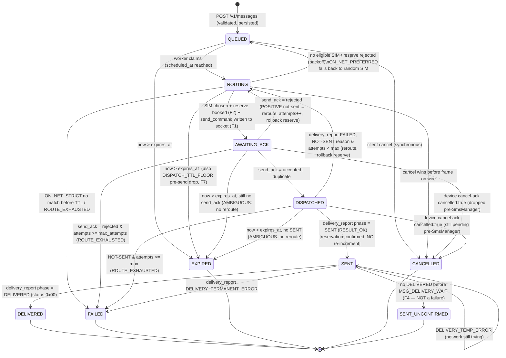

# 08 — Amendments & Errata (Normative)

> **Status:** Normative. This document resolves 15 findings from an adversarial audit of the
> WSMS-Gateway plan. It **supersedes** the specific sections it names in docs 01–06 until those
> corrections are folded back into their home documents. Where this document and any other doc
> (including the SSoT, [02 — Contract, Protocol & Schema](02-contract-protocol-schema.md))
> disagree, **this document wins for the amended clause**; everything not amended here is
> unchanged and doc 02 remains the SSoT for it. The overview (doc 00) links this document as
> normative.
>
> **Vocabulary discipline.** Every enum value, column, table, endpoint, frame `type`, close
> code, and state name used below is the one defined in doc 02, or a precisely-defined extension
> of it. New values are called out in the [Consolidated schema & config deltas](#z-deltas) table
> so an implementer can apply them directly. RFC 2119 keywords (MUST / MUST NOT / SHOULD / MAY)
> carry their usual meaning. "Server" = Go backend; "Device" = owned Android phone running the
> Flutter sender; "Client" = external REST caller.

---

## Findings index

| ID | Sev | One-line | Amends |
|---|---|---|---|
| [F1](#f1) | **BLOCKER** | Double-send hole: a lost `send_ack` on a message still in `ROUTING` lets `requeue()` reroute to another device that has no ledger entry. | 02 §C.6, §D, §E; 04 §10.3; 05 §8.1 |
| [F2](#f2) | HIGH | Quota/pacing reserve never wired into dispatch; concurrent workers over-book one SIM; counter double-increment + `sent_window` unit mismatch. | 02 §A.5, §C.4; 03 §7; 04 §6.3, §9.2, §10.3, §11 |
| [F3](#f3) | HIGH | Inbound HMAC signing impossible: server stores only an Argon2id hash, cannot recompute the MAC. | 06 §1.4; 02 §A.3 |
| [F4](#f4) | MEDIUM | `SENT → EXPIRED` misreports the common Indonesian no-DLR case as failure → client resends. | 02 §A.2, §D, §B.9; 04 §12 |
| [F5](#f5) | MEDIUM | Device writes ledger `ACCEPTED` before radio handoff; a kill in the gap loses the message (never sent, never rerouted). | 05 §8.1; 02 §E.2 |
| [F6](#f6) | MEDIUM | FCM cannot wake a force-stopped / stopped-state app; survival matrix wrongly implies it recovers all kills. | 01 §7.2; 05 §4, §10.2 |
| [F7](#f7) | MEDIUM | Default TTL of 6h delivers stale OTPs after a short outage. | 02 §A.6, §B.2; 04 §10.3 |
| [F8](#f8) | MEDIUM | "FGS not subject to background limits" is outdated (Android 15 `dataSync` cap, `specialUse` scrutiny, OEM killers). | 01 §7.1; 05 §3.1 |
| [F9](#f9) | MEDIUM | `/cancel` returns `200 CANCELLED` optimistically even when the device may already have sent. | 02 §B.6, §C.5; 04 §7.1; 05 §8.2 |
| [F10](#f10) | MEDIUM | Native `ENUM` + golang-migrate: `ALTER TYPE … ADD VALUE` cannot be added-and-used in one txn; enums can't be removed/reordered. | 02 §A.1, §A.2; 04 §5.1 |
| [F11](#f11) | LOW | Broken cross-references (cost/legal pointers). | 02 §0.6, §A.5 |
| [F12](#f12) | LOW | Same `Idempotency-Key` + **different** body silently replays the old message. | 02 §B.1; 04 §7.3 |
| [F13](#f13) | LOW | A 500-item batch may cost 1 rate-limit token, bypassing ingress backpressure. | 02 §B.1, §B.3; 06 §1.7; 04 §7.2 |
| [F14](#f14) | LOW | `readyz` green misleads `ON_NET_STRICT` clients targeting an operator with no online SIM. | 02 §B.8 |
| [F15](#f15) | LOW | "jitter/rotation = hygiene NOT evasion" is a fig leaf — they *do* reduce bulk-detection chance. | 03 §7, appendix; 06 §2; 02 appendix |

Two findings that several others touch — the message state machine and the exactly-once
guarantee — are restated consolidated at the end: [State machine v2](#sm-v2) and
[Idempotency guarantee v2](#idem-v2).

---

# Blocker

<a name="f1"></a>

## F1 — BLOCKER — Double-send hole on a lost `send_ack`

**Restatement.** The device inserts its ledger row and calls `SmsManager` (the SMS leaves the
radio) **before** sending `send_ack`. If that `send_ack` is lost and the device then drops,
doc 04 §10.3's worker loop calls `d.requeue(...)` while the message is still `ROUTING` (it never
reached `DISPATCHED`). Because the no-reroute rule in doc 02 §D only guards the `DISPATCHED`
state, the message is routed to a **different** device whose per-device SQLite `outbox` has no
entry for that `message_id` → a **second** SMS.

**Amends:** doc 02 §C.6 (timeout table), §D (state machine + reroute rule), §E; doc 04 §10.3
(worker loop), §12 (reaper); doc 05 §8.1 (device redelivery, see also [F5](#f5)).

### F1.1 Root cause

The window between "`send_command` frame handed to the socket" and "`send_ack` received" is
spent in `ROUTING`. In that window the SMS **may already be gone**, yet the state machine treats
`ROUTING` as safe to reroute. Doc 04 §10.3 even encodes the faulty reasoning in a comment
("we never got past ROUTING here, so it's safe to requeue"). It is not safe: the frame was on
the wire. Worse, once **any** redelivery iteration successfully enqueued a frame, a *later*
`SendToDevice` failure still falls through to `requeue()`.

### F1.2 Fix — new ambiguity-locked state `AWAITING_ACK` + server-side dispatch ledger

1. **New `message_status_t` value `AWAITING_ACK`**, ordinally between `ROUTING` and `DISPATCHED`.
   It means: *the `send_command` frame has been written to the device socket; no `send_ack` yet;
   the SMS may already have left the radio.* It is **ambiguity-locked** exactly like `DISPATCHED`:
   the server MUST NOT reroute it to a different SIM/device except on positive not-sent evidence
   (a `send_ack` with `result:"rejected"`).

2. **New server-side dispatch ledger `message_dispatch`, keyed by `message_id`** (not only the
   device's per-device SQLite ledger). It records the single live commitment of a `message_id`
   to one `(sim_id, device_id)` the instant the frame is on the wire, so the no-reroute
   invariant holds **across devices** even after a crash:

   ```sql
   CREATE TABLE message_dispatch (
     message_id       uuid        PRIMARY KEY REFERENCES messages(id) ON DELETE CASCADE,
     sim_id           uuid        NOT NULL REFERENCES sims(id),
     device_id        uuid        NOT NULL REFERENCES devices(id),
     attempt          int         NOT NULL,
     command_frame_id text        NOT NULL,     -- the send_command ULID actually written to the socket
     wire_at          timestamptz NOT NULL,     -- when the frame was handed to writePump
     resolved_reason  text        NOT NULL DEFAULT 'PENDING', -- PENDING | SENT | REROUTABLE | TERMINAL
     created_at       timestamptz NOT NULL DEFAULT now()
   );
   ```

   - The `PRIMARY KEY (message_id)` means a `message_id` has **at most one unresolved
     commitment** at a time.
   - `resolved_reason = 'PENDING'` while `AWAITING_ACK`/`DISPATCHED` and no terminal outcome.
   - It flips to `'REROUTABLE'` **only** on positive not-sent evidence (`send_ack:rejected` or a
     `delivery_report FAILED` with a NOT-SENT reason). Only then may a different SIM be assigned
     — an `UPSERT` overwrites the row for the new attempt.
   - It flips to `'SENT'`/`'TERMINAL'` on `delivery_report SENT` / any terminal transition.
   - **Dispatch guard:** the engine MUST NOT emit a `send_command` for a `message_id` whose
     `message_dispatch` row exists with `resolved_reason = 'PENDING'` or `'SENT'`. This is the
     server-side, cross-device backstop that makes reroute-to-another-device impossible while a
     command is live.

### F1.3 Corrected worker loop (supersedes doc 04 §10.3, from the `send_command` build onward)

```go
// 3. Reserve quota+pacing at assignment (see F2) then build the command. Still ROUTING.
if !d.reserve(ctx, &dec.SIM, m) {            // atomic SQL reserve, F2.2
    d.requeue(ctx, m, models.ReasonQuotaExceeded) // or ReasonRateLimited; another SIM later
    return
}
frame, cmdID := dispatch.BuildSendCommand(m, dec.SIM, m.Attempts+1, d.cfg)

// 4. Register the ack waiter BEFORE the first transmit (avoid a lost-ack race).
ackCh := d.inflight.register(m.ID)
defer d.inflight.clear(m.ID)

// 5. FIRST transmit. If it fails here, NOTHING reached the wire (conn nil or send-buffer
//    default branch → frame not enqueued), so the SMS cannot have been sent: rollback + requeue.
if err := d.hub.SendToDevice(dec.Device.ID, frame); err != nil {
    d.rollbackReserve(ctx, dec.SIM.ID, m.Segments)   // F2.3
    d.requeue(ctx, m, models.ReasonDeviceOffline)    // safe: still ROUTING, wire empty
    return
}

// *** From here the command is on the wire. The message becomes AMBIGUITY-LOCKED. ***
if err := d.transition(ctx, m, models.StatusRouting, models.StatusAwaitingAck,
        models.EvDispatch, models.ReasonNone, &dec.SIM.ID, &dec.Device.ID); err != nil {
    return // lost the optimistic guard (e.g. a concurrent cancel/expire) — leave it
}
d.dispatchLedger.Pin(ctx, m.ID, dec.SIM.ID, dec.Device.ID, m.Attempts+1, cmdID) // INSERT message_dispatch

// 6. Await send_ack with transport redeliveries. Redelivery is safe (device dedups on message_id).
var ack ws.SendAck; got := false
for try := 0; try <= d.cfg.AckRedeliveries; try++ {
    select {
    case ack = <-ackCh:
        got = true
    case <-time.After(d.cfg.AckTimeout):        // 15s: resend SAME message_id, NEW frame id
        frame = dispatch.Rewrap(frame)
        _ = d.hub.SendToDevice(dec.Device.ID, frame) // best-effort; a failure here does NOT reroute
        continue
    case <-ctx.Done():
        return
    }
    break
}

// 7. Ambiguity: no send_ack after N redeliveries. The SMS MAY already be gone.
//    DO NOT reroute, DO NOT rollback the reservation. Leave AWAITING_ACK; the dispatched
//    reaper (§12), the device idempotency ledger on reconnect, or TTL→EXPIRED resolves it.
if !got {
    return
}

// 8. Apply the send_ack.
switch ack.Result {
case "accepted", "duplicate":
    d.transition(ctx, m, models.StatusAwaitingAck, models.StatusDispatched,
        models.EvSendAccepted, models.ReasonNone, &dec.SIM.ID, &dec.Device.ID)
case "rejected":                                // POSITIVE not-sent evidence → reroute is safe
    d.rollbackReserve(ctx, dec.SIM.ID, m.Segments)          // F2.3
    d.dispatchLedger.MarkReroutable(ctx, m.ID)              // message_dispatch.resolved_reason='REROUTABLE'
    d.rerouteOrFail(ctx, m, ack.Reason)                     // AWAITING_ACK→ROUTING, attempts++, or FAILED
}
```

Key deltas vs. doc 04 §10.3: the message transitions to **`AWAITING_ACK` the moment the frame is
on the wire**; the "no `send_ack` after redeliveries" branch **no longer calls `requeue`**; a
`SendToDevice` failure on a *redelivery* is swallowed (never a reroute); the only reroute is on
`send_ack:rejected`.

### F1.4 Reconnect resolution (supersedes doc 02 §C.6 "Reconnect resume", augments doc 05 §7.3)

On device reconnect, for each `AWAITING_ACK`/`DISPATCHED` message assigned to that device whose
`message_dispatch` row is still `PENDING` and which has no terminal report, the server **MAY
re-issue the exact same `send_command`** (same `message_id`, new frame `id`). This is safe by the
device ledger ([F5](#f5)): a device that already handed the PDU to the radio replies
`send_ack:duplicate` and re-emits its last report; a device that was killed **before** the radio
handoff (`outbox.phase = PENDING`) performs the one real send it still owes. The server MUST NOT
route a different SIM on reconnect.

### F1.5 Timeout table correction (supersedes doc 02 §C.6)

| From | Waits for | Timeout | On timeout |
|---|---|---|---|
| server, after `send_command` on wire (`AWAITING_ACK`) | `send_ack` | `ack_timeout_sec` (15s) | resend **same** `message_id`, **new** frame `id`, up to `AckRedeliveries` (3); device dedups. **Never** reroute to a different SIM. |
| server, all `send_ack` redeliveries exhausted (`AWAITING_ACK`) | — | — | **keep `AWAITING_ACK`** (ambiguity-locked); reaper/TTL/reconnect resolve. Reservation is **not** rolled back. |
| server, after `send_ack:accepted` (`DISPATCHED`) | `delivery_report(SENT)` | `send_wait_sec` (60s) | keep `DISPATCHED`; re-issue same `send_command` on reconnect; do NOT reroute — TTL decides. |

### F1.6 Reaper correction (supersedes doc 04 §12 "Dispatched reaper")

The reaper now covers **both** `AWAITING_ACK` and `DISPATCHED` rows past their watchdog: it
**does not reroute** either; it may fire a `ping`/wake hint and re-issue the same `send_command`
on the next reconnect. Its "reset stale `ROUTING` rows older than 2 min back to `QUEUED`" job is
**unchanged and remains safe** — a `ROUTING` row by definition has no `message_dispatch` row (the
frame never reached the wire), so re-claiming it cannot double-send.

### F1.7 Required chaos test (adds to doc 06 §4.3)

> **`ack_lost_then_offline`** — device receives `send_command`, synthesizes the radio send,
> writes `outbox.phase = HANDED_OFF`, emits `send_ack`, but the harness **drops that `send_ack`**
> and then **drops the WS**. Assert: (a) the message stays `AWAITING_ACK`, never re-routed to a
> second device; (b) on reconnect the device replays and resolves to `SENT`/`DELIVERED`; (c) the
> invariant **`count(SmsManager.send | message_id) ∈ {0,1}`, never 2**. Run the same assertion
> for the crash-before-handoff variant (`outbox.phase = PENDING`) where the reconnect re-issue
> produces exactly one real send.

---

# High

<a name="f2"></a>

## F2 — HIGH — Reserve not wired into dispatch; over-booking; counter double-count & unit mismatch

**Restatement.** The per-SIM reserve described in doc 03 §7.1 is never invoked by the doc 04
dispatch path; counters are moved only by `IncSent` **after** a `SENT` report arrives. Under
concurrent `FOR UPDATE SKIP LOCKED` workers, many messages route to the **same** SIM before any
`SENT` moves its counters → `daily_quota` and `min_gap` are both blown (a ban pattern). Separately,
the reserve (doc 03 §7.1) does `sent_today += segments` **and** `sent_window += 1`, while
`IncSent` (doc 04 §6.3) does `sent_today += segments` **and** `sent_window += segments` — so
`sent_today` is **double-counted** and `sent_window` has **two different units**.

**Amends:** doc 02 §A.5 (`sent_window` semantics), §C.4 (`SENT` handler); doc 03 §7.1; doc 04
§6.3 (`IncSent`), §9.2, §10.3, §11.

### F2.1 One unit, one authoritative writer

- **`sent_window` is measured in SEGMENTS everywhere** (docs 02/03/04). The doc 03 §7.1
  `sent_window += 1` is corrected to `sent_window += msg.segments`.
- **The reserve at assignment is the SOLE writer that *books* quota.** The `SENT`
  `delivery_report` handler **no longer increments** any counter — it only *confirms* the
  reservation (stamps `sent_at`). Positive not-sent evidence *rolls the reservation back*. This
  is a **reserve → confirm/rollback** model, so a segment is counted exactly once.

### F2.2 Atomic reserve AT ASSIGNMENT (supersedes doc 03 §7.1 and wires into doc 04 §9/§10)

Executed synchronously as part of the `ROUTING` assignment, **before** the `send_command` is
built (see [F1.3](#f13-corrected-worker-loop-supersedes-doc-04-103-from-the-send_command-build-onward) step 3). A single atomic statement enforces daily cap **and** `min_gap`
**and** SIM readiness, so two concurrent workers can never over-book:

```sql
-- Reserve: books capacity for @seg on @sim_id IFF quota, pacing and readiness allow.
-- Returns 1 row on success, 0 rows on rejection. This is the serialization point.
UPDATE sims
SET sent_today  = sent_today  + @seg,
    sent_window = sent_window + @seg,                       -- SEGMENTS (unit fixed)
    last_sent_at = now(),
    status = CASE WHEN sent_today + @seg >= daily_quota
                  THEN 'QUOTA_EXCEEDED'::sim_status_t ELSE status END
WHERE id = @sim_id
  AND enabled = true
  AND status = 'READY'
  AND sent_today + @seg <= daily_quota                      -- daily segment cap (contract §A.5)
  AND (last_sent_at IS NULL OR now() - last_sent_at >= @min_gap_interval)  -- per-SIM min_gap
RETURNING id, sent_today, sent_window;
```

- **0 rows returned** = reject. The engine drops that SIM from the pool and picks the next
  candidate; if the pool empties, it `requeue`s with `ReasonQuotaExceeded` / `ReasonRateLimited`
  per the empty-pool rules in doc 03 §5.4 / §9. A concurrent over-book is impossible: the loser's
  `sent_today + @seg <= daily_quota` predicate fails against the winner's committed increment; a
  second send inside `min_gap` fails the `last_sent_at` predicate.
- `@min_gap_interval` is the SIM's `min_gap_ms` as an interval. The device-side Layer-2 jitter
  (doc 03 §7.2) is unchanged and remains the same budget enforced on the handset.
- **Redis fast path (optional, single source still Postgres):** a per-`sim_id` lock + token
  bucket + `min_gap` check MAY front this UPDATE for hot fleets, but Redis and Postgres MUST NOT
  both be authoritative — the SQL above is the single writer; Redis is a cache snapshotted to
  `sims.sent_window` by the window-decay job (doc 04 §12).

### F2.3 Rollback (positive not-sent only)

Invoked on `send_ack:rejected` and on `delivery_report FAILED` with a NOT-SENT reason
(`RADIO_OFF`, `NO_SERVICE`, `SIM_ABSENT`, `NULL_PDU`, `QUOTA_EXCEEDED`, `RATE_LIMITED`). It is
**not** invoked on ambiguity (no `send_ack`, device offline, `AWAITING_ACK`/`DISPATCHED` →
`EXPIRED`) — an ambiguous outcome may have really sent, so the reservation stands (biasing toward
over-counting quota, which is the anti-ban-safe direction).

```sql
UPDATE sims
SET sent_today  = GREATEST(sent_today  - @seg, 0),
    sent_window = GREATEST(sent_window - @seg, 0),
    status = CASE WHEN status = 'QUOTA_EXCEEDED' AND (sent_today - @seg) < daily_quota
                  THEN 'READY'::sim_status_t ELSE status END
WHERE id = @sim_id;
```

### F2.4 `SENT` handler correction (supersedes doc 02 §C.4 and doc 04 §6.3/§11)

- Doc 02 §C.4 bullet "`phase:"SENT"` → … increment `sim.sent_today += segments`" is
  **struck**. Replace with: "`phase:"SENT"` → set `messages.status = SENT`, stamp `sent_at`,
  set `message_dispatch.resolved_reason = 'SENT'`. **Counters were already reserved at
  assignment; do NOT re-increment.**"
- Doc 04's `SIMs.IncSent` is **removed from the `SENT` ingress path**. `IncSent`'s former
  `UPDATE … sent_today = sent_today + ?` body is repurposed only as the reserve (F2.2) /
  rollback (F2.3). The doc 04 §11 `onDeliveryReport` `case "SENT":` no longer calls `IncSent`.

<a name="f3"></a>

## F3 — HIGH — Inbound HMAC signing is cryptographically impossible against a stored hash

**Restatement.** Doc 06 §1.4 says the server "recomputes with the same `api_secret` used for
bearer auth." But bearer auth stores only `api_keys.secret_hash` (Argon2id, one-way, salted).
An Argon2id hash cannot be used to recompute an HMAC, so request signing as written cannot be
implemented.

**Amends:** doc 06 §1.4, §1.8; doc 02 §A.3 (`api_keys`).

### F3.1 Fix — a separate, reversibly-stored signing secret

Signing is a **distinct secret from the bearer secret**, stored **encrypted at rest** (reversible)
exactly like `clients.webhook_secret`, never as an Argon2id hash. Add to `api_keys` (doc 02 §A.3):

```go
type APIKey struct {
    // … existing fields (KeyID, SecretHash, Scopes, …) unchanged …

    // Whether inbound request signing is REQUIRED for this key (admin-set).
    RequireSigning bool   `gorm:"not null;default:false" json:"require_signing"`
    // HMAC signing secret, present iff RequireSigning. Stored ENCRYPTED at rest (bytea, same
    // envelope as clients.webhook_secret via WSMS_ENCRYPTION_KEY). This is DELIBERATELY separate
    // from SecretHash: HMAC verification needs the plaintext secret, which a one-way hash cannot
    // provide. Decrypted only in memory to verify.
    SigningSecret  []byte `gorm:"type:bytea" json:"-"`
}
```

```sql
ALTER TABLE api_keys ADD COLUMN require_signing boolean NOT NULL DEFAULT false;
ALTER TABLE api_keys ADD COLUMN signing_secret  bytea;   -- encrypted; NULL unless require_signing
```

### F3.2 Corrected signing scheme (supersedes doc 06 §1.4)

- Issuance: when a key is created (or updated) with `require_signing = true`, the server
  generates a 32-byte random `signing_secret`, stores it **encrypted**, and returns it to the
  admin **exactly once** alongside the bearer token. It is never retrievable again.
- Header on `POST /v1/messages` and `/v1/messages/batch`:
  `X-WSMS-Signature: t=<unix_seconds>,v1=<hex HMAC_SHA256(signing_secret, "{t}." + raw_body)>`
  — note the MAC key is `signing_secret`, **not** the bearer secret.
- Verification: the server decrypts `signing_secret` in memory, recomputes, constant-time
  compares against `v1`, rejects if `|now − t| > 300s`. This mirrors the outbound webhook
  algorithm (doc 02 §B.9) verbatim, so both directions share one implementation.
- Update the doc 06 §1.8 secrets table: add a row **"API-key signing secret | Encrypted (`bytea`,
  envelope) | shown once at enable | re-issue"**, and correct any wording implying the bearer
  secret is reused for signing.

---

# Medium

<a name="f4"></a>

## F4 — MEDIUM — `SENT → EXPIRED` misreports the common no-DLR case as failure

**Restatement.** Doc 02 §D has `SENT → EXPIRED` when no `DELIVERED` arrives before the delivery
watchdog. On many Indonesian routes a delivery report simply **never comes** even though the SMS
was delivered. Reporting that as `EXPIRED` (a failure-shaped terminal) makes clients resend →
duplicate at the app layer.

**Amends:** doc 02 §A.2 (`message_status_t`, `event_type_t`), §D, §B.9 (webhooks); doc 04 §12
(expiry sweeper).

### F4.1 Fix — new terminal state `SENT_UNCONFIRMED`

- **New `message_status_t` value `SENT_UNCONFIRMED`** (a.k.a. *delivery-unknown*), terminal.
  Semantics: *the SMS left the phone (we received `phase:"SENT"` / `RESULT_OK`) but no delivery
  report ever arrived.* This is **not** a failure and **not** `EXPIRED`. `last_reason` stays
  `NONE`. `MessageStatus.Terminal()` returns `true` for it.
- **Remove the `SENT → EXPIRED` edge.** Replace with **`SENT → SENT_UNCONFIRMED`**, fired by the
  delivery watchdog once `now - sent_at > delivery_wait` and no `DELIVERED`/permanent-error
  arrived. `EXPIRED` now means strictly *"TTL elapsed while the SMS had **not** left the phone"*
  (a `QUEUED`/`ROUTING`/`AWAITING_ACK`/`DISPATCHED` row) — the semantic opposite of
  `SENT_UNCONFIRMED`.
- **New `event_type_t` value `SENT_UNCONFIRMED`** for the `message_events` row.
- **New webhook event `message.sent_unconfirmed`**, in the default subscription (terminal events
  + `sent`). Payload identical to other status webhooks with `"status":"SENT_UNCONFIRMED"`,
  `"previous_status":"SENT"`, `"reason":"NONE"`. Document plainly that **missing delivery reports
  are expected on many Indonesian routes and `SENT_UNCONFIRMED` MUST NOT be treated as a
  send-failure or trigger a resend.**
- **New config `MSG_DELIVERY_WAIT`** (default `6h`): the `SENT → SENT_UNCONFIRMED` finalization
  window measured from `sent_at`.

### F4.2 Index & sweeper corrections

- Doc 02 §A.6 `ix_msg_expiry` partial-index predicate `WHERE status NOT IN (…)` adds
  `SENT_UNCONFIRMED` to the terminal exclusion list.
- Doc 04 §12 expiry/reaper: the former "`SENT`-but-unconfirmed → `EXPIRED`" action becomes
  "`SENT` past `delivery_wait` → `SENT_UNCONFIRMED`" (a separate scan keyed on `sent_at`, not
  `expires_at`).

<a name="f5"></a>

## F5 — MEDIUM — Device commits the ledger before radio handoff → lost message

**Restatement.** Doc 05 §8.1 does `outbox.insertIfAbsent(phase:'ACCEPTED')` **before**
`telephony.sendSms`. A kill between the insert and the handoff means, on redelivery, the handler
sees the ledger row and replies `send_ack:duplicate` and re-emits a last report — but the SMS
never went out. The server then waits for a `SENT` that never comes → the message `EXPIRED`s
unsent, and the reroute guard (ambiguity) blocks fallback. The message is silently lost.

**Amends:** doc 05 §8 (outbox schema + `_onSendCommand`); doc 02 §E.2.

### F5.1 Fix — expanded on-device `outbox.phase` lifecycle

The device ledger must distinguish "command received" from "PDU actually handed to the radio."
Redefine the on-device SQLite `outbox.phase` vocabulary (supersedes doc 05 §8 and doc 02 §E.2):

| `outbox.phase` | Meaning | Redelivery behavior |
|---|---|---|
| `PENDING` | Command received & row inserted, `SmsManager` **not yet** confirmed handoff. | **Safe to perform the one real send** — the radio never got it. |
| `SENDING` | Inside the synchronous `sendSms` call. | Conservative: assume the PDU **may** have left → reply `duplicate`, do **not** resend. (Tiny window; biases to ≤1 send.) |
| `HANDED_OFF` | `SmsManager` accepted; PDU is with the radio. | Reply `duplicate`, re-emit last report. **Never** a 2nd handoff. |
| `SENT` / `DELIVERED` | Confirmed by PendingIntent. | Reply `duplicate`, re-emit last report. |
| `FAILED` | Delivery/permanent error after handoff. | Reply `duplicate`, re-emit last report. |
| `VOID` | Proven **not-sent** (pre-flight `rejected`, or a not-sent `delivery_report FAILED`). | A later `send_command` with a higher `attempt` may perform a fresh real send (reroute to the other SIM on this device). |

Add an `attempt INTEGER` column to `outbox`.

### F5.2 Corrected command handler (supersedes doc 05 §8.1)

```dart
Future<void> _onSendCommand(Frame cmd) async {
  final d = cmd.data;
  final messageId = d['message_id'] as String;
  final attempt   = (d['attempt'] as int?) ?? 1;

  // Compare-and-set insert. Frames for one message_id are processed serially by the WS isolate,
  // so this plus the phase table gives ≤1 radio handoff per message_id.
  final row = await outbox.get(messageId);

  // Already possibly/actually on the radio → never send again.
  if (row != null && (row.phase == 'SENDING' || row.phase == 'HANDED_OFF' ||
                      row.phase == 'SENT' || row.phase == 'DELIVERED' || row.phase == 'FAILED')) {
    _send(Frame('send_ack', data: {'ref': cmd.id, 'message_id': messageId,
        'result': 'duplicate', 'reason': 'NONE', 'sim_subscription_id': d['sim_subscription_id']}));
    final last = await outbox.lastReport(messageId);
    if (last != null) _send(Frame('delivery_report', data: last));
    return;
  }

  // First time (no row), a crash-in-PENDING redelivery, or a rerouted VOID with a newer attempt:
  // we own exactly one real send.
  if (row == null) {
    await outbox.insert(messageId, subId: d['sim_subscription_id'] as int,
        phase: 'PENDING', attempt: attempt);
  } else if (row.phase == 'VOID' && attempt <= row.attempt) {
    // A stale re-delivery of an already-voided attempt: do not resend.
    _send(Frame('send_ack', data: {'ref': cmd.id, 'message_id': messageId,
        'result': 'rejected', 'reason': 'ROUTE_EXHAUSTED', 'sim_subscription_id': d['sim_subscription_id']}));
    return;
  }

  await outbox.setPhase(messageId, 'SENDING', attempt: attempt);  // commit intent-to-send
  final res = await telephony.sendSms(
    messageId: messageId, subId: d['sim_subscription_id'] as int,
    to: d['to'] as String, body: d['body'] as String,
    segments: d['segments'] as int,
    requestDeliveryReport: d['request_delivery_report'] as bool? ?? true,
  );

  if (res.result == 'accepted') {
    await outbox.setPhase(messageId, 'HANDED_OFF');   // commit AFTER SmsManager accepts
    _send(Frame('send_ack', data: {'ref': cmd.id, 'message_id': messageId,
        'result': 'accepted', 'reason': 'NONE', 'sim_subscription_id': d['sim_subscription_id']}));
  } else {
    // Pre-flight proves the radio never reached (e.g. SIM_ABSENT/RADIO_OFF). NOT a duplicate:
    // reply rejected so the SERVER may reroute (positive not-sent evidence).
    await outbox.setPhase(messageId, 'VOID', reason: res.reason);
    _send(Frame('send_ack', data: {'ref': cmd.id, 'message_id': messageId,
        'result': 'rejected', 'reason': res.reason, 'sim_subscription_id': d['sim_subscription_id']}));
  }
}
```

Result: a kill in the `PENDING` window causes the one real send on redelivery (no loss, no
double); a proven-not-sent replies `rejected` (reroute works); only a `SENDING`/`HANDED_OFF`+
row suppresses a resend. Combined with [F1.4](#f14-reconnect-resolution-supersedes-doc-02-c6-reconnect-resume-augments-doc-05-73), a genuinely-lost command is re-issued by the server and
delivered exactly once.

<a name="f6"></a>

## F6 — MEDIUM — FCM cannot wake a force-stopped app; survival matrix overclaims

**Restatement.** Doc 01 §7.2's survival matrix implies FCM wake recovers *all* kills. It does
not: an app in Android's **stopped state** — after the user taps **Force stop** in Settings, or
after some OEM task-killers — receives **no** FCM messages and **no** implicit broadcasts,
including `BOOT_COMPLETED` (which will not fire until the app is manually launched once).

**Amends:** doc 01 §7.2; doc 05 §4, §10.2.

### F6.1 Fix — honest survival matrix (supersedes doc 01 §7.2 rows)

| Situation | Layer 1 (FS/WSS) | Layer 2 (FCM wake) | Outcome |
|---|---|---|---|
| Doze + socket dropped | dead until woken | **wake** on pending work | Reconnect → dispatch |
| LMK / swipe-away / OEM background kill | dead | **wake** → `startForegroundService` | Revive → reconnect → dispatch |
| **User "Force stop" / OEM stopped-state** | dead | **wake NOT delivered** (stopped state suppresses FCM) | **Requires manual relaunch** — server raises `DeviceUnwakeable` |
| Phone rebooted **after** a normal run | `BOOT_COMPLETED` starts FS | wake works post-boot | Auto-rejoin |
| Phone rebooted **while force-stopped** | `BOOT_COMPLETED` **suppressed** | wake not delivered | Manual relaunch required |
| Phone powered off / no network | dead | wake undeliverable | Message stays `QUEUED` until TTL |

### F6.2 Detect chronically-unwakeable devices

Add to `devices` (doc 02 §A.4):

```sql
ALTER TABLE devices ADD COLUMN consecutive_failed_wakes int NOT NULL DEFAULT 0;
ALTER TABLE devices ADD COLUMN last_wake_at timestamptz;
```

- The wake service (doc 01 §7.3) fires up to `WAKE_MAX_ATTEMPTS` (default 3) high-priority
  `{"wsms":"wake"}` messages with backoff for a device that has pending work and no live socket,
  incrementing `consecutive_failed_wakes` and setting `last_wake_at` each time no reconnect
  follows within the wake window. A successful `welcome` **resets `consecutive_failed_wakes = 0`**.
- When `consecutive_failed_wakes >= WAKE_MAX_ATTEMPTS`, the server sets
  `devices.health->>'needs_manual_relaunch' = true` (surfaced in `GET /v1/devices`) and emits the
  alert **`DeviceUnwakeable`** (new; doc 06 §3.6): *"phone needs manual relaunch."*
- New metric `wsms_device_wake_attempts_total{device_key,result}` (`result = woke|failed`).

### F6.3 Documentation correction (doc 05 §4, §10.2)

Strike any claim that FCM "revives *all* kills." State: FCM revives a **backgrounded, Doze-frozen,
or LMK/OEM-killed** process, but **cannot** reach a **force-stopped / stopped-state** app, and
`BOOT_COMPLETED` is likewise suppressed in that state; recovery then requires a **manual
relaunch**, which the operator is alerted to chase (`DeviceUnwakeable`).

<a name="f7"></a>

## F7 — MEDIUM — 6h default TTL delivers stale OTPs

**Restatement.** Doc 02 §A.6 defaults `expires_at = created_at + 6h`. A device offline for 20
minutes then reconnecting will deliver a long-stale OTP — useless and a security risk.

**Amends:** doc 02 §A.6, §B.2; doc 04 §10.3.

### F7.1 Fix — message class with class-specific TTL defaults

- Add a request field `message_class` on `POST /v1/messages` and a column `messages.message_class`,
  modeled as **`text` + `CHECK`** (per [F10](#f10), to avoid enum-migration friction):

  ```sql
  ALTER TABLE messages ADD COLUMN message_class text NOT NULL DEFAULT 'TRANSACTIONAL'
    CHECK (message_class IN ('OTP','TRANSACTIONAL','BULK'));
  ```

- Class-specific default `ttl_seconds` when the client does not pass one explicitly:

  | `message_class` | Default TTL | Rationale |
  |---|---|---|
  | `OTP` | **300s (5 min)** | A stale OTP is worthless/dangerous. |
  | `TRANSACTIONAL` | **900s (15 min)** | Short-lived notifications. |
  | `BULK` | 21600s (6h) | Unchanged legacy default. |

  An explicit `ttl_seconds` (60..86400) still overrides. Doc 02 §B.2's "Default 21600 (6h)" is
  superseded by this class-dependent default; the **global** default (no class given) becomes
  `TRANSACTIONAL` = 900s.

### F7.2 Dispatch-time TTL floor (drop instead of send stale)

- New config `DISPATCH_TTL_FLOOR` (default `30s`). At dispatch (doc 04 §10.3 `handle()`, and on
  any reconnect re-issue per [F1.4](#f14-reconnect-resolution-supersedes-doc-02-c6-reconnect-resume-augments-doc-05-73)):

  ```text
  if msg.expires_at - now < DISPATCH_TTL_FLOOR:
      transition → EXPIRED (reason EXPIRED_TTL, detail "stale_ttl_floor")   // do NOT send
  ```

  This guarantees a message whose remaining life is below the floor is **never handed to a SIM**;
  it terminates `EXPIRED` rather than delivering a stale OTP after an outage.

<a name="f8"></a>

## F8 — MEDIUM — "FGS is not subject to background limits" is outdated

**Restatement.** Doc 05 §3.1 / doc 01 §7.1 lean on foreground services being exempt from
background limits. On Android 15 (API 35) a `dataSync` FGS has a cumulative ~6h/24h runtime
budget after which the system calls `Service.onTimeout()` and force-stops it; `specialUse` is
subject to Play/console review (a "gamble"); and OEM battery killers tear the socket down
regardless.

**Amends:** doc 01 §7.1; doc 05 §3.1.

### F8.1 Fix — soften the claim, treat FGS survival as best-effort

Replace absolute survival language with: *the foreground service is a **best-effort** survival
layer, not a guarantee.* Specifically document:

- **Android 15 `dataSync` cap:** cumulative ~6h/24h, then `Service.onTimeout()` → force-stop. Our
  API-35+ manifest declares **`specialUse`** (doc 05 §3.1 table) precisely to avoid the `dataSync`
  budget, but `specialUse` is **review-gated and OEM-discretionary** — a gamble, not a right.
  Implement `Service.onTimeout()` to stop gracefully and rely on FCM wake + fast reconnect.
- **OEM killers** (MIUI/HyperOS, ColorOS, FuntouchOS, EMUI) tear down the socket regardless of
  battery-optimization exemption (already noted in doc 05 §10.3; now the *primary* expectation,
  not an edge case).
- Correctness therefore **never depends on FGS survival**: it depends on fast reconnect + FCM
  wake ([F6](#f6)) + presence-driven requeue (a device that drops leaves the routing pool via the
  `d.status = ONLINE` candidate predicate; its `AWAITING_ACK`/`DISPATCHED` messages stay pinned;
  `QUEUED`/`ROUTING` work re-routes to other devices).

### F8.2 Per-device "time since last seen" health metric + alert

- New gauge `wsms_device_seconds_since_last_seen{device_key}` derived from `devices.last_seen_at`.
- New alert **`DeviceStale`** (doc 06 §3.6): a device expected online whose
  `seconds_since_last_seen` exceeds ~3× the heartbeat interval (and no clean `DISABLED`), warn →
  page if it persists. This turns silent FGS teardown into an operator signal and complements
  `DeviceUnwakeable` ([F6.2](#f62-detect-chronically-unwakeable-devices)).

<a name="f9"></a>

## F9 — MEDIUM — `/cancel` lies with an optimistic `200 CANCELLED`

**Restatement.** Doc 02 §B.6 returns `200 { "status":"CANCELLED" }` for a `DISPATCHED` message,
but the device may already have handed the PDU to the radio — the "cancelled" is a lie.

**Amends:** doc 02 §B.6, §C.5, §A.2 (`event_type_t`), §B.9; doc 04 §7.1; doc 05 §8.2.

### F9.1 Fix — two-phase cancel with honest states

`POST /v1/messages/:id/cancel` outcome depends on where the message is:

| State at cancel | Server action | HTTP response |
|---|---|---|
| `QUEUED`, `ROUTING` | `Transition → CANCELLED` (optimistic `WHERE status=From` guard; loses to a racing `AWAITING_ACK`) | `200 { "status":"CANCELLED" }` |
| `AWAITING_ACK`, `DISPATCHED` | send WS `cancel` frame, **keep current state**, write `CANCEL_REQUESTED` event | `202 { "status":"<current>", "cancel":"cancel_requested" }` |
| `SENT`, `DELIVERED`, `SENT_UNCONFIRMED`, `FAILED`, `EXPIRED`, `CANCELLED` | reject | `409 CONFLICT` |

The device `cancel` ack (doc 05 §8.2 already emits `ack{ref, cancelled:bool}`) is correlated by
the cancel frame `id → message_id` in ingress (`onTransportAck`) and resolves the message
asynchronously:

| Device ack | Meaning | Server resolution |
|---|---|---|
| `cancelled:true` | dropped before `SmsManager` (`outbox.phase` was `PENDING` → `CANCELLED`) | `Transition AWAITING_ACK/DISPATCHED → CANCELLED`; rollback reserve (F2.3); webhook `message.cancelled` |
| `cancelled:false` | already handed to the radio | keep the normal `SENT`/`DELIVERED` lifecycle; write `CANCEL_FAILED` event; webhook `message.cancel_failed` |

### F9.2 New vocabulary

- **New `event_type_t` values `CANCEL_REQUESTED`, `CANCEL_FAILED`.**
- **New webhook events `message.cancel_requested`, `message.cancel_failed`.**
- Doc 02 §B.6 "Success → `200 { "status":"CANCELLED" }`" is superseded by the table above.
  Doc 05 §8.2's device handler is unchanged in shape (it already answers `cancelled:true/false`);
  the change is entirely server-side interpretation.

<a name="f10"></a>

## F10 — MEDIUM — Native `ENUM` + golang-migrate cannot add-and-use a value in one txn

**Restatement.** Doc 02 §A.1/§A.2 and doc 04 §5.1 add enum values with `ALTER TYPE … ADD VALUE`.
On Postgres, a newly added enum value **cannot be used in the same transaction** that adds it,
migration runners commonly wrap a step in a transaction, and enum values **cannot be removed or
reordered**. This document itself adds several values (`AWAITING_ACK`, `SENT_UNCONFIRMED`,
`SENT_UNCONFIRMED`/`CANCEL_REQUESTED`/`CANCEL_FAILED` events), so the migration mechanics must be
fixed.

**Amends:** doc 02 §A.1, §A.2; doc 04 §5.1.

### F10.1 Fix — split add-value from use-value; keep add-value transaction-free & alone

1. **One `ALTER TYPE … ADD VALUE` per migration file, alone**, with no statement that *uses* the
   value in the same file. Postgres 15 permits `ADD VALUE` inside a transaction but forbids
   *referencing* the new value until commit; keeping the statement solitary and letting the
   golang-migrate `pgx`/`postgres` driver run it un-wrapped avoids the "unsafe use of new value"
   error entirely. If the chosen runner *does* wrap files (e.g. goose), annotate the file to run
   **without a transaction** (goose: `-- +goose NO TRANSACTION`).
2. **A separate, later migration performs any *use* of the value** — partial-index rebuilds, data
   backfills (`UPDATE … SET status='SENT_UNCONFIRMED'`), `CHECK` constraints referencing it.
3. **Add-value is irreversible.** The `.down.sql` for an `ADD VALUE` is a documented no-op
   comment (Postgres cannot drop/reorder an enum label). Retiring a value = stop writing it, then
   optionally migrate to a fresh type via *create-new-type → swap column → drop old type*, never
   in place.

Example ordering for this document's additions:

```
migrations/
  0007_status_add_awaiting_ack.up.sql        -- ALTER TYPE message_status_t ADD VALUE 'AWAITING_ACK' BEFORE 'DISPATCHED';
  0008_status_add_sent_unconfirmed.up.sql    -- ALTER TYPE message_status_t ADD VALUE 'SENT_UNCONFIRMED' AFTER 'SENT';
  0009_events_add_cancel_and_unconfirmed.up.sql -- one ADD VALUE per statement, alone
  0010_apply_new_enum_uses.up.sql            -- rebuild ix_msg_expiry, backfill, CHECKs  (USES the values)
```

### F10.2 Model churny vocabularies as `text` + `CHECK`

For vocabularies that **grow** — `failure_reason_t` and `event_type_t` (and the new
`message_class` from [F7](#f7)) — the recommended forward model is a `text` column with a `CHECK`
constraint or a small FK lookup table, so adding/removing a value is ordinary DML/DDL with no
`ALTER TYPE` dance and no irreversibility trap. Stable vocabularies (`operator_t`,
`message_status_t`, `sim_status_t`, `device_status_t`, `routing_policy_t`, `encoding_t`) stay as
native enums. Doc 04 §5.1 is amended to state this split explicitly.

---

# Low

<a name="f11"></a>

## F11 — LOW — Broken cross-references

**Restatement.** Doc 02 points to the wrong documents for cost and legal content.

**Amends:** doc 02 §0.6, §A.5.

### F11.1 Corrections

- **Doc 02 §0.6** — replace *"Doc `05-*` (billing) computes cost from `segments × operator
  tariff`."* with: *"The **cost & deliverability model** in **doc 06 §6** computes cost from
  `segments × operator tariff`. This contract only guarantees `segments` is present and correct."*
  (There is no billing content in doc 05; the model lives in doc 06 §6.)
- **Doc 02 §A.5** — replace the `sims` comment *"// Anti-ban hygiene (see doc 08
  legal/deliverability)."* with: *"// Anti-ban hygiene (see **doc 06 §2** legal reality and **doc
  06 §6.1** deliverability/capacity). Per-SIM daily cap in *segments*."*
- **Note on "doc 08":** doc 08 is now **this amendments document**, not a legal/deliverability
  doc. Any lingering "see doc 08" pointers that meant legal/deliverability now resolve to **doc 06
  §2 / §6**; pointers that mean errata/corrections resolve here.

<a name="f12"></a>

## F12 — LOW — Same `Idempotency-Key` + different body silently replays

**Restatement.** Doc 02 §B.1 returns the original message for a repeated `Idempotency-Key` even
when the request **body differs**, silently dropping the new content.

**Amends:** doc 02 §B.1; doc 04 §7.3.

### F12.1 Fix — store a payload hash with the dedup key; conflict on mismatch

Add a column:

```sql
ALTER TABLE messages ADD COLUMN dedup_payload_hash bytea;  -- sha256 of the canonical request payload
```

Canonical payload = SHA-256 over the **content-bearing** fields, unit-separated (`0x1f`):
`to` (normalized `+62…`) ‖ `body` ‖ `routing_policy` ‖ `coalesce(pinned_sim_id,'')` ‖
`coalesce(scheduled_at,'')` ‖ `coalesce(ttl_seconds,'')`. (Cosmetic-only differences, e.g.
`metadata`, MAY be excluded via config; body/to/policy/pin are always included.)

Corrected `SubmitMessage` idempotency branch (doc 04 §7.3):

```go
dedup := c.GetHeader("Idempotency-Key")
if dedup != "" {
    ph := payloadHash(to, in.Body, in.RoutingPolicy, in.PinnedSIMID, in.ScheduledAt, in.TTLSeconds)
    if orig, _ := s.Messages.FindByClientDedup(c, cl.ID, dedup); orig != nil {
        if bytes.Equal(orig.DedupPayloadHash, ph) {
            c.JSON(200, dto.FromMessage(orig, /*replay*/ true)); return   // true idempotent replay
        }
        fail(c, 409, "CONFLICT", errIdemKeyReuse) // details:{field:"Idempotency-Key",
        return                                    //           reason:"reused_with_different_payload"}
    }
    m.DedupPayloadHash = ph // stored on create; also compared in the unique-violation race catch
}
```

The unique-index race catch (two concurrent identical-key submits) performs the same
hash comparison after re-reading the original: equal → `200` replay; unequal → `409 CONFLICT`.
`CONFLICT` is already in doc 02 §B.1's error-code set.

<a name="f13"></a>

## F13 — LOW — A 500-item batch can cost one rate-limit token

**Restatement.** Doc 02 §B.3 allows up to 500 messages per batch, but the per-client token bucket
(doc 02 §B.1, doc 06 §1.7) charges per **HTTP request**, so a batch can push 500 sends for 1
token — bypassing ingress backpressure.

**Amends:** doc 02 §B.1, §B.3; doc 06 §1.7; doc 04 §7.2 (`RateLimit` middleware).

### F13.1 Fix — charge the bucket per contained message, deny-partial

- The token bucket is charged **one token per contained message** for `/v1/messages/batch`
  (`POST /v1/messages` continues to charge 1). A stricter **per-segment** mode is available via
  config `RATE_LIMIT_BATCH_MODE = per_message (default) | per_segment` (segment mode charges
  `Σ segments`).
- Because the `RateLimit` middleware (doc 04 §7.2) cannot see the item count pre-handler, batch
  accounting moves into the handler: the middleware charges `1` for the request envelope, and the
  batch handler calls `bucket.TakeN(K-1)` (or `TakeN(Σ segments − 1)`).
- **Deny-partial (default):** accept items in array order up to the tokens available; reject the
  overflow **per item** in the existing multi-status response with `error.code = "RATE_LIMITED"`,
  and set `Retry-After`. This preserves the non-atomic batch contract (doc 02 §B.3) while making
  the bucket honest.

Doc 02 §B.3 gains: *"Batch submission is charged against the client token bucket per contained
message (or per segment when `RATE_LIMIT_BATCH_MODE=per_segment`). When the bucket cannot cover
the whole batch, items beyond the available budget are returned `rejected` with
`RATE_LIMITED`."* Doc 06 §1.7 bullet 1 is annotated accordingly.

<a name="f14"></a>

## F14 — LOW — `readyz` green misleads `ON_NET_STRICT` clients

**Restatement.** Doc 02 §B.8 `readyz` returns `200` when *any* SIM is `READY`, but an
`ON_NET_STRICT` client targeting an operator with **no** online SIM will still see `readyz` green
and its messages will `FAILED / NO_MATCHING_OPERATOR_SIM`.

**Amends:** doc 02 §B.8.

### F14.1 Fix — keep `readyz` coarse; expose per-operator capacity

- `GET /v1/readyz` stays a **coarse process/deploy gate**: `200` iff DB reachable **and** ≥1
  device `ONLINE` **and** ≥1 SIM `READY`. It is explicitly documented as **not** a per-operator
  send guarantee.
- Strict clients MUST consult per-operator capacity before relying on strict routing:
  - `GET /v1/sims?operator=TELKOMSEL` already returns `on_net_ready` (doc 02 §B.7). Define it
    precisely: **`on_net_ready = true` iff ≥1 SIM with `operator = X`, `status = READY`,
    `enabled = true`, its device `ONLINE`, and `sent_today + 1 <= daily_quota`** — the same
    predicate the on-net routing pool uses.
  - `GET /v1/stats` adds a per-operator block: `{ "operator":"TELKOMSEL", "ready_sims":n,
    "on_net_ready":bool, "sent_today":…, "daily_quota":… }`.
- **Optional per-operator probe:** `GET /v1/readyz?operator=TELKOMSEL` → `200` iff that operator's
  `on_net_ready` is true, else `503 { "ready":false, "reasons":["no_ready_sim_for_operator"] }`.
  This gives strict clients a cheap pre-flight without pulling the full `/sims` list.

<a name="f15"></a>

## F15 — LOW — "hygiene NOT evasion" framing is a fig leaf

**Restatement.** Docs 03 §7/appendix, 06 §2, and 02's appendix insist pacing/jitter/rotation are
"hygiene, **not** detection-evasion." That is not fully honest: these controls *do* reduce the
probability of tripping carrier bulk-detection heuristics — that is part of why they exist.

**Amends:** doc 03 §7 and appendix; doc 06 §2; doc 02 appendix.

### F15.1 Fix — replacement framing (normal professional prose)

Replace the "hygiene, not detection-evasion" wording in each location with the following honest
statement:

> The per-SIM daily quota, `sent_today`/`sent_window` accounting, `min_gap_ms` + `jitter_ms`
> pacing, SIM rotation, and the `COOLDOWN`/`QUOTA_EXCEEDED` states serve two purposes at once, and
> we state both plainly. First, they are genuine deliverability and network-courtesy measures that
> keep per-SIM volume low and traffic well-spaced. Second — and we do not pretend otherwise — by
> keeping volume low, paced, and rotated, they **statistically reduce the chance** that a SIM
> trips a carrier's bulk-/A2P-detection heuristics. What they do **not** do is make the route
> compliant or ban-proof. Sending A2P traffic over consumer SIMs remains a violation of carrier
> terms of service and of Indonesia's A2P rules; these controls lower the *probability* of
> detection and ban, they do not remove it, and a SIM can still be throttled, blocked, or
> permanently banned at any time. For traffic that must be compliant or reliably delivered, the
> correct answer is a licensed A2P provider, not more or better-paced SIMs. This risk is disclosed
> to the owner, not hidden behind the word "hygiene."

This preserves every control unchanged; it only corrects the description so the owner understands
what the controls actually buy and what they do not.

---

<a name="sm-v2"></a>

# Consolidated: Message status state machine v2

Incorporates `AWAITING_ACK` ([F1](#f1)), `SENT_UNCONFIRMED` ([F4](#f4)), and the two-phase cancel
([F9](#f9)). This supersedes doc 02 §D.



**Terminal states:** `DELIVERED`, `FAILED`, `EXPIRED`, `CANCELLED`, `SENT_UNCONFIRMED`.
`MessageStatus.Terminal()` returns `true` for all five.

**Reroute rule v2 (the exactly-once safety rule).** The **only** back-edges that re-select a
different SIM/device are `AWAITING_ACK → ROUTING` (on `send_ack:rejected`) and `DISPATCHED →
ROUTING` (on `delivery_report FAILED` with a NOT-SENT reason: `RADIO_OFF`, `NO_SERVICE`,
`SIM_ABSENT`, `NULL_PDU`, `QUOTA_EXCEEDED`, `RATE_LIMITED`). **Every** ambiguous outcome — command
on the wire with no `send_ack`, device offline mid-flight, redelivery/reconnect, `AWAITING_ACK`/
`DISPATCHED` reaching `EXPIRED` — keeps the message pinned to its `(message_id, assigned_sim_id)`
and is resolved only by the device ledger on reconnect or by TTL. The server-side
`message_dispatch` ledger (keyed by `message_id`, [F1.2](#f12-fix-new-ambiguity-locked-state-awaiting_ack-server-side-dispatch-ledger)) enforces this across devices, and no reroute is permitted while its
`resolved_reason` is `PENDING` or `SENT`. `EXPIRED` = TTL elapsed **without** the SMS leaving the
phone; `SENT_UNCONFIRMED` = SMS left the phone but no delivery report — the two are never
conflated.

---

<a name="idem-v2"></a>

# Consolidated: Idempotency & no-double-send guarantee v2

Supersedes doc 02 §E. **Five** guards, all mandatory:

1. **Submit dedup with payload binding ([F12](#f12)).** `(client_id, dedup_key)` is unique
   (`uq_msg_client_dedup`). A repeat with the **same** canonical payload returns the original
   (`200`, `idempotent_replay=true`); a repeat with a **different** payload is rejected
   `409 CONFLICT`. Prevents both accidental duplicates and silent content-swaps.

2. **Server-side dispatch ledger keyed by `message_id` ([F1](#f1)).** The instant a
   `send_command` frame is on the wire, `message_dispatch` pins `message_id → (sim_id, device_id,
   attempt)` and the message enters the ambiguity-locked `AWAITING_ACK` state. No `send_command`
   is emitted for a `message_id` whose ledger row is `PENDING`/`SENT`, so a lost `send_ack` can
   **never** cause a reroute to a different device. Reroute is possible only after the row is
   marked `REROUTABLE` by positive not-sent evidence.

3. **Device command ledger with a pre-handoff phase ([F5](#f5)).** The on-device `outbox`
   (keyed by `message_id`) permits **at most one** real `SmsManager` handoff per `message_id`: a
   real send occurs only from `PENDING`/`VOID`; any row that reached `SENDING`/`HANDED_OFF`/`SENT`/
   `DELIVERED` replies `duplicate` and never re-sends. A crash **before** handoff (`PENDING`)
   yields the one owed send on redelivery; a proven-not-sent (`VOID`) replies `rejected` so the
   server may reroute.

4. **Reroute guard ([F1](#f1), [F5](#f5)).** A different SIM/device is chosen **only** on positive
   not-sent evidence (`send_ack:rejected` or `delivery_report FAILED` NOT-SENT). Ambiguity waits,
   never duplicates.

5. **Reserve → confirm/rollback counters ([F2](#f2)).** `sent_today`/`sent_window` (both in
   **segments**) are reserved exactly once at assignment; `SENT` only **confirms** (no
   re-increment); rollback happens **only** on positive not-sent evidence. A segment is counted
   once, and quota/pacing are enforced atomically at assignment so concurrent workers cannot
   over-book a SIM.

**Convergence.** A re-submitted request, a redelivered command, a dropped `send_ack`, a device
that goes offline mid-flight, a reconnect mid-flight, and a crash before **or** after the radio
handoff all converge to **exactly one SMS** per `message_id` — or **zero** plus a terminal
`FAILED`/`EXPIRED`/`CANCELLED` — never two. A send that left the phone but yielded no delivery
report converges to the terminal `SENT_UNCONFIRMED`, which MUST NOT trigger a client resend.

---

<a name="z-deltas"></a>

# Consolidated: schema, config & API deltas (for implementers)

**New enum values** (apply per [F10](#f10) migration rules):

| Type | Added value(s) | Finding |
|---|---|---|
| `message_status_t` (native) | `AWAITING_ACK` (before `DISPATCHED`), `SENT_UNCONFIRMED` (after `SENT`) | F1, F4 |
| `event_type_t` (→ recommend `text`+`CHECK`, F10.2) | `SENT_UNCONFIRMED`, `CANCEL_REQUESTED`, `CANCEL_FAILED` | F4, F9 |

**New tables / columns:**

| Object | Change | Finding |
|---|---|---|
| `message_dispatch` (new table) | server-side dispatch ledger keyed by `message_id` | F1 |
| `api_keys` | `+ require_signing bool`, `+ signing_secret bytea` (encrypted) | F3 |
| `messages` | `+ dedup_payload_hash bytea`; `+ message_class text CHECK IN ('OTP','TRANSACTIONAL','BULK')` | F12, F7 |
| `devices` | `+ consecutive_failed_wakes int`, `+ last_wake_at timestamptz`; `health.needs_manual_relaunch` | F6 |
| `sims` | `sent_window` semantics fixed to **segments** (no DDL; unit correction) | F2 |
| on-device `outbox` (SQLite) | `phase ∈ {PENDING,SENDING,HANDED_OFF,SENT,DELIVERED,FAILED,VOID}`; `+ attempt int` | F5 |
| `ix_msg_expiry` | add `SENT_UNCONFIRMED` to the terminal exclusion list | F4 |

**New config knobs:**

| Env / knob | Default | Finding |
|---|---|---|
| `MSG_DELIVERY_WAIT` | `6h` (`SENT → SENT_UNCONFIRMED`) | F4 |
| `DISPATCH_TTL_FLOOR` | `30s` (pre-send stale drop → `EXPIRED`) | F7 |
| class TTL defaults | `OTP 300s`, `TRANSACTIONAL 900s`, `BULK 21600s` | F7 |
| `WAKE_MAX_ATTEMPTS` (+ backoff) | `3` | F6 |
| `RATE_LIMIT_BATCH_MODE` | `per_message` (`per_segment` optional) | F13 |

**New webhook events:** `message.sent_unconfirmed` (F4); `message.cancel_requested`,
`message.cancel_failed` (F9). All join the default subscription for terminal/near-terminal events.

**API changes:** `POST /v1/messages/:id/cancel` → `200 CANCELLED` (pre-dispatch) | `202
cancel_requested` (`AWAITING_ACK`/`DISPATCHED`) | `409 CONFLICT` (terminal/`SENT`) (F9);
`POST /v1/messages` reuses `Idempotency-Key` + payload hash → `409 CONFLICT` on mismatch (F12);
`GET /v1/readyz?operator=X` per-operator probe + `on_net_ready` in `GET /v1/stats` (F14);
`POST /v1/messages` gains optional `message_class` (F7).

**New metrics / alerts (doc 06 §3.4/§3.6):** `wsms_device_wake_attempts_total{device_key,result}`
+ alert `DeviceUnwakeable` (F6); `wsms_device_seconds_since_last_seen{device_key}` + alert
`DeviceStale` (F8).

**New required chaos test (doc 06 §4.3):** `ack_lost_then_offline` asserting
`count(SmsManager.send | message_id) ∈ {0,1}` across the lost-ack-then-offline and
crash-before-handoff variants (F1.7).
